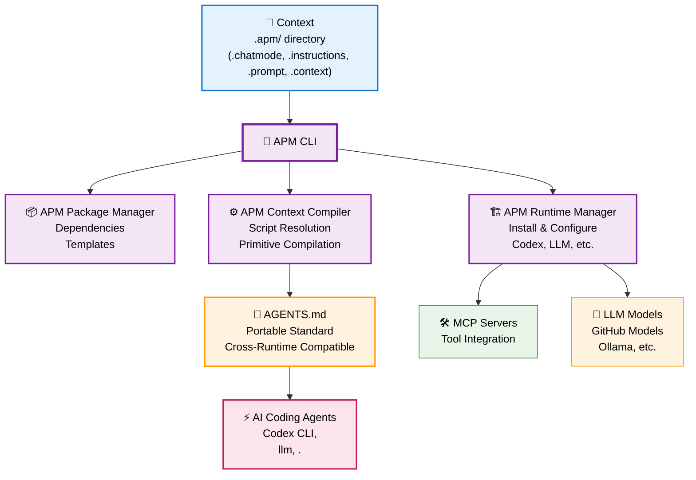

This file is a merged representation of a subset of the codebase, containing specifically included files and files not matching ignore patterns, combined into a single document by Repomix.
The content has been processed where empty lines have been removed, content has been compressed (code blocks are separated by ⋮---- delimiter), security check has been disabled.

# File Summary

## Purpose
This file contains a packed representation of a subset of the repository's contents that is considered the most important context.
It is designed to be easily consumable by AI systems for analysis, code review,
or other automated processes.

## File Format
The content is organized as follows:
1. This summary section
2. Repository information
3. Directory structure
4. Repository files (if enabled)
5. Multiple file entries, each consisting of:
  a. A header with the file path (## File: path/to/file)
  b. The full contents of the file in a code block

## Usage Guidelines
- This file should be treated as read-only. Any changes should be made to the
  original repository files, not this packed version.
- When processing this file, use the file path to distinguish
  between different files in the repository.
- Be aware that this file may contain sensitive information. Handle it with
  the same level of security as you would the original repository.

## Notes
- Some files may have been excluded based on .gitignore rules and Repomix's configuration
- Binary files are not included in this packed representation. Please refer to the Repository Structure section for a complete list of file paths, including binary files
- Only files matching these patterns are included: **/*.md
- Files matching these patterns are excluded: .github/**
- Files matching patterns in .gitignore are excluded
- Files matching default ignore patterns are excluded
- Empty lines have been removed from all files
- Content has been compressed - code blocks are separated by ⋮---- delimiter
- Security check has been disabled - content may contain sensitive information
- Files are sorted by Git change count (files with more changes are at the bottom)

# Directory Structure
```
.apm/
  instructions/
    python.md
docs/
  cli-reference.md
  compilation.md
  concepts.md
  dependencies.md
  enhanced-primitive-discovery.md
  examples.md
  getting-started.md
  index.md
  integration-testing.md
  integrations.md
  primitives.md
  prompts.md
  README.md
  runtime-integration.md
templates/
  hello-world/
    .apm/
      chatmodes/
        backend-engineer.chatmode.md
        default.chatmode.md
      context/
        architecture.context.md
        project-info.context.md
      instructions/
        python.instructions.md
        testing.instructions.md
        typescript.instructions.md
    feature-implementation.prompt.md
    hello-world.prompt.md
    README.md
tests/
  fixtures/
    constitution.md
CHANGELOG.md
CODE_OF_CONDUCT.md
CONTRIBUTING.md
MANIFESTO.md
README.md
SECURITY.md
```

# Files

## File: .apm/instructions/python.md
````markdown
---
description: Python development guidelines
applyTo: '**/*.py'
---

Use type hints for all function parameters and return values.
Follow PEP 8 style guidelines.
Write comprehensive docstrings.
````

## File: docs/cli-reference.md
````markdown
# APM CLI Reference

Complete command-line interface reference for Agent Package Manager (APM).

## Quick Start

```bash
# 1. Set your GitHub tokens (minimal setup)
export GITHUB_APM_PAT=your_fine_grained_token_here
# Optional: export GITHUB_TOKEN=your_models_token           # For Codex CLI with GitHub Models

# 2. Install APM CLI (GitHub org members)
curl -sSL https://raw.githubusercontent.com/danielmeppiel/apm/main/install.sh | sh

# 3. Setup runtime
apm runtime setup copilot  

# 4. Create project
apm init my-project && cd my-project

# 5. Run your first workflow
apm compile && apm run start --param name="<YourGitHubHandle>"
```

## Installation

### Quick Install (Recommended)
```bash
curl -sSL https://raw.githubusercontent.com/danielmeppiel/apm/main/install.sh | sh
```

### Manual Download
Download from [GitHub Releases](https://github.com/danielmeppiel/apm/releases/latest):
```bash
# Linux x86_64
curl -L https://github.com/danielmeppiel/apm/releases/latest/download/apm-linux-x86_64 -o apm && chmod +x apm

# macOS Intel
curl -L https://github.com/danielmeppiel/apm/releases/latest/download/apm-darwin-x86_64 -o apm && chmod +x apm

# macOS Apple Silicon  
curl -L https://github.com/danielmeppiel/apm/releases/latest/download/apm-darwin-arm64 -o apm && chmod +x apm
```

### From Source (Developers)
```bash
git clone https://github.com/danielmeppiel/apm-cli.git
cd apm-cli && pip install -e .
```

## Global Options

```bash
apm [OPTIONS] COMMAND [ARGS]...
```

### Options
- `--version` - Show version and exit
- `--help` - Show help message and exit

## Core Commands

### `apm init` - 🚀 Initialize new APM project

Initialize a new APM project with sample prompt and configuration (like `npm init`).

```bash
apm init [PROJECT_NAME] [OPTIONS]
```

**Arguments:**
- `PROJECT_NAME` - Optional name for new project directory. Use `.` to explicitly initialize in current directory

**Options:**
- `-f, --force` - Overwrite existing files without confirmation
- `-y, --yes` - Skip interactive questionnaire and use defaults

**Examples:**
```bash
# Initialize in current directory (interactive)
apm init

# Initialize in current directory explicitly  
apm init .

# Create new project directory
apm init my-hello-world

# Force overwrite existing project
apm init --force

# Use defaults without prompts
apm init my-project --yes
```

**Behavior:**
- **Interactive mode**: Prompts for project details unless `--yes` specified
- **Existing projects**: Detects existing `apm.yml` and preserves configuration unless `--force` used
- **Strictly additive**: Like npm, preserves existing fields and values where possible

**Creates:**
- `apm.yml` - Project configuration with MCP dependencies
- `hello-world.prompt.md` - Sample prompt with GitHub integration
- `README.md` - Project documentation

### `apm install` - 📦 Install APM and MCP dependencies

Install APM package and MCP server dependencies from `apm.yml` (like `npm install`).

```bash
apm install [OPTIONS]
```

**Options:**
- `--runtime TEXT` - Target specific runtime only (codex, vscode)
- `--exclude TEXT` - Exclude specific runtime from installation
- `--only [apm|mcp]` - Install only specific dependency type
- `--update` - Update dependencies to latest Git references  
- `--dry-run` - Show what would be installed without installing

**Examples:**
```bash
# Install all dependencies from apm.yml
apm install

# Install only APM dependencies (skip MCP servers)
apm install --only=apm

# Install only MCP dependencies (skip APM packages)  
apm install --only=mcp

# Preview what would be installed
apm install --dry-run

# Update existing dependencies to latest versions
apm install --update

# Install for all runtimes except Codex
apm install --exclude codex
```

**Dependency Types:**
- **APM Dependencies**: GitHub repositories containing `.apm/` context collections
- **MCP Dependencies**: Model Context Protocol servers for runtime integration

**Requirements:** Must be run in a directory with `apm.yml` file.

**Working Example with Dependencies:**
```yaml
# Example apm.yml with APM dependencies
name: my-compliance-project
version: 1.0.0
dependencies:
  apm:
    - danielmeppiel/compliance-rules  # GDPR, legal review workflows
    - danielmeppiel/design-guidelines # Accessibility, UI standards
  mcp:
    - github/github-mcp-server
```

```bash
# Install all dependencies (APM + MCP)
apm install

# Install only APM dependencies for faster setup
apm install --only=apm

# Preview what would be installed  
apm install --dry-run
```

### `apm deps` - 🔗 Manage APM package dependencies

Manage APM package dependencies with installation status, tree visualization, and package information.

```bash
apm deps COMMAND [OPTIONS]
```

#### `apm deps list` - 📋 List installed APM dependencies

Show all installed APM dependencies in a Rich table format with context files and agent workflows.

```bash
apm deps list
```

**Examples:**
```bash
# Show all installed APM packages
apm deps list
```

**Sample Output:**
```
┌─────────────────────┬─────────┬──────────────┬─────────────┬─────────────┐
│ Package             │ Version │ Source       │ Context     │ Workflows   │
├─────────────────────┼─────────┼──────────────┼─────────────┼─────────────┤
│ compliance-rules    │ 1.0.0   │ main         │ 2 files     │ 3 wf        │
│ design-guidelines   │ 1.0.0   │ main         │ 1 files     │ 3 wf        │
└─────────────────────┴─────────┴──────────────┴─────────────┴─────────────┘
```

**Output includes:**
- Package name and version
- Source repository/branch information
- Number of context files (instructions, chatmodes, contexts)
- Number of agent workflows (prompts)
- Installation path and status

#### `apm deps tree` - 🌳 Show dependency tree structure

Display dependencies in hierarchical tree format showing context and agent workflows.

```bash
apm deps tree  
```

**Examples:**
```bash
# Show dependency tree
apm deps tree
```

**Sample Output:**
```
company-website (local)
├── compliance-rules@1.0.0
│   ├── 1 instructions
│   ├── 1 chatmodes
│   └── 3 agent workflows
└── design-guidelines@1.0.0
    ├── 1 instructions
    └── 3 agent workflows
```

**Output format:**
- Hierarchical tree showing project name and dependencies
- File counts grouped by type (instructions, chatmodes, agent workflows)
- Version numbers from dependency package metadata
- Version information for each dependency

#### `apm deps info` - ℹ️ Show detailed package information

Display comprehensive information about a specific installed package.

```bash
apm deps info PACKAGE_NAME
```

**Arguments:**
- `PACKAGE_NAME` - Name of the package to show information about

**Examples:**
```bash
# Show details for compliance rules package
apm deps info compliance-rules

# Show info for design guidelines package  
apm deps info design-guidelines
```

**Output includes:**
- Complete package metadata (name, version, description, author)
- Source repository and installation details
- Detailed context file counts by type
- Agent workflow descriptions and counts
- Installation path and status

#### `apm deps clean` - 🧹 Remove all APM dependencies

Remove the entire `apm_modules/` directory and all installed APM packages.

```bash
apm deps clean
```

**Examples:**
```bash
# Remove all APM dependencies (with confirmation)
apm deps clean
```

**Behavior:**
- Shows confirmation prompt before deletion
- Removes entire `apm_modules/` directory
- Displays count of packages that will be removed
- Can be cancelled with Ctrl+C or 'n' response

#### `apm deps update` - 🔄 Update APM dependencies

Update installed APM dependencies to their latest versions.

```bash
apm deps update [PACKAGE_NAME]
```

**Arguments:**
- `PACKAGE_NAME` - Optional. Update specific package only

**Examples:**
```bash
# Update all APM dependencies to latest versions
apm deps update

# Update specific package to latest version
apm deps update compliance-rules
```

**Note:** Package update functionality requires dependency downloading infrastructure from enhanced install command.

### `apm mcp search` - 🔍 Search MCP servers

Search for MCP servers in the GitHub MCP Registry.

```bash
apm mcp search QUERY [OPTIONS]
```

**Arguments:**
- `QUERY` - Search term to find MCP servers

**Options:**
- `--limit INTEGER` - Number of results to show (default: 10)

**Examples:**
```bash
# Search for filesystem-related servers
apm mcp search filesystem

# Search with custom limit
apm mcp search database --limit 5

# Search for GitHub integration
apm mcp search github
```

### `apm mcp show` - 📋 Show MCP server details

Show detailed information about a specific MCP server from the registry.

```bash
apm mcp show SERVER_NAME
```

**Arguments:**
- `SERVER_NAME` - Name or ID of the MCP server to show

**Examples:**
```bash
# Show details for a server by name
apm mcp show @modelcontextprotocol/servers/src/filesystem

# Show details by server ID
apm mcp show a5e8a7f0-d4e4-4a1d-b12f-2896a23fd4f1
```

**Output includes:**
- Server name and description
- Latest version information
- Repository URL
- Available installation packages
- Installation instructions

### `apm run` - 🚀 Execute prompts

Execute a script defined in your apm.yml with parameters and real-time output streaming.

```bash
apm run [SCRIPT_NAME] [OPTIONS]
```

**Arguments:**
- `SCRIPT_NAME` - Name of script to run from apm.yml scripts section

**Options:**
- `-p, --param TEXT` - Parameter in format `name=value` (can be used multiple times)

**Examples:**
```bash
# Run start script (default script)
apm run start --param name="<YourGitHubHandle>"

# Run with different scripts 
apm run start --param name="Alice"
apm run llm --param service=api
apm run debug --param service=api

# Run specific scripts with parameters
apm run llm --param service=api --param environment=prod
```

**Return Codes:**
- `0` - Success
- `1` - Execution failed or error occurred

### `apm preview` - 👀 Preview compiled scripts

Show the processed prompt content with parameters substituted, without executing.

```bash
apm preview [SCRIPT_NAME] [OPTIONS]
```

**Arguments:**
- `SCRIPT_NAME` - Name of script to preview from apm.yml scripts section

**Options:**
- `-p, --param TEXT` - Parameter in format `name=value`

**Examples:**
```bash
# Preview start script
apm preview start --param name="<YourGitHubHandle>"

# Preview specific script with parameters
apm preview llm --param name="Alice"
```

### `apm list` - 📋 List available scripts

Display all scripts defined in apm.yml.

```bash
apm list
```

**Examples:**
```bash
# List all prompts in project
apm list
```

**Output format:**
```
Available scripts:
  start: codex hello-world.prompt.md
  llm: llm hello-world.prompt.md -m github/gpt-4o-mini  
  debug: RUST_LOG=debug codex hello-world.prompt.md
```

### `apm compile` - 📝 Compile APM context files into AGENTS.md

Compile APM context files (chatmodes, instructions, contexts) into a single intelligent AGENTS.md file with conditional sections, markdown link resolution, and project setup auto-detection.

```bash
apm compile [OPTIONS]
```

**Options:**
- `-o, --output TEXT` - Output file path (default: AGENTS.md)
- `--chatmode TEXT` - Chatmode to prepend to the AGENTS.md file
- `--dry-run` - Generate content without writing file
- `--no-links` - Skip markdown link resolution
- `--with-constitution/--no-constitution` - Include Spec Kit `memory/constitution.md` verbatim at top inside a delimited block (default: `--with-constitution`). When disabled, any existing block is preserved but not regenerated.
- `--watch` - Auto-regenerate on changes (file system monitoring)
- `--validate` - Validate context without compiling

**Examples:**
```bash
# Basic compilation with auto-detected context
apm compile

# Generate with specific chatmode
apm compile --chatmode architect

# Preview without writing file
apm compile --dry-run

# Custom output file
apm compile --output docs/AI-CONTEXT.md

# Validate context without generating output
apm compile --validate

# Watch for changes and auto-recompile (development mode)
apm compile --watch

# Watch mode with dry-run for testing
apm compile --watch --dry-run

# Compile injecting Spec Kit constitution (auto-detected)
apm compile --with-constitution

# Recompile WITHOUT updating the block but preserving previous injection
apm compile --no-constitution
```

**Watch Mode:**
- Monitors `.apm/`, `.github/instructions/`, `.github/chatmodes/` directories
- Auto-recompiles when `.md` or `apm.yml` files change
- Includes 1-second debounce to prevent rapid recompilation
- Press Ctrl+C to stop watching
- Requires `watchdog` library (automatically installed)

**Validation Mode:**
- Checks primitive structure and frontmatter completeness
- Displays actionable suggestions for fixing validation errors
- Exits with error code 1 if validation fails
- No output file generation in validation-only mode

**Configuration Integration:**
The compile command supports configuration via `apm.yml`:

```yaml
compilation:
  output: "AGENTS.md"           # Default output file
  chatmode: "backend-engineer"  # Default chatmode to use
  resolve_links: true           # Enable markdown link resolution
```

Command-line options always override `apm.yml` settings. Priority order:
1. Command-line flags (highest priority)
2. `apm.yml` compilation section
3. Built-in defaults (lowest priority)

**Generated AGENTS.md structure:**
- **Header** - Generation metadata and APM version
- **(Optional) Spec Kit Constitution Block** - Delimited block:
  - Markers: `<!-- SPEC-KIT CONSTITUTION: BEGIN -->` / `<!-- SPEC-KIT CONSTITUTION: END -->`
  - Second line includes `hash: <sha256_12>` for drift detection
  - Entire raw file content in between (Phase 0: no summarization)
- **Pattern-based Sections** - Content grouped by exact `applyTo` patterns from instruction context files (e.g., "Files matching `**/*.py`")
- **Footer** - Regeneration instructions

The structure is entirely dictated by the instruction context found in `.apm/` and `.github/instructions/` directories. No predefined sections or project detection are applied.

**Primitive Discovery:**
- **Chatmodes**: `.chatmode.md` files in `.apm/chatmodes/`, `.github/chatmodes/`
- **Instructions**: `.instructions.md` files in `.apm/instructions/`, `.github/instructions/`
- **Contexts**: `.context.md`, `.memory.md` files in `.apm/context/`, `.github/context/`
- **Workflows**: `.prompt.md` files in project and `.github/prompts/`

APM integrates seamlessly with [Spec-kit](https://github.com/github/spec-kit) for specification-driven development, automatically injecting Spec-kit `constitution` into the compiled context layer.

### `apm config` - ⚙️ Configure APM CLI

Display APM CLI configuration information.

```bash
apm config [OPTIONS]
```

**Options:**
- `--show` - Show current configuration

**Examples:**
```bash
# Show current configuration
apm config --show
```

## Runtime Management

### `apm runtime` - 🤖 Manage AI runtimes

APM manages AI runtime installation and configuration automatically. Currently supports two runtimes: `codex`, and `llm`.

```bash
apm runtime COMMAND [OPTIONS]
```

**Supported Runtimes:**
- **`codex`** - OpenAI Codex CLI with GitHub Models support
- **`llm`** - Simon Willison's LLM library with multiple providers

#### `apm runtime setup` - ⚙️ Install AI runtime

Download and configure an AI runtime from official sources.

```bash
apm runtime setup RUNTIME_NAME [OPTIONS]
```

**Arguments:**
- `RUNTIME_NAME` - Runtime to remove: `codex`, or `llm`

**Options:**
- `--vanilla` - Install runtime without APM configuration (uses runtime's native defaults)

**Examples:**
```bash
# Install Codex with APM defaults
apm runtime setup codex

# Install LLM with APM defaults  
apm runtime setup llm
```

**Default Behavior:**
- Installs runtime binary from official sources
- Configures with GitHub Models (free) as APM default
- Creates configuration file at `~/.codex/config.toml` or similar
- Provides clear logging about what's being configured

**Vanilla Behavior (`--vanilla` flag):**
- Installs runtime binary only
- No APM-specific configuration applied
- Uses runtime's native defaults (e.g., OpenAI for Codex)
- No configuration files created by APM

#### `apm runtime list` - 📋 Show installed runtimes

List all available runtimes and their installation status.

```bash
apm runtime list
```

**Output includes:**
- Runtime name and description
- Installation status (✅ Installed / ❌ Not installed)
- Installation path and version
- Configuration details

#### `apm runtime remove` - 🗑️ Uninstall runtime

Remove an installed runtime and its configuration.

```bash
apm runtime remove RUNTIME_NAME
```

**Arguments:**
- `RUNTIME_NAME` - Runtime to remove: `codex`, or `llm`

#### `apm runtime status` - 📊 Show runtime status

Display which runtime APM will use for execution and runtime preference order.

```bash
apm runtime status
```

**Output includes:**
- Runtime preference order (codex → llm)
- Currently active runtime
- Next steps if no runtime is available

#### `apm runtime status` - Show runtime status

Display detailed status for a specific runtime.

```bash
apm runtime status RUNTIME_NAME
```

**Arguments:**
- `RUNTIME_NAME` - Runtime to check: `codex` or `llm`

## File Formats

### APM Project Configuration (`apm.yml`)
```yaml
name: my-project
version: 1.0.0
description: My APM application
author: Your Name
scripts:
  start: "codex hello-world.prompt.md"
  llm: "llm hello-world.prompt.md -m github/gpt-4o-mini"
  debug: "RUST_LOG=debug codex hello-world.prompt.md"

dependencies:
  mcp:
    - ghcr.io/github/github-mcp-server
```

### Prompt Format (`.prompt.md`)
```markdown
---
description: Brief description of what this prompt does
mcp:
  - ghcr.io/github/github-mcp-server
input:
  - param1
  - param2
---

# Prompt Title

Your prompt content here with ${input:param1} substitution.
```

### Supported Prompt Locations
APM discovers `.prompt.md` files anywhere in your project:
- `./hello-world.prompt.md`
- `./prompts/my-prompt.prompt.md`
- `./.github/prompts/workflow.prompt.md` 
- `./docs/prompts/helper.prompt.md`

## Quick Start Workflow

```bash
# 1. Initialize new project (like npm init)
apm init my-hello-world

# 2. Navigate to project
cd my-hello-world

# 3. Discover MCP servers (optional)
apm search filesystem
apm show @modelcontextprotocol/servers/src/filesystem

# 4. Install dependencies (like npm install)
apm install

# 5. Run the hello world prompt
apm run start --param name="<YourGitHubHandle>"

# 6. Preview before execution
apm preview start --param name="<YourGitHubHandle>"

# 7. List available prompts
apm list
```

## Tips & Best Practices

1. **Start with runtime setup**: Run `apm runtime setup copilot` 
2. **Use GitHub Models for free tier**: Set `GITHUB_TOKEN` (user-scoped with Models read permission) for free Codex access
3. **Discover MCP servers**: Use `apm search` to find available MCP servers before adding to apm.yml
4. **Preview before running**: Use `apm preview` to check parameter substitution
5. **Organize prompts**: Use descriptive names and place in logical directories
6. **Version control**: Include `.prompt.md` files and `apm.yml` in your git repository
7. **Parameter naming**: Use clear, descriptive parameter names in prompts
8. **Error handling**: Always check return codes in scripts and CI/CD
9. **MCP integration**: Declare MCP dependencies in both `apm.yml` and prompt frontmatter

## Integration Examples

### In CI/CD (GitHub Actions)
```yaml
- name: Setup APM runtime
  run: |
    apm runtime setup codex  
    # Purpose-specific authentication
    export GITHUB_APM_PAT=${{ secrets.GITHUB_APM_PAT }}          # Private modules + fallback
    export GITHUB_TOKEN=${{ secrets.GITHUB_TOKEN }}              # Optional: Codex CLI with GitHub Models
    
- name: Setup APM project
  run: apm install
    
- name: Run code review
  run: |
    apm run code-review \
      --param pr_number=${{ github.event.number }}
```

### In Development Scripts
```bash
#!/bin/bash
# Setup and run APM project
apm runtime setup codex  
# Fine-grained token preferred
export GITHUB_APM_PAT=your_fine_grained_token      # Private modules + fallback auth
export GITHUB_TOKEN=your_models_token              # Codex CLI with GitHub Models

cd my-apm-project
apm install

# Run documentation analysis
if apm run document --param project_name=$(basename $PWD); then
    echo "Documentation analysis completed"
else
    echo "Documentation analysis failed" 
    exit 1
fi
```

### Project Structure Example
```
my-apm-project/
├── apm.yml                           # Project configuration
├── README.md                         # Project documentation  
├── hello-world.prompt.md             # Main prompt file
├── prompts/
│   ├── code-review.prompt.md         # Code review prompt
│   └── documentation.prompt.md       # Documentation prompt
└── .github/
    └── workflows/
        └── apm-ci.yml                # CI using APM prompts
```
````

## File: docs/compilation.md
````markdown
# APM Compilation: Mathematical Context Optimization

**Solving the AI agent scalability problem through constraint satisfaction optimization**

APM's compilation system implements a mathematically rigorous solution to the **context pollution problem** that degrades AI agent performance as projects grow. Through constraint satisfaction optimization and hierarchical coverage guarantees, `apm compile` transforms scattered primitives into perfectly optimized AGENTS.md files.

## The Context Pollution Problem

### Why Traditional Approaches Fail

In traditional monolithic AGENTS.md approaches, AI agents face a fundamental efficiency problem: **context pollution**. As projects grow, agents must process increasingly large amounts of irrelevant instructions, degrading performance and overwhelming context windows.

**The Mathematical Challenge**:
```
Context_Efficiency = Relevant_Instructions / Total_Instructions_Inherited
```

Without optimization, context efficiency degrades quadratically with project size, creating an unsustainable burden on AI agents working in specific directories.

### The AGENTS.md Standard Solution

APM implements the [AGENTS.md standard](https://agents.md) for hierarchical context files:

- **Recursive Discovery**: Agents read AGENTS.md files from current directory up to project root
- **Proximity Priority**: Closest AGENTS.md to the edited file takes precedence  
- **Inheritance Model**: Child directories inherit and can override parent instructions
- **Universal Compatibility**: Works with GitHub Copilot, Cursor, Claude, and all AGENTS.md-compliant tools

## The Mathematical Foundation

### Core Optimization Problem

APM treats instruction placement as a **constrained optimization problem**:

```
Objective: minimize Σ(pollution[d] × files[d])
           d∈directories

Subject to: ∀f ∈ matching_files(pattern) → 
           ∃p ∈ placements : f.can_inherit_from(p)

Variables: placement_matrix ∈ {0,1}^(directories × instructions)
```

This mathematical formulation guarantees:
1. **Complete Coverage**: Every file can access its applicable instructions
2. **Minimal Pollution**: Irrelevant context is systematically minimized
3. **Hierarchical Validity**: Inheritance chains remain consistent

### The Three-Tier Placement Algorithm

APM employs sophisticated distribution scoring with mathematical thresholds:

```python
# From context_optimizer.py
Distribution_Score = (matching_directories / total_directories) × diversity_factor

Where:
diversity_factor = 1.0 + (depth_variance × DIVERSITY_FACTOR_BASE)
DIVERSITY_FACTOR_BASE = 0.5  # Mathematical constant
```

**Strategy Selection**:

| Distribution Score | Strategy | Mathematical Logic |
|-------------------|----------|-------------------|
| < 0.3 | Single-Point | `_optimize_single_point_placement()` |
| 0.3 - 0.7 | Selective Multi | `_optimize_selective_placement()` |
| > 0.7 | Distributed | `_optimize_distributed_placement()` |

### Constraint Satisfaction Weights

The optimization engine uses mathematically calibrated weights:

```python
# Mathematical optimization parameters from the source
COVERAGE_EFFICIENCY_WEIGHT = 1.0    # Mandatory coverage priority
POLLUTION_MINIMIZATION_WEIGHT = 0.8  # Strong pollution penalty
MAINTENANCE_LOCALITY_WEIGHT = 0.3    # Moderate locality preference
DEPTH_PENALTY_FACTOR = 0.1          # Excessive nesting penalty
```

## Understanding the Metrics

### Context Efficiency Ratio

The primary performance indicator for AI agent effectiveness:

```python
def get_efficiency_ratio(self) -> float:
    """Calculate context efficiency ratio."""
    if self.total_context_load == 0:
        return 1.0
    return self.relevant_context_load / self.total_context_load
```

**Interpretation Guide**:

| Efficiency Range | Assessment | Optimization Quality |
|-----------------|------------|-------------------|
| 80-100% | Excellent | Near-perfect instruction locality |
| 60-80% | Good | Well-optimized with minimal conflicts |
| 40-60% | Fair | Acceptable coverage/efficiency balance |
| 20-40% | Poor | Significant cross-cutting concerns |
| 0-20% | Critical | Architecture requires refactoring |

**Important**: Low efficiency can be mathematically optimal when coverage constraints force root placement. The optimizer **always prioritizes complete coverage** over efficiency.

### Distribution Score Analysis

Measures pattern spread across the directory structure:

```python
def _calculate_distribution_score(self, matching_directories: Set[Path]) -> float:
    """Calculate distribution score with diversity factor."""
    total_dirs_with_files = len([d for d in self._directory_cache.values() if d.total_files > 0])
    base_ratio = len(matching_directories) / total_dirs_with_files
    
    # Account for depth diversity
    depths = [self._directory_cache[d].depth for d in matching_directories]
    depth_variance = sum((d - sum(depths)/len(depths))**2 for d in depths) / len(depths)
    diversity_factor = 1.0 + (depth_variance * self.DIVERSITY_FACTOR_BASE)
    
    return base_ratio * diversity_factor
```

### Coverage Verification

Mathematical guarantee that no instruction is lost:

```python
def _calculate_hierarchical_coverage(self, placements: List[Path], target_directories: Set[Path]) -> Set[Path]:
    """Verify hierarchical coverage through inheritance chains."""
    covered = set()
    for target in target_directories:
        for placement in placements:
            if self._is_hierarchically_covered(target, placement):
                covered.add(target)
                break
    return covered
```

## Usage and Configuration

### Basic Compilation (Default: Distributed)

```bash
# Intelligent distributed optimization
apm compile

# Example output:
📊 Analyzing 247 files across 12 directories...
🎯 Optimizing instruction placement...
✅ Generated 4 AGENTS.md files with guaranteed coverage
```

### Mathematical Analysis Mode

```bash
# Show optimization reasoning
apm compile --verbose

# Example detailed output:
🔬 Mathematical Analysis:
├─ Distribution Scores:
│  ├─ **/*.py: 0.23 → Single-Point Strategy
│  ├─ **/*.tsx: 0.67 → Selective Multi Strategy  
│  └─ **/*.md: 0.81 → Distributed Strategy
├─ Coverage Verification: ✓ Complete (100%)
├─ Constraint Satisfaction: All 8 constraints satisfied
└─ Generation Time: 127ms
```

### Performance Analysis

```bash
# Preview placement without writing files
apm compile --dry-run

# Timing instrumentation
apm compile --verbose
# Shows: ⏱️ Project Analysis: 45.2ms
#        ⏱️ Instruction Processing: 82.1ms
```

### Configuration Control

```yaml
# apm.yml
compilation:
  strategy: "distributed"  # Default: mathematical optimization
  placement:
    min_instructions_per_file: 1  # Minimal context principle
    clean_orphaned: true  # Remove outdated files
  optimization:
    # Mathematical weights (advanced users)
    coverage_weight: 1.0      # Coverage priority (mandatory)
    pollution_weight: 0.8     # Pollution minimization
    locality_weight: 0.3      # Maintenance locality
```

## Advanced Optimization Features

### Hierarchical Coverage Guarantee

The mathematical **coverage constraint** ensures no instruction is ever lost:

```
project/
├── AGENTS.md                    # Global standards
├── src/
│   ├── AGENTS.md               # Source code patterns
│   └── components/
│       ├── AGENTS.md           # Component-specific
│       └── Button.tsx          # Inherits: global + src + components
```

**Coverage Verification Algorithm**:
```python
def verify_coverage(placements, matching_files):
    """Ensure every file can inherit its instructions"""
    for file in matching_files:
        chain = get_inheritance_chain(file)
        if not any(p in chain for p in placements):
            raise CoverageViolation(file)  # Mathematical guarantee
    return True
```

### Performance Engineering

**Multi-layer caching system** for sub-second compilation:

```python
# From context_optimizer.py
self._directory_cache: Dict[Path, DirectoryAnalysis] = {}
self._pattern_cache: Dict[str, Set[Path]] = {}
self._glob_cache: Dict[str, List[str]] = {}
```

**Typical performance**: < 500ms for projects with 10,000+ files

### Deterministic Output

Compilation is completely reproducible:
- Sorted iteration order prevents randomness
- Stable optimization algorithm
- Consistent Build IDs across machines
- Cache-friendly for CI/CD systems

### Constitution Injection

Project governance automatically injected at AGENTS.md top:

```markdown
<!-- SPEC-KIT CONSTITUTION: BEGIN -->
hash: 34c5812dafc9 path: memory/constitution.md
[Project principles and governance]
<!-- SPEC-KIT CONSTITUTION: END -->
```

## Real-World Application

### Enterprise React Application Case

**Project Characteristics**:
- 15,000+ lines of code
- 127 component files
- 8 instruction patterns
- 3 team-specific standards

**Optimization Results**:
- **7 strategically placed** AGENTS.md files
- **Complete coverage** mathematically verified
- **Context efficiency**: 67.3% (Good rating)
- **Generation time**: 89ms

**Compared to Monolithic Approach**:
- Single 847-line AGENTS.md file
- Universal context pollution
- No mathematical optimization
- Manual maintenance required

## Technical Innovation

### Constraint Satisfaction Algorithm

APM implements **complete coverage with minimal pollution**:

1. **Coverage Constraint**: Mathematical guarantee every file accesses applicable instructions
2. **Pollution Minimization**: Systematic reduction of irrelevant context
3. **Hierarchical Validation**: Inheritance chain verification
4. **Performance Optimization**: Sub-second compilation with caching

### Three-Tier Strategy Implementation

```python
# Actual implementation from context_optimizer.py
if distribution_score < self.LOW_DISTRIBUTION_THRESHOLD:
    strategy = PlacementStrategy.SINGLE_POINT
    placements = self._optimize_single_point_placement(matching_directories, instruction)
elif distribution_score > self.HIGH_DISTRIBUTION_THRESHOLD:
    strategy = PlacementStrategy.DISTRIBUTED  
    placements = self._optimize_distributed_placement(matching_directories, instruction)
else:
    strategy = PlacementStrategy.SELECTIVE_MULTI
    placements = self._optimize_selective_placement(matching_directories, instruction)
```

### Mathematical Sophistication

The optimization engine implements:
- **Variance-weighted distribution scoring**
- **Hierarchical coverage verification**  
- **Constraint satisfaction with fallback guarantees**
- **Performance-optimized caching strategies**
- **Deterministic reproducible results**

## Universal Compatibility

Generated AGENTS.md files work seamlessly across all major coding agents:

- ✅ **GitHub Copilot** (All variations)
- ✅ **Cursor** (Native AGENTS.md support)
- ✅ **Continue** (VS Code & JetBrains)
- ✅ **Codeium** (Universal compatibility)
- ✅ **Claude** (Anthropic's implementation)
- ✅ **Any AGENTS.md standard compliant tool**

## Theoretical Foundations

### Computational Complexity

- **Time Complexity**: O(n·m·log(d))
  - n = number of instructions
  - m = number of directories  
  - d = maximum directory depth

- **Space Complexity**: O(n·m)
  - Placement matrix storage

### Optimization Bounds

**Theoretical maximum efficiency**:
```
Max_Efficiency = 1 - (cross_cutting_patterns / total_patterns)
```

Most well-structured projects achieve 60-85% of theoretical maximum through mathematical optimization.

## Future Enhancements

### Planned Optimizations

**Machine Learning Enhancement**: Neural network to predict optimal placement based on:
- Historical agent query patterns
- File change frequency analysis
- Team-specific access patterns

**Dynamic Recompilation**: File watcher with targeted optimization:
```bash
apm compile --watch  # Auto-recompile on changes
```

**Context Budget Optimization**: Token-aware instruction prioritization:
```yaml
compilation:
  optimization:
    max_tokens_per_file: 4000
    priority_scoring: true
```

## Conclusion

APM's Context Optimization Engine represents a fundamental advancement in AI-assisted development infrastructure. By treating instruction distribution as a **mathematical optimization problem** with **guaranteed coverage constraints**, APM creates:

1. **Mathematically optimal context loading** for AI agents
2. **Complete coverage guarantee** through constraint satisfaction
3. **Linear scalability** with project size
4. **Universal compatibility** with the AGENTS.md standard
5. **Performance engineering** with sub-second compilation

The result: AI agents that work efficiently and reliably, regardless of project size or complexity.

---

**Ready to optimize your AI agent performance?**

```bash
# See the mathematics in action
apm compile --verbose

# Experience optimized AI development
apm init my-project && cd my-project && apm compile
```

**Technical Implementation**: [`src/apm_cli/compilation/`](../src/apm_cli/compilation/)  
**Mathematical Core**: [`context_optimizer.py`](../src/apm_cli/compilation/context_optimizer.py)
````

## File: docs/concepts.md
````markdown
# Core Concepts

APM implements the complete [AI-Native Development framework](https://danielmeppiel.github.io/awesome-ai-native/docs/concepts/) - a systematic approach to making AI coding assistants reliable, scalable, and team-friendly.

## Why This Matters

Most developers experience AI as inconsistent and unreliable:

- ❌ **Ad-hoc prompting** that produces different results each time
- ❌ **Context overload** that confuses AI agents and wastes tokens  
- ❌ **Vendor lock-in** to specific AI tools and platforms
- ❌ **No knowledge persistence** across sessions and team members

**APM solves this** by implementing the complete 3-layer AI-Native Development framework:

**🔧 Layer 1: Markdown Prompt Engineering** - Structured, repeatable AI instructions  
**⚙️ Layer 2: Context** - Configurable tools that deploy prompt + context engineering  
**🎯 Layer 3: Context Engineering** - Strategic LLM memory management for reliability

**Result**: Transform from supervising every AI interaction to architecting systems that delegate complete workflows to AI agents.

## AI-Native Development Maturity Journey

**From Manual Supervision → Engineered Architecture**

Most developers start by manually supervising every AI interaction. APM enables the transformation to AI-Native engineering:

### 🔴 Before APM: Manual Agent Supervision

The traditional approach requires constant developer attention:

- **Write one-off prompts** for each task  
- **Manually guide** every AI conversation step-by-step
- **Start from scratch** each time, no reusable patterns
- **Inconsistent results** - same prompt produces different outputs
- **Context chaos** - overwhelming AI with too much information
- **No team knowledge** - everyone reinvents their own AI workflows

*You're the bottleneck - every AI task needs your personal attention and guidance.*

### 🟢 With APM: Engineered Agent Delegation  

APM transforms AI from a supervised tool to an engineered system:

- **Build reusable Context** once, use everywhere
- **Engineer context strategically** for optimal AI performance
- **Delegate complete workflows** to AI with confidence
- **Reliable results** - structured prompts produce consistent outputs
- **Smart context loading** - AI gets exactly what it needs, when it needs it
- **Team knowledge scaling** - share effective AI patterns across the entire organization

*You're the architect - AI handles execution autonomously while following your engineered patterns.*

## The Infrastructure Layer

**APM provides the missing infrastructure for AI-Native Development**

### The Problem

Developers have powerful AI coding assistants but lack systematic approaches to make them reliable and scalable. Every team reinvents their AI workflows, can't share effective context, and struggles with inconsistent results.

### The Solution

APM provides the missing infrastructure layer that makes AI-Native Development portable and reliable.

Just as npm revolutionized JavaScript by creating package ecosystem infrastructure, APM creates the missing infrastructure for AI-Native Development:

- **Package Management**: Share and version AI workflows like code dependencies
- **Context Compilation**: Transform Context into dynamically injected context 
- **Runtime Management**: Install and configure AI tools automatically
- **Standards Compliance**: Generate agents.md files for universal compatibility

### Key Benefits

**🎯 Reliable Results** - Replace trial-and-error with proven AI-Native Development patterns  
**🔄 Universal Portability** - Works with any coding agent through the agents.md standard  
**📦 Knowledge Packaging** - Share AI workflows like code packages with versioning  
**🧠 Compound Intelligence** - Primitives improve through iterative team refinement  
**⚡ Team Scaling** - Transform any project for reliable AI-Native Development workflows

## Architecture Overview

APM implements a complete system architecture that bridges the gap between human intent and AI execution:



**Key Architecture Components**:

1. **Context** (.apm/ directory) - Your source code for AI workflows
2. **APM CLI** - Three core engines working together:
   - **Package Manager** - Dependency resolution and distribution
   - **Primitives Compiler** - Transforms primitives → agents.md format  
   - **Runtime Manager** - Install and configure AI tools
3. **AGENTS.md** - Portable standard ensuring compatibility across all coding agents
4. **AI Coding Agents** - Execute your compiled workflows (Copilot, Cursor, etc.)
5. **Supporting Infrastructure** - MCP servers for tools, LLM models for execution

The compiled `agents.md` file ensures your Context work with any coding agent - from GitHub Copilot to Cursor, Codex to Aider.

## The Three Layers Explained

### Layer 1: Markdown Prompt Engineering

Transform ad-hoc prompts into structured, repeatable instructions using markdown format:

**❌ Traditional**: "Add authentication to the API"

**✅ Engineered**:
```markdown
# Secure Authentication Implementation

## Requirements Analysis
- Review existing security patterns
- Identify authentication method requirements
- Validate session management needs

## Implementation Steps
1. Set up JWT token system
2. Implement secure password hashing
3. Create session management
4. Add logout functionality

## Validation Gates
🚨 **STOP**: Security review required before deployment
```

### Layer 2: Context

Package your prompt engineering into reusable, configurable components:

- **Instructions** (.instructions.md) - Context and coding standards
- **Prompts** (.prompt.md) - Executable AI workflows  
- **Chat Modes** (.chatmode.md) - AI assistant personalities
- **Context** (.context.md) - Project knowledge base

### Layer 3: Context Engineering

Strategic management of LLM memory and context for optimal performance:

- **Dynamic Loading** - Load relevant context based on current task
- **Smart Filtering** - Include only necessary information
- **Memory Management** - Optimize token usage across conversations
- **Performance Tuning** - Balance context richness with response speed

## Component Types

### Instructions (.instructions.md)
Context rules applied based on file patterns:

```yaml
---
applyTo: "**/*.py"
---
# Python Coding Standards
- Follow PEP 8 style guidelines
- Use type hints for all functions
- Include comprehensive docstrings
```

### Prompts (.prompt.md)  
Executable AI workflows with parameters:

```yaml
---
description: "Implement secure authentication"
mode: backend-dev
input: [auth_method, session_duration]
---
# Authentication Implementation
Use ${input:auth_method} with ${input:session_duration} sessions
```

### Chat Modes (.chatmode.md)
AI assistant personalities with tool boundaries:

```yaml
---
name: "Backend Developer"
model: "gpt-4"
tools: ["terminal", "file-manager"] 
---
You are a senior backend developer focused on API design and security.
```

### Context (.context.md)
Optimized project knowledge for AI consumption:

```markdown
# Project Architecture

## Core Patterns
- Repository pattern for data access
- Clean architecture with domain separation
- Event-driven communication between services
```

## Universal Compatibility

APM generates `AGENTS.md` files that work across all major coding agents:

- **GitHub Copilot** - VSCode integration, chat, and CLI
- **Cursor** - AI-first code editor  
- **Codex CLI** - OpenAI's development tool
- **Aider** - AI pair programming in terminal
- **Any agent** supporting the agents.md standard

This ensures your investment in Context works regardless of which AI tools your team chooses.

## Learn the Complete Framework

APM implements concepts from the broader [AI-Native Development Guide](https://danielmeppiel.github.io/awesome-ai-native/) - explore the complete framework for advanced techniques in:

- **Prompt Engineering Patterns** - Advanced prompting techniques
- **Context Optimization** - Memory management strategies  
- **Team Scaling Methods** - Organizational AI adoption
- **Tool Integration** - Connecting AI with development workflows

Ready to see these concepts in action? Check out [Examples & Use Cases](examples.md) next!
````

## File: docs/dependencies.md
````markdown
# APM Package Dependencies Guide

Complete guide to APM package dependency management - share and reuse context collections across projects for consistent, scalable AI-native development.

## What Are APM Dependencies?

APM dependencies are GitHub repositories containing `.apm/` directories with context collections (instructions, chatmodes, contexts) and agent workflows (prompts). They enable teams to:

- **Share proven workflows** across projects and team members
- **Standardize compliance and design patterns** organization-wide
- **Build on tested context** instead of starting from scratch
- **Maintain consistency** across multiple repositories and teams

## Quick Start

### 1. Add Dependencies to Your Project

Add APM dependencies to your `apm.yml` file:

```yaml
name: my-project
version: 1.0.0
dependencies:
  apm:
    - danielmeppiel/compliance-rules  # GDPR, legal review workflows
    - danielmeppiel/design-guidelines # Accessibility, UI standards
  mcp:
    - io.github.github/github-mcp-server
```

### 2. Install Dependencies

```bash
# Install all dependencies
apm install

# Install only APM dependencies (faster)
apm install --only=apm

# Preview what will be installed
apm install --dry-run
```

### 3. Verify Installation

```bash
# List installed packages
apm deps list

# Show dependency tree
apm deps tree

# Get package details
apm deps info compliance-rules
```

### 4. Use Dependencies in Compilation

```bash
# Compile with dependencies
apm compile

# The compilation process generates distributed AGENTS.md files across the project
# Instructions with matching applyTo patterns are merged from all sources
# See docs/wip/distributed-agents-compilation-strategy.md for detailed compilation logic
```

## GitHub Authentication Setup

APM dependencies require GitHub authentication for downloading repositories. Set up your tokens:

### Option 1: Fine-grained Token (Recommended)

Create a fine-grained personal access token at [github.com/settings/personal-access-tokens/new](https://github.com/settings/personal-access-tokens/new):

- **Repository access**: Select specific repositories or "All repositories"
- **Permissions**: 
  - Contents: Read (to access repository files)
  - Metadata: Read (to access basic repository information)

```bash
export GITHUB_CLI_PAT=your_fine_grained_token
```

### Option 2: Classic Token (Fallback)

Create a classic personal access token with `repo` scope:

```bash
export GITHUB_TOKEN=your_classic_token
```

### Verify Authentication

```bash
# Test that your token works
apm install --dry-run
```

If authentication fails, you'll see an error with guidance on token setup.

## Real-World Example: Corporate Website Project

This example shows how APM dependencies enable powerful layered functionality by combining multiple specialized packages. The company website project uses both [danielmeppiel/compliance-rules](https://github.com/danielmeppiel/compliance-rules) and [danielmeppiel/design-guidelines](https://github.com/danielmeppiel/design-guidelines) to supercharge development workflows:

```yaml
# company-website/apm.yml
name: company-website
version: 1.0.0
description: Corporate website with compliance and design standards
dependencies:
  apm:
    - danielmeppiel/compliance-rules
    - danielmeppiel/design-guidelines
  mcp:
    - io.github.github/github-mcp-server

scripts:
  # Compliance workflows
  audit: "codex --skip-git-repo-check compliance-audit.prompt.md"
  gdpr-check: "codex --skip-git-repo-check gdpr-assessment.prompt.md"
  legal-review: "codex --skip-git-repo-check legal-review.prompt.md"
  
  # Design workflows  
  design-review: "codex --skip-git-repo-check design-review.prompt.md"
  accessibility: "codex --skip-git-repo-check accessibility-audit.prompt.md"
  style-check: "codex --skip-git-repo-check style-guide-check.prompt.md"
```

### Package Contributions

The combined packages provide comprehensive coverage:

**[compliance-rules](https://github.com/danielmeppiel/compliance-rules) contributes:**
- **Agent Workflows**: `compliance-audit.prompt.md`, `gdpr-assessment.prompt.md`, `legal-review.prompt.md`
- **Context Files**: `.apm/context/legal-compliance.context.md` - Legal compliance framework and requirements
- **Instructions**: `.apm/instructions/compliance.instructions.md` - Compliance checking guidelines
- **Chat Modes**: `.apm/chatmodes/legal-compliance.chatmode.md` - Interactive legal consultation mode

**[design-guidelines](https://github.com/danielmeppiel/design-guidelines) contributes:**
- **Agent Workflows**: `design-review.prompt.md`, `accessibility-audit.prompt.md`, `style-guide-check.prompt.md`
- **Context Files**: `.apm/context/design-system.context.md` - Design system specifications and standards
- **Instructions**: `.apm/instructions/design-standards.instructions.md` - UI/UX design guidelines and best practices

### Compounding Benefits

When both packages are installed, your project gains:
- **Legal compliance** validation for all code changes
- **Accessibility audit** capabilities for web components
- **Design system enforcement** with automated style checking
- **GDPR assessment** workflows for data handling
- **Rich context** about legal requirements AND design standards

## Dependency Resolution

### Installation Process

1. **Parse Configuration**: APM reads the `dependencies.apm` section from `apm.yml`
2. **Download Repositories**: Clone or update each GitHub repository to `apm_modules/`
3. **Validate Packages**: Ensure each repository has valid APM package structure
4. **Build Dependency Graph**: Resolve transitive dependencies recursively
5. **Check Conflicts**: Identify any circular dependencies or conflicts

### File Processing and Content Merging

APM uses instruction-level merging rather than file-level precedence. When local and dependency files contribute instructions with overlapping `applyTo` patterns:

```
my-project/
├── .apm/
│   └── instructions/
│       └── security.instructions.md      # Local instructions (applyTo: "**/*.py")
├── apm_modules/
│   └── compliance-rules/
│       └── .apm/
│           └── instructions/
│               └── compliance.instructions.md  # Dependency instructions (applyTo: "**/*.py")
└── apm.yml
```

During compilation, APM merges instruction content by `applyTo` patterns:
1. **Pattern-Based Grouping**: Instructions are grouped by their `applyTo` patterns, not by filename
2. **Content Merging**: All instructions matching the same pattern are concatenated in the final AGENTS.md
3. **Source Attribution**: Each instruction includes source file attribution when compiled

This allows multiple packages to contribute complementary instructions for the same file types, enabling rich layered functionality.

### Dependency Tree Structure

Based on the actual structure of our real-world examples:

```
my-project/
├── apm_modules/                     # Dependency installation directory
│   ├── compliance-rules/            # From danielmeppiel/compliance-rules
│   │   ├── .apm/
│   │   │   ├── instructions/
│   │   │   │   └── compliance.instructions.md
│   │   │   ├── context/
│   │   │   │   └── legal-compliance.context.md
│   │   │   └── chatmodes/
│   │   │       └── legal-compliance.chatmode.md
│   │   ├── compliance-audit.prompt.md         # Agent workflows in root
│   │   ├── gdpr-assessment.prompt.md
│   │   ├── legal-review.prompt.md
│   │   └── apm.yml
│   └── design-guidelines/           # From danielmeppiel/design-guidelines
│       ├── .apm/
│       │   ├── instructions/
│       │   │   └── design-standards.instructions.md
│       │   └── context/
│       │       └── design-system.context.md
│       ├── accessibility-audit.prompt.md      # Agent workflows in root
│       ├── design-review.prompt.md
│       ├── style-guide-check.prompt.md
│       └── apm.yml
├── .apm/                            # Local context (highest priority)
├── apm.yml                          # Project configuration
└── .gitignore                       # Manually add apm_modules/ to ignore
```

**Note**: These repositories store agent workflows (`.prompt.md` files) in the root directory, while context files, instructions, and chat modes are organized under `.apm/` subdirectories.

## Advanced Scenarios

### Branch and Tag References

Specify specific branches, tags, or commits for dependency versions:

```yaml
dependencies:
  apm:
    - danielmeppiel/compliance-rules#v2.1.0    # Specific tag
    - danielmeppiel/design-guidelines#main     # Specific branch  
    - company/internal-standards#abc123        # Specific commit
```

### Updating Dependencies

```bash
# Update all dependencies to latest versions
apm deps update

# Update specific dependency  
apm deps update compliance-rules

# Install with updates (equivalent to update)
apm install --update
```

### Cleaning Dependencies

```bash
# Remove all APM dependencies
apm deps clean

# This removes the entire apm_modules/ directory
# Use with caution - requires reinstallation
```

## Best Practices

### Package Structure

Create well-structured APM packages for maximum reusability:

```
your-package/
├── .apm/
│   ├── instructions/        # Context for AI behavior
│   ├── contexts/           # Domain knowledge and facts  
│   ├── chatmodes/          # Interactive chat configurations
│   └── prompts/            # Agent workflows
├── apm.yml                 # Package metadata
├── README.md               # Package documentation
└── examples/               # Usage examples (optional)
```

### Package Naming

- Use descriptive, specific names: `compliance-rules`, `design-guidelines`
- Follow GitHub repository naming conventions
- Consider organization/team prefixes: `company/platform-standards`

### Version Management

- Use semantic versioning for package releases
- Tag releases for stable dependency references
- Document breaking changes clearly

### Documentation

- Include clear README.md with usage examples
- Document all prompts and their parameters
- Provide integration examples

## Troubleshooting

### Common Issues

#### "Authentication failed" 
**Problem**: GitHub token is missing or invalid
**Solution**: 
```bash
# Verify token is set
echo $GITHUB_CLI_PAT

# Test token access
curl -H "Authorization: token $GITHUB_CLI_PAT" https://api.github.com/user
```

#### "Package validation failed"
**Problem**: Repository doesn't have valid APM package structure
**Solution**: 
- Ensure target repository has `.apm/` directory
- Check that `apm.yml` exists and is valid
- Verify repository is accessible with your token

#### "Circular dependency detected"
**Problem**: Packages depend on each other in a loop
**Solution**:
- Review your dependency chain
- Remove circular references
- Consider merging closely related packages

#### "File conflicts during compilation"
**Problem**: Multiple packages or local files have same names
**Resolution**: Local files automatically override dependency files with same names

### Getting Help

```bash
# Show detailed package information
apm deps info package-name

# Show full dependency tree
apm deps tree

# Preview installation without changes
apm install --dry-run

# Enable verbose logging
apm compile --verbose
```

## Integration with Workflows

### Continuous Integration

Add dependency installation to your CI/CD pipelines:

```yaml
# .github/workflows/apm.yml
- name: Install APM dependencies
  run: |
    apm install --only=apm
    apm compile
```

### Team Development

1. **Share dependencies** through your `apm.yml` file in version control
2. **Pin specific versions** for consistency across team members
3. **Document dependency choices** in your project README
4. **Update together** to avoid version conflicts

### Local Development

```bash
# Quick setup for new team members
git clone your-project
cd your-project
apm install
apm compile

# Now all team contexts and workflows are available
apm run design-review --param component="login-form"
```

## Next Steps

- **[CLI Reference](cli-reference.md)** - Complete command documentation
- **[Getting Started](getting-started.md)** - Basic APM usage
- **[Context Guide](concepts.md)** - Understanding the AI-Native Development framework
- **[Creating Packages](primitives.md)** - Build your own APM packages

Ready to create your own APM packages? See the [Context Guide](primitives.md) for detailed instructions on building reusable context collections and agent workflows.
````

## File: docs/enhanced-primitive-discovery.md
````markdown
# Enhanced Primitive Discovery System

This document describes the enhanced primitive discovery system implemented for APM CLI, providing dependency support with source tracking and conflict detection.

## Overview

The enhanced primitive discovery system extends the existing primitive discovery functionality to support:

- **Dependency-aware discovery**: Scan primitives from both local `.apm/` directories and dependency packages in `apm_modules/`
- **Source tracking**: Every primitive knows where it came from (`local` or `dependency:{package_name}`)
- **Priority system**: Local primitives always override dependency primitives; dependencies processed in declaration order
- **Conflict detection**: Track when multiple sources provide the same primitive and report which source wins

## Key Features

### 1. Source Tracking

All primitive models (`Chatmode`, `Instruction`, `Context`) now include an optional `source` field:

```python
from apm_cli.primitives import Chatmode

# Local primitive
chatmode = Chatmode(
    name="assistant", 
    file_path=Path("local.chatmode.md"),
    description="Local assistant",
    content="...",
    source="local"  # New field
)

# Dependency primitive  
dep_chatmode = Chatmode(
    name="reviewer",
    file_path=Path("dep.chatmode.md"), 
    description="Dependency assistant",
    content="...",
    source="dependency:company-standards"  # New field
)
```

### 2. Enhanced Discovery Functions

#### `discover_primitives_with_dependencies(base_dir=".")`

Main enhanced discovery function that:
1. Scans local `.apm/` directory (highest priority)
2. Scans dependency packages in `apm_modules/` (lower priority, in declaration order)
3. Applies conflict resolution (local always wins)
4. Returns `PrimitiveCollection` with source tracking and conflict information

#### `discover_primitives(base_dir=".")`

Original discovery function - unchanged for backward compatibility. Only scans local primitives.

### 3. Conflict Detection

The `PrimitiveCollection` class now tracks conflicts when multiple sources provide primitives with the same name:

```python
collection = discover_primitives_with_dependencies()

# Check for conflicts
if collection.has_conflicts():
    for conflict in collection.conflicts:
        print(f"Conflict: {conflict}")
        # Output: "chatmode 'assistant': local overrides dependency:company-standards"
```

### 4. Priority System

1. **Local primitives always win**: Primitives in local `.apm/` directory override any dependency primitives with the same name
2. **Dependency order matters**: Dependencies are processed in the order declared in `apm.yml`; first declared dependency wins conflicts with later dependencies

### 5. Source-based Filtering

```python
collection = discover_primitives_with_dependencies()

# Get primitives by source
local_primitives = collection.get_primitives_by_source("local")
dep_primitives = collection.get_primitives_by_source("dependency:package-name")

# Get conflicts by type
chatmode_conflicts = collection.get_conflicts_by_type("chatmode")
```

## Usage Examples

### Basic Enhanced Discovery

```python
from apm_cli.primitives import discover_primitives_with_dependencies

# Discover all primitives (local + dependencies)
collection = discover_primitives_with_dependencies("/path/to/project")

print(f"Total primitives: {collection.count()}")
print(f"Conflicts detected: {collection.has_conflicts()}")

for primitive in collection.all_primitives():
    print(f"- {primitive.name} from {primitive.source}")
```

### Handling Conflicts

```python
collection = discover_primitives_with_dependencies()

if collection.has_conflicts():
    print("Conflicts detected:")
    for conflict in collection.conflicts:
        print(f"  - {conflict.primitive_name}: {conflict.winning_source} wins")
        print(f"    Overrides: {', '.join(conflict.losing_sources)}")
```

### Dependency Declaration Order

The system reads `apm.yml` to determine the order in which dependencies should be processed:

```yaml
# apm.yml
name: my-project
version: 1.0.0
dependencies:
  apm:
    - company/standards#v1.0.0
    - team/workflows@workflow-alias  
    - user/utilities
```

Dependencies are processed in this exact order. If multiple dependencies provide primitives with the same name, the first one declared wins.

## Directory Structure

The enhanced discovery system expects this structure:

```
project/
├── apm.yml                           # Dependency declarations
├── .apm/                             # Local primitives (highest priority)
│   ├── chatmodes/
│   ├── instructions/
│   └── contexts/
└── apm_modules/                      # Dependency primitives
    ├── standards/                    # From company/standards
    │   └── .apm/
    │       ├── chatmodes/
    │       └── instructions/
    ├── workflow-alias/               # From team/workflows (uses alias)
    │   └── .apm/
    │       └── contexts/
    └── utilities/                    # From user/utilities
        └── .apm/
            └── instructions/
```

## Backward Compatibility

All changes are fully backward compatible:

- Existing `discover_primitives()` function unchanged
- Existing primitive constructors work unchanged (source field is optional)
- Existing `PrimitiveCollection` methods work unchanged
- All existing tests continue to pass

## Integration Points

The enhanced discovery system integrates with:

- **APM Package Models**: Uses `APMPackage` and `DependencyReference` from Task 1 to parse `apm.yml`
- **Existing Parser**: Extends existing primitive parser with optional source parameter
- **Future Compilation**: Prepared for integration with compilation system for source attribution

## Technical Details

### Conflict Resolution Algorithm

1. Create empty `PrimitiveCollection`
2. Scan local `.apm/` directory, add all primitives with `source="local"`
3. Parse `apm.yml` to get dependency declaration order
4. For each dependency in order:
   - Scan `apm_modules/{dependency}/.apm/` directory
   - Add primitives with `source="dependency:{dependency}"`
   - If primitive name conflicts with existing primitive:
     - Keep existing primitive (higher priority)
     - Record conflict with losing source information

### Error Handling

- Gracefully handles missing `apm_modules/` directory
- Gracefully handles missing `apm.yml` file
- Gracefully handles invalid dependency directories
- Continues processing other dependencies if one fails
- Reports warnings for unparseable primitive files

## Testing

Comprehensive test suite in `tests/test_enhanced_discovery.py` covers:

- Source tracking functionality
- Conflict detection accuracy
- Priority system validation
- Dependency order parsing
- Backward compatibility
- Edge cases and error conditions

Run tests with:

```bash
python -m pytest tests/test_enhanced_discovery.py -v
```

## Future Enhancements

The enhanced discovery system is designed to support future features:

- **Compilation Integration**: Source attribution in generated `AGENTS.md` files
- **CLI Commands**: `apm deps list`, `apm compile --trace` commands
- **Advanced Conflict Resolution**: User-configurable conflict resolution strategies
- **Performance Optimization**: Caching and incremental discovery for large projects
````

## File: docs/examples.md
````markdown
# Examples & Use Cases

This guide showcases real-world APM workflows, from simple automation to enterprise-scale AI development patterns. Learn through practical examples that demonstrate the power of structured AI workflows.

## Before & After: Traditional vs APM

### Traditional Approach (Unreliable)

**Manual Prompting**:
```
"Add authentication to the API"
```

**Problems**:
- Inconsistent results each time
- No context about existing code
- Manual guidance required for each step
- No reusable patterns
- Different developers get different implementations

### APM Approach (Reliable)

**Structured Workflow** (.prompt.md):
```yaml
---
description: Implement secure authentication system
mode: backend-dev
mcp:
  - ghcr.io/github/github-mcp-server
input: [auth_method, session_duration]
---

# Secure Authentication Implementation

## Context Loading
Review [security standards](../context/security-standards.md) and [existing auth patterns](../context/auth-patterns.md).

## Implementation Requirements
- Use ${input:auth_method} authentication 
- Session duration: ${input:session_duration}
- Follow [security checklist](../specs/auth-security.spec.md)

## Validation Gates
🚨 **STOP**: Confirm security review before implementation

## Implementation Steps
1. Set up JWT token system with proper secret management
2. Implement secure password hashing using bcrypt
3. Create session management with Redis backend
4. Add logout and token revocation functionality
5. Implement rate limiting on auth endpoints
6. Add comprehensive logging for security events

## Testing Requirements
- Unit tests for all auth functions
- Integration tests for complete auth flow
- Security penetration testing
- Load testing for auth endpoints
```

**Execute**:
```bash
apm run implement-auth --param auth_method=jwt --param session_duration=24h
```

**Benefits**:
- Consistent, reliable results
- Contextual awareness of existing codebase
- Security standards automatically applied
- Reusable across projects
- Team knowledge embedded

## Multi-Step Feature Development

APM enables complex workflows that chain multiple AI interactions:

### Example: Complete Feature Implementation

```bash
# 1. Generate specification from requirements
apm run create-spec --param feature="user-auth"
```

```yaml
# .apm/prompts/create-spec.prompt.md
---
description: Generate technical specification from feature requirements
mode: architect
input: [feature]
---

# Technical Specification Generator

## Requirements Analysis
Generate a comprehensive technical specification for: ${input:feature}

## Specification Sections Required
1. **Functional Requirements** - What the feature must do
2. **Technical Design** - Architecture and implementation approach  
3. **API Contracts** - Endpoints, request/response formats
4. **Database Schema** - Data models and relationships
5. **Security Considerations** - Authentication, authorization, validation
6. **Testing Strategy** - Unit, integration, and e2e test plans
7. **Performance Requirements** - Load expectations and optimization
8. **Deployment Plan** - Rollout strategy and monitoring

## Context Sources
- Review [existing architecture](../context/architecture.context.md)
- Follow [API design standards](../context/api-standards.context.md)
- Apply [security guidelines](../context/security.context.md)

## Output Format
Create `specs/${input:feature}.spec.md` following our specification template.
```

```bash
# 2. Review and validate specification  
apm run review-spec --param spec="specs/user-auth.spec.md"
```

```bash
# 3. Implement feature following specification
apm run implement --param spec="specs/user-auth.spec.md"
```

```bash
# 4. Generate comprehensive tests
apm run test-feature --param feature="user-authentication"
```

Each step leverages your project's Context for consistent, reliable results that build upon each other.

## Enterprise Use Cases

### Legal Compliance Package

**Scenario**: Fintech company needs GDPR compliance across all projects

```yaml
# .apm/instructions/gdpr-compliance.instructions.md
---
applyTo: "**/*.{py,js,ts}"
---

# GDPR Compliance Standards

## Data Processing Requirements
- Explicit consent for all data collection
- Data minimization principles
- Right to be forgotten implementation
- Data portability support
- Breach notification within 72 hours

## Implementation Checklist
- [ ] Personal data encryption at rest and in transit
- [ ] Audit logging for all data access
- [ ] User consent management system
- [ ] Data retention policies enforced
- [ ] Regular security assessments scheduled

## Code Pattern Requirements
```python
# Required pattern for user data handling
@gdpr_compliant
@audit_logged
def process_user_data(user_data: UserData, consent: ConsentRecord):
    validate_consent(consent)
    return secure_process(user_data)
```
```

```yaml  
# .apm/prompts/gdpr-audit.prompt.md
---
description: Comprehensive GDPR compliance audit
mode: legal-compliance
input: [scope]
---

# GDPR Compliance Audit

## Audit Scope
Review ${input:scope} for GDPR compliance violations.

## Audit Areas
1. **Data Collection Points** - Identify all user data capture
2. **Consent Management** - Verify explicit consent mechanisms  
3. **Data Storage** - Check encryption and access controls
4. **Data Processing** - Validate lawful basis for processing
5. **User Rights** - Confirm right to access/delete/portability
6. **Breach Response** - Verify notification procedures

## Compliance Report
Generate detailed findings with:
- ✅ Compliant areas
- ⚠️ Areas needing attention  
- ❌ Critical violations requiring immediate action
- 📋 Recommended remediation steps
```

**Usage across projects**:
```bash
# Audit new feature for compliance
apm run gdpr-audit --param scope="user-profile-feature"

# Generate compliance documentation  
apm run compliance-docs --param regulations="GDPR,CCPA"
```

### Code Review Package

**Scenario**: Engineering team needs consistent code quality standards

```yaml
# .apm/chatmodes/senior-reviewer.chatmode.md
---
name: "Senior Code Reviewer"
model: "gpt-4"
tools: ["file-manager", "git-analysis"]
expertise: ["security", "performance", "maintainability"]
---

You are a senior software engineer with 10+ years experience conducting thorough code reviews. 

## Review Focus Areas
- **Security**: Identify vulnerabilities and attack vectors
- **Performance**: Spot efficiency issues and optimization opportunities  
- **Maintainability**: Assess code clarity, documentation, and structure
- **Best Practices**: Enforce team coding standards and patterns

## Review Style
- Constructive and educational feedback
- Specific, actionable recommendations
- Code examples for suggested improvements
- Balance between thoroughness and development velocity
```

```yaml
# .apm/prompts/security-review.prompt.md
---  
description: Comprehensive security code review
mode: senior-reviewer
input: [files, severity_threshold]
---

# Security Code Review

## Review Scope  
Analyze ${input:files} for security vulnerabilities with ${input:severity_threshold} minimum severity.

## Security Checklist
- [ ] **Input Validation** - All user inputs properly sanitized
- [ ] **Authentication** - Secure authentication implementation
- [ ] **Authorization** - Proper access control enforcement
- [ ] **Encryption** - Sensitive data encrypted appropriately
- [ ] **SQL Injection** - Parameterized queries used
- [ ] **XSS Prevention** - Output properly encoded
- [ ] **CSRF Protection** - Anti-CSRF tokens implemented
- [ ] **Secrets Management** - No hardcoded credentials

## Report Format
For each finding provide:
1. **Severity Level** (Critical/High/Medium/Low)
2. **Vulnerability Description** - What the issue is
3. **Impact Assessment** - Potential consequences
4. **Code Location** - Exact file and line numbers
5. **Remediation Steps** - How to fix the issue
6. **Example Fix** - Code showing the correction
```

**Team Usage**:
```bash
# Pre-merge security review
apm run security-review --param files="src/auth/**" --param severity_threshold="medium"

# Performance review for critical path
apm run performance-review --param files="src/payment-processing/**"

# Full feature review before release  
apm run feature-review --param feature="user-dashboard"
```

### Onboarding Package

**Scenario**: Quickly get new developers productive with company standards

```yaml
# .apm/context/company-standards.context.md

# Development Standards at AcmeCorp

## Tech Stack
- **Backend**: Python FastAPI, PostgreSQL, Redis
- **Frontend**: React TypeScript, Tailwind CSS  
- **Infrastructure**: AWS, Docker, Kubernetes
- **CI/CD**: GitHub Actions, Terraform

## Code Organization
- Domain-driven design with clean architecture
- Repository pattern for data access
- Event-driven communication between services
- Comprehensive testing with pytest and Jest

## Security Standards  
- Zero-trust security model
- All API endpoints require authentication
- Sensitive data encrypted with AES-256
- Regular security audits and penetration testing
```

```yaml
# .apm/prompts/onboard-developer.prompt.md
---
description: Interactive developer onboarding experience
mode: tech-lead  
input: [developer_name, role, experience_level]
---

# Welcome ${input:developer_name}! 

## Your Onboarding Journey
Welcome to the engineering team! I'll help you get productive quickly.

**Your Role**: ${input:role}
**Experience Level**: ${input:experience_level}

## Step 1: Environment Setup
Let me guide you through setting up your development environment:

1. **Repository Access** - Clone main repositories
2. **Local Development** - Set up Docker development environment  
3. **IDE Configuration** - Configure VSCode with team extensions
4. **Database Setup** - Connect to development database
5. **API Keys** - Set up necessary service credentials

## Step 2: Codebase Tour
I'll walk you through our architecture:
- [Company Standards](../context/company-standards.context.md)
- [API Patterns](../context/api-patterns.context.md) 
- [Testing Guidelines](../context/testing-standards.context.md)

## Step 3: First Tasks
Based on your experience level, here are your starter tasks:
${experience_level == "senior" ? "Architecture review and team mentoring" : "Bug fixes and small feature implementation"}

## Step 4: Team Integration
- Schedule 1:1s with team members
- Join relevant Slack channels
- Set up recurring team meetings

Ready to start? Let's begin with environment setup!
```

**Usage**:
```bash
# Personalized onboarding for new hire
apm run onboard-developer \
  --param developer_name="Alice" \
  --param role="Backend Engineer" \
  --param experience_level="mid-level"
```

## Real-World Workflow Patterns

### API Development Workflow

Complete API development from design to deployment:

```bash
# 1. Design API specification
apm run api-design --param endpoint="/users" --param operations="CRUD"

# 2. Generate implementation skeleton  
apm run api-implement --param spec="specs/users-api.spec.md"

# 3. Add comprehensive tests
apm run api-tests --param endpoint="/users"

# 4. Security review
apm run security-review --param files="src/api/users/**"

# 5. Performance optimization
apm run optimize-performance --param endpoint="/users" --param target_latency="100ms"

# 6. Documentation generation
apm run api-docs --param spec="specs/users-api.spec.md"
```

### Bug Fix Workflow

Systematic approach to bug resolution:

```bash
# 1. Bug analysis and reproduction
apm run analyze-bug --param issue_id="GH-123"

# 2. Root cause investigation  
apm run root-cause --param symptoms="slow_api_response" --param affected_endpoints="/search"

# 3. Fix implementation with tests
apm run implement-fix --param bug_analysis="analysis/GH-123.md"

# 4. Regression testing
apm run regression-test --param fix_areas="search,performance"

# 5. Release preparation
apm run prepare-hotfix --param fix_id="GH-123" --param target_environment="production"
```

### Documentation Workflow

Keep documentation synchronized with code:

```bash
# Auto-update docs when code changes
apm run sync-docs --param changed_files="src/api/**"

# Generate comprehensive API documentation
apm run generate-api-docs --param openapi_spec="openapi.yaml"

# Create tutorial from working examples  
apm run create-tutorial --param example_dir="examples/authentication"

# Update architecture diagrams
apm run update-architecture --param components="auth,payment,user-management"
```

## Performance Optimization Examples

### High-Performance Code Generation

```yaml
# .apm/prompts/optimize-performance.prompt.md
---
description: Optimize code for performance and scalability
mode: performance-engineer
input: [target_files, performance_goals]
---

# Performance Optimization

## Optimization Targets
Files: ${input:target_files}
Goals: ${input:performance_goals}

## Analysis Areas
1. **Algorithm Complexity** - Identify O(n²) operations
2. **Database Queries** - Find N+1 query problems
3. **Memory Usage** - Spot memory leaks and inefficient allocations
4. **I/O Operations** - Optimize file and network operations
5. **Caching Opportunities** - Add strategic caching layers

## Optimization Techniques
- Database query optimization with proper indexing
- Implement response caching with Redis  
- Add database connection pooling
- Optimize serialization/deserialization
- Implement lazy loading for expensive operations
- Add performance monitoring and alerting

## Benchmarking
Before and after performance measurements required:
- Response time percentiles (p50, p95, p99)
- Memory usage patterns
- CPU utilization under load
- Database query execution times
```

## Advanced Enterprise Patterns  

### Multi-Repository Consistency

**Scenario**: Ensure consistency across microservices

```bash
# Synchronize API contracts across services
apm run sync-contracts --param services="user-service,payment-service,notification-service"

# Update shared libraries across repositories
apm run update-shared-libs --param version="2.1.0" --param repositories="all-backend-services"

# Consistent logging and monitoring setup
apm run setup-observability --param services="production-services" --param monitoring_level="full"
```

### Compliance and Governance

```bash
# Regular compliance audits
apm run compliance-audit --param regulations="SOX,GDPR,PCI-DSS" --param scope="financial-services"

# Security posture assessment
apm run security-assessment --param severity="all" --param scope="customer-facing-apis"  

# Code quality governance
apm run quality-gate --param threshold="A" --param coverage_min="85%" --param security_scan="required"
```

## Next Steps

Ready to build your own workflows? Check out:

- **[Context Guide](primitives.md)** - Learn to build custom workflows
- **[Integrations Guide](integrations.md)** - Connect with your existing tools
- **[Getting Started](getting-started.md)** - Set up your first project

Or explore the complete framework at [AI-Native Development Guide](https://danielmeppiel.github.io/awesome-ai-native/)!
````

## File: docs/getting-started.md
````markdown
# Getting Started with APM

Welcome to APM - the AI Package Manager that transforms any project into reliable AI-Native Development. This guide will walk you through setup, installation, and creating your first AI-native project.

## Prerequisites

### GitHub Tokens Required

APM requires GitHub tokens for accessing models and package registries. Get your tokens at [github.com/settings/personal-access-tokens/new](https://github.com/settings/personal-access-tokens/new):

#### Required Tokens

##### GITHUB_APM_PAT (Fine-grained PAT - Recommended)
```bash
export GITHUB_APM_PAT=ghp_finegrained_token_here  
```
- **Purpose**: Access to private APM modules
- **Type**: Fine-grained Personal Access Token (org or user-scoped)
- **Permissions**: Repository read access to whatever repositories you want APM to install APM modules from
- **Required**: Only for private modules (public modules work without auth)
- **Fallback**: Public module installation works without any token

##### GITHUB_TOKEN (User PAT - Optional)
```bash
export GITHUB_TOKEN=ghp_user_token_here
```
- **Purpose**: Codex CLI authentication for GitHub Models free inference
- **Type**: Fine-grained Personal Access Token (user-scoped)
- **Permissions**: Models scope (read)
- **Required**: Only when using Codex CLI with GitHub Models
- **Fallback**: Used by Codex CLI when no dedicated token is provided

### Common Setup Scenarios

#### Scenario 1: Basic Setup (Public modules + Codex)
```bash
export GITHUB_TOKEN=ghp_models_token         # For GitHub Models (optional)
```

#### Scenario 2: Enterprise Setup (Private org modules + GitHub Models)
```bash
export GITHUB_APM_PAT=ghp_org_token          # For private org modules
export GITHUB_TOKEN=ghp_models_token         # For GitHub Models free inference
```

#### Scenario 3: Minimal Setup (Public modules only)
```bash
# No tokens needed for public modules
# APM will work with public modules without any authentication
```

### Token Creation Guide

1. **Create Fine-grained PAT** for `GITHUB_APM_PAT`:
   - Go to [github.com/settings/personal-access-tokens/new](https://github.com/settings/personal-access-tokens/new)  
   - Select "Fine-grained Personal Access Token"
   - Scope: Organization or Personal account (as needed)
   - Permissions: Repository read access


2. **Create User PAT** for `GITHUB_TOKEN` (if using Codex with GitHub Models):
   - Go to [github.com/settings/personal-access-tokens/new](https://github.com/settings/personal-access-tokens/new)
   - Select "Fine-grained Personal Access Token" 
   - Permissions: Models scope with read access
   - Required for Codex CLI to unlock free GitHub Models inference

## Installation

### Quick Install (Recommended)

The fastest way to get APM running:

```bash
curl -sSL https://raw.githubusercontent.com/danielmeppiel/apm/main/install.sh | sh
```

This script automatically:
- Detects your platform (macOS/Linux, Intel/ARM)
- Downloads the latest binary
- Installs to `/usr/local/bin/`
- Verifies installation

### Python Package

If you prefer managing APM through Python:

```bash
pip install apm-cli
```

**Note**: This requires Python 3.8+ and may have additional dependencies.

### Manual Installation

Download the binary for your platform from [GitHub Releases](https://github.com/danielmeppiel/apm/releases/latest):

#### macOS Apple Silicon
```bash
curl -L https://github.com/danielmeppiel/apm/releases/latest/download/apm-darwin-arm64.tar.gz | tar -xz
sudo mkdir -p /usr/local/lib/apm
sudo cp -r apm-darwin-arm64/* /usr/local/lib/apm/
sudo ln -sf /usr/local/lib/apm/apm /usr/local/bin/apm
```

#### macOS Intel
```bash
curl -L https://github.com/danielmeppiel/apm/releases/latest/download/apm-darwin-x86_64.tar.gz | tar -xz
sudo mkdir -p /usr/local/lib/apm
sudo cp -r apm-darwin-x86_64/* /usr/local/lib/apm/
sudo ln -sf /usr/local/lib/apm/apm /usr/local/bin/apm
```

#### Linux x86_64
```bash
curl -L https://github.com/danielmeppiel/apm/releases/latest/download/apm-linux-x86_64.tar.gz | tar -xz
sudo mkdir -p /usr/local/lib/apm
sudo cp -r apm-linux-x86_64/* /usr/local/lib/apm/
sudo ln -sf /usr/local/lib/apm/apm /usr/local/bin/apm
```

### From Source (Developers)

For development or customization:

```bash
git clone https://github.com/danielmeppiel/apm-cli.git
cd apm-cli

# Install uv (if not already installed)
curl -LsSf https://astral.sh/uv/install.sh | sh

# Create virtual environment and install in development mode
uv venv
uv pip install -e ".[dev]"

# Activate the environment for development
source .venv/bin/activate  # On macOS/Linux
# .venv\Scripts\activate   # On Windows
```

### Build Binary from Source

To build a platform-specific binary using PyInstaller:

```bash
# Clone and setup (if not already done)
git clone https://github.com/danielmeppiel/apm-cli.git
cd apm-cli

# Install uv and dependencies
curl -LsSf https://astral.sh/uv/install.sh | sh
uv venv
uv pip install -e ".[dev]"
uv pip install pyinstaller

# Activate environment
source .venv/bin/activate

# Build binary for your platform
chmod +x scripts/build-binary.sh
./scripts/build-binary.sh
```

This creates a platform-specific binary at `./dist/apm-{platform}-{arch}/apm` that can be distributed without Python dependencies.

**Build features**:
- **Cross-platform**: Automatically detects macOS/Linux and Intel/ARM architectures
- **UPX compression**: Automatically compresses binary if UPX is available (`brew install upx`)
- **Self-contained**: Binary includes all Python dependencies
- **Fast startup**: Uses `--onedir` mode for optimal CLI performance
- **Verification**: Automatically tests the built binary and generates checksums

## Setup AI Runtime

APM works with multiple AI coding agents. Choose your preferred runtime:

### GitHub Copilot CLI (Recommended)

```bash
apm runtime setup copilot
```

Uses GitHub Copilot CLI with native MCP integration and advanced AI coding assistance.

### OpenAI Codex CLI

```bash
apm runtime setup codex
```

Uses GitHub Models API for GPT-4 access through Codex CLI.

### LLM Library

```bash
apm runtime setup llm
```

Installs the LLM library for local and cloud model access.

### Verify Installation

Check what runtimes are available:

```bash
apm runtime list
```

## First Project Walkthrough

Let's create your first AI-native project step by step:

### 1. Initialize Project

```bash
apm init my-first-project
cd my-first-project
```

This creates a complete Context structure:

```yaml
my-first-project/
├── apm.yml              # Project configuration
└── .apm/
    ├── chatmodes/       # AI assistant personalities  
    ├── instructions/    # Context and coding standards
    ├── prompts/         # Reusable agent workflows
    └── context/         # Project knowledge base
```

### 2. Explore Generated Files

Let's look at what was created:

```bash
# See project structure
ls -la .apm/

# Check the main configuration
cat apm.yml

# Look at available workflows
ls .apm/prompts/
```

### 3. Compile Context

Transform your context into the universal `AGENTS.md` format:

```bash
apm compile
```

This generates `AGENTS.md` - a file compatible with all major coding agents.

### 4. Install Dependencies

Install APM and MCP dependencies from your `apm.yml` configuration:

```bash
apm install
```

#### Adding APM Dependencies (Optional)

For reusable context from other projects, add APM dependencies:

```yaml
# Add to apm.yml
dependencies:
  apm:
    - danielmeppiel/compliance-rules  # GDPR, legal workflows  
    - danielmeppiel/design-guidelines # UI/UX standards
  mcp:
    - io.github.github/github-mcp-server
```

```bash
# Install APM dependencies
apm install --only=apm

# View installed dependencies
apm deps list

# See dependency tree
apm deps tree
```

### 5. Run Your First Workflow

Execute the default "start" workflow:

```bash
apm run start --param name="<YourGitHubHandle>"
```

This runs the AI workflow with your chosen runtime, demonstrating how APM enables reliable, reusable AI interactions.

### 6. Explore Available Scripts

See what workflows are available:

```bash
apm list
```

### 7. Preview Workflows

Before running, you can preview what will be executed:

```bash
apm preview start --param name="<YourGitHubHandle>"
```

## Common Troubleshooting

### Token Issues

**Problem**: "Authentication failed" or "Token invalid"
**Solution**: 
1. Verify token has correct permissions
2. Check token expiration
3. Ensure environment variables are set correctly

```bash
# Test token access
curl -H "Authorization: token $GITHUB_CLI_PAT" https://api.github.com/user
```

### Runtime Installation Fails

**Problem**: `apm runtime setup` fails
**Solution**:
1. Check internet connection
2. Verify system requirements
3. Try installing specific runtime manually

### Command Not Found

**Problem**: `apm: command not found`
**Solution**:
1. Check if `/usr/local/bin` is in your PATH
2. Try `which apm` to locate the binary
3. Reinstall using the quick install script

### Permission Denied

**Problem**: Permission errors during installation
**Solution**:
1. Use `sudo` for system-wide installation
2. Or install to user directory: `~/bin/`

## Next Steps

Now that you have APM set up:

1. **Learn the concepts**: Read [Core Concepts](concepts.md) to understand the AI-Native Development framework
2. **Study examples**: Check [Examples & Use Cases](examples.md) for real-world patterns  
3. **Build workflows**: See [Context Guide](primitives.md) to create advanced workflows
4. **Explore dependencies**: See [Dependency Management](dependencies.md) for sharing context across projects
5. **Explore integrations**: Review [Integrations Guide](integrations.md) for tool compatibility

## Quick Reference

### Essential Commands
```bash
apm init <project>     # 🏗️ Initialize AI-native project
apm compile           # ⚙️ Generate AGENTS.md compatibility layer
apm run <workflow>    # 🚀 Execute agent workflows
apm runtime setup     # ⚡ Install coding agents
apm list              # 📋 Show available workflows
apm install           # 📦 Install APM & MCP dependencies
apm deps list         # 🔗 Show installed APM dependencies
```

### File Structure
- `apm.yml` - Project configuration and scripts
- `.apm/` - Context directory
- `AGENTS.md` - Generated compatibility layer
- `apm_modules/` - Installed APM dependencies
- `*.prompt.md` - Executable agent workflows

Ready to build reliable AI workflows? Let's explore the [core concepts](concepts.md) next!
````

## File: docs/index.md
````markdown
# APM Documentation

Welcome to the Agent Package Manager (APM) documentation. APM is the AI Package Manager that transforms any project into reliable AI-Native Development - build, package, share, and run agentic workflows across any LLM runtime.

## Quick Start Guide

New to APM? Follow this learning path for the fastest way to get productive:

1. **[Getting Started](getting-started.md)** - Installation, setup, and your first project
2. **[Core Concepts](concepts.md)** - Understanding the AI-Native Development framework  
3. **[Examples & Use Cases](examples.md)** - Real-world workflow patterns and enterprise examples
4. **[Context Guide](primitives.md)** - Build custom workflows and advanced patterns

## Essential References

### Core Innovation
- **[APM Compilation](compilation.md)** - Mathematical context optimization that solves AI agent scalability

### Command Line Interface
- **[CLI Reference](cli-reference.md)** - Complete command documentation with examples
- **[Integration Guide](integrations.md)** - VSCode, Spec-kit, AI runtimes, and tool compatibility

### Framework Implementation  
- **[Context Guide](primitives.md)** - Creating and using the four primitive types
- **[Prompts Guide](prompts.md)** - Creating reusable AI instructions and workflows
- **[Runtime Integration](runtime-integration.md)** - Setup for Codex and LLM runtimes

## Development & Contributing

### Project Development
- **[Development Status](development-status.md)** - Current feature status and testing coverage
- **[Integration Testing](integration-testing.md)** - Testing strategy and execution
- **[Contributing Guide](../CONTRIBUTING.md)** - How to contribute to the APM ecosystem

### Community Resources
- **[APM Manifesto](../MANIFESTO.md)** - Our principles and philosophy for AI-Native Development
- **[GitHub Issues](https://github.com/danielmeppiel/apm/issues)** - Bug reports and feature requests
- **[AI-Native Development Guide](https://danielmeppiel.github.io/awesome-ai-native/)** - Complete framework documentation

## Architecture & Advanced Topics

### Work in Progress
- **[MCP Integration](wip/mcp-integration.md)** - Model Context Protocol tool integration (Phase 2)

### Framework Context
APM implements the complete [AI-Native Development framework](https://danielmeppiel.github.io/awesome-ai-native/docs/concepts/) through:

- **🔧 Layer 1: Markdown Prompt Engineering** - Structured, repeatable AI instructions  
- **⚙️ Layer 2: Context** - Configurable tools that deploy prompt + context engineering  
- **🎯 Layer 3: Context Engineering** - Strategic LLM memory management for reliability

**Result**: Transform from supervising every AI interaction to architecting systems that delegate complete workflows to AI agents.

---

**Ready to get started?** Jump to the [Getting Started Guide](getting-started.md) or explore [Core Concepts](concepts.md) to understand the framework.
````

## File: docs/integration-testing.md
````markdown
# Integration Testing

This document describes APM's integration testing strategy to ensure runtime setup scripts work correctly and the golden scenario from the README functions as expected.

## Testing Strategy

APM uses a tiered approach to integration testing:

### 1. **Smoke Tests** (Every CI run)
- **Location**: `tests/integration/test_runtime_smoke.py`
- **Purpose**: Fast verification that runtime setup scripts work
- **Scope**: 
  - Runtime installation (codex, llm)
  - Binary functionality (`--version`, `--help`)
  - APM runtime detection
  - Workflow compilation without execution
- **Duration**: ~2-3 minutes per platform
- **Trigger**: Every push/PR

### 2. **End-to-End Golden Scenario Tests** (Releases only)
- **Location**: `tests/integration/test_golden_scenario_e2e.py`
- **Purpose**: Complete verification of the README golden scenario
- **Scope**:
  - Full runtime setup and configuration
  - Project initialization (`apm init`)
  - Dependency installation (`apm install`)
  - Real API calls to GitHub Models
  - Both Codex and LLM runtime execution
- **Duration**: ~10-15 minutes per platform (with 20-minute timeout)  
- **Trigger**: Only on version tags (releases)

## Running Tests Locally

### Smoke Tests
```bash
# Run all smoke tests
pytest tests/integration/test_runtime_smoke.py -v

# Run specific test
pytest tests/integration/test_runtime_smoke.py::TestRuntimeSmoke::test_codex_runtime_setup -v
```

### E2E Tests

#### Option 1: Complete CI Process Simulation (Recommended)
```bash
```bash
export GITHUB_TOKEN=your_token_here
./scripts/test-integration.sh
```
```

This script (`scripts/test-integration.sh`) is a unified script that automatically adapts to your environment:

**Local mode** (no existing binary):
1. **Builds binary** with PyInstaller (like CI build job)
2. **Sets up symlink and PATH** (like CI artifacts download)
3. **Installs runtimes** (codex/llm setup)
4. **Installs test dependencies** (like CI test setup)
5. **Runs integration tests** with the built binary (like CI integration-tests job)

**CI mode** (binary exists in `./dist/`):
1. **Uses existing binary** from CI build artifacts
2. **Sets up symlink and PATH** (standard CI process)
3. **Installs runtimes** (codex/llm setup)
4. **Installs test dependencies** (like CI test setup)  
5. **Runs E2E tests** with pre-built binary

#### Option 2: Direct pytest execution
```bash
# Set up environment
export APM_E2E_TESTS=1
export GITHUB_TOKEN=your_github_token_here
export GITHUB_MODELS_KEY=your_github_token_here  # LLM runtime expects this specific env var

# Run E2E tests
pytest tests/integration/test_golden_scenario_e2e.py -v -s

# Run specific E2E test
pytest tests/integration/test_golden_scenario_e2e.py::TestGoldenScenarioE2E::test_complete_golden_scenario_codex -v -s
```

**Note**: Both `GITHUB_TOKEN` and `GITHUB_MODELS_KEY` should contain the same GitHub token value, but different runtimes expect different environment variable names.

## CI/CD Integration

### GitHub Actions Workflow

**On every push/PR:**
1. Unit tests + **Smoke tests** (runtime installation verification)

**On version tag releases:**
1. Unit tests + Smoke tests
2. Build binaries (cross-platform)
3. **E2E golden scenario tests** (using built binaries)
4. Create GitHub Release
5. Publish to PyPI 
6. Update Homebrew Formula

**Manual workflow dispatch:**
- Test builds (uploads as workflow artifacts)
- Allows testing the full build pipeline without creating a release
- Useful for validating changes before tagging

### GitHub Actions Authentication

E2E tests require proper GitHub Models API access:

**Required Permissions:**
- `contents: read` - for repository access
- `models: read` - **Required for GitHub Models API access**

**Environment Variables:**
- `GITHUB_TOKEN: ${{ secrets.GITHUB_TOKEN }}` - for Codex runtime
- `GITHUB_MODELS_KEY: ${{ secrets.GITHUB_TOKEN }}` - for LLM runtime (expects different env var name)

Both runtimes authenticate against GitHub Models but expect different environment variable names.

### Release Pipeline Sequencing

The workflow ensures quality gates at each step:

1. **test** job - Unit tests + smoke tests (all platforms)
2. **build** job - Binary compilation (depends on test success)
3. **integration-tests** job - Comprehensive runtime scenarios (depends on build success)
4. **create-release** job - GitHub release creation (depends on integration-tests success)
5. **publish-pypi** job - PyPI package publication (depends on release creation)
6. **update-homebrew** job - Homebrew formula update (depends on PyPI publication)

Each stage must succeed before proceeding to the next, ensuring only fully validated releases reach users.

### Test Matrix

All integration tests run on:
- **Linux**: ubuntu-24.04 (x86_64)
- **macOS Intel**: macos-13 (x86_64) 
- **macOS Apple Silicon**: macos-14 (arm64)

**Python Version**: 3.12 (standardized across all environments)
**Package Manager**: uv (for fast dependency management and virtual environments)

## What the Tests Verify

### Smoke Tests Verify:
- ✅ Runtime setup scripts execute successfully
- ✅ Binaries are downloaded and installed correctly
- ✅ Binaries respond to basic commands
- ✅ APM can detect installed runtimes
- ✅ Configuration files are created properly
- ✅ Workflow compilation works (without execution)

### E2E Tests Verify:
- ✅ Complete golden scenario from README works
- ✅ `apm runtime setup copilot` installs and configures GitHub Copilot CLI
- ✅ `apm runtime setup codex` installs and configures Codex
- ✅ `apm runtime setup llm` installs and configures LLM
- ✅ `apm init my-hello-world` creates project correctly
- ✅ `apm install` handles dependencies
- ✅ `apm run start --param name="Tester"` executes successfully
- ✅ Real API calls to GitHub Models work
- ✅ Parameter substitution works correctly
- ✅ MCP integration functions (GitHub tools)
- ✅ Binary artifacts work across platforms
- ✅ Release pipeline integrity (GitHub Release → PyPI → Homebrew)

## Benefits

### **Speed vs Confidence Balance**
- **Smoke tests**: Fast feedback (2-3 min) on every change
- **E2E tests**: High confidence (15 min) only when shipping

### **Cost Efficiency**
- Smoke tests use no API credits
- E2E tests only run on releases (minimizing API usage)
- Manual workflow dispatch for test builds without publishing

### **Platform Coverage**
- Tests run on all supported platforms
- Catches platform-specific runtime issues

### **Release Confidence**
- E2E tests must pass before any publishing steps
- Multi-stage release pipeline ensures quality gates
- Guarantees shipped releases work end-to-end
- Users can trust the README golden scenario
- Cross-platform binary verification
- Automatic Homebrew formula updates

## Debugging Test Failures

### Smoke Test Failures
- Check runtime setup script output
- Verify platform compatibility
- Check network connectivity for downloads

### E2E Test Failures  
- **Use the unified integration script first**: Run `./scripts/test-integration.sh` to reproduce the exact CI environment locally
- Verify `GITHUB_TOKEN` has required permissions (`models:read`)
- Ensure both `GITHUB_TOKEN` and `GITHUB_MODELS_KEY` environment variables are set
- Check GitHub Models API availability
- Review actual vs expected output
- Test locally with same environment
- For hanging issues: Check command transformation in script runner (codex expects prompt content, not file paths)

## Adding New Tests

### For New Runtime Support:
1. Add smoke test for runtime setup
2. Add E2E test for golden scenario with new runtime
3. Update CI matrix if new platform support

### For New Features:
1. Add smoke test for compilation/validation
2. Add E2E test if feature requires API calls
3. Keep tests focused and fast

---

This testing strategy ensures we ship with confidence while maintaining fast development cycles.
````

## File: docs/integrations.md
````markdown
# Integrations Guide

APM is designed to work seamlessly with your existing development tools and workflows. This guide covers integration patterns, supported AI runtimes, and compatibility with popular development tools.

## APM + Spec-kit Integration

APM manages the **context foundation** and provides **advanced context management** for software projects. It works exceptionally well alongside [Spec-kit](https://github.com/github/spec-kit) for specification-driven development, as well as with other AI Native Development methodologies like vibe coding.

### 🔧 APM: Context Foundation

APM provides the infrastructure layer for AI development:

- **Context Packaging**: Bundle project knowledge, standards, and patterns into reusable modules
- **Dynamic Loading**: Smart context composition based on file patterns and current tasks
- **Performance Optimization**: Optimized context delivery for large, complex projects
- **Memory Management**: Strategic LLM token usage across conversations

### 📋 Spec-kit: Specification Layer

When using Spec-kit for Specification-Driven Development (SDD), APM automatically integrates the Spec-kit constitution:

- **Constitution Injection**: APM automatically injects the Spec-kit `constitution.md` into the compiled context layer (`AGENTS.md`)
- **Rule Enforcement**: All coding agents respect the non-negotiable rules governing your project
- **Contextual Augmentation**: APM embeds your team's context modules into `AGENTS.md` after Spec-kit's constitution
- **SDD Enhancement**: Augments the Spec Driven Development process with additional context curated by your teams

### 🚀 Integrated Workflow

```bash
# 1. Set up APM contextual foundation
apm init my-project && apm compile

# 2. Use Spec-kit for specification-driven development
# Spec-kit constitution is automatically included in AGENTS.md

# 3. Run AI workflows with both SDD rules and team context
apm run implement-feature --param spec="user-auth" --param approach="sdd"
```

**Key Benefits of Integration**:
- **Universal Context**: APM grounds any coding agent on context regardless of workflow
- **SDD Compatibility**: Perfect for specification-driven development approaches
- **Flexible Workflows**: Also works with traditional prompting and vibe coding
- **Team Knowledge**: Combines constitutional rules with team-specific context

## Supported AI Runtimes

APM manages AI runtime installation and provides seamless integration with multiple coding agents:

### ⚡ OpenAI Codex CLI

Direct integration with OpenAI's development-focused models:

```bash
# Install and configure  
apm runtime setup copilot

# Features
- GitHub Models API backend
- Terminal-native workflow
- Customizable model parameters
- Advanced prompt engineering support
- Multi-model switching
```

**Best for**: Teams preferring terminal workflows, custom model configurations

**Configuration**:
```yaml
runtime:
  codex:
    model: "github/gpt-4o-mini"
    provider: "github-models"
    api_base: "https://models.github.ai"
    temperature: 0.2
    max_tokens: 8000
```

### 🔧 LLM Library

Flexible runtime supporting multiple model providers:

```bash
# Install and configure
apm runtime setup llm

# Features  
- Multiple model providers (OpenAI, Anthropic, Ollama)
- Local model support
- Custom plugin system
- Advanced configuration options
- Cost optimization features
```

**Best for**: Teams needing model flexibility, local development, cost optimization, custom integrations

**Configuration**:
```yaml
runtime:
  llm:
    default_model: "gpt-4"
    providers:
      - openai
      - ollama  
      - anthropic
    local_models: 
      - "llama3:8b"
    cost_limits:
      daily_max: "$50"
```

### Verify Installation

Check what runtimes are available and properly configured:

```bash
# List installed runtimes
apm runtime list

# Test runtime functionality
apm runtime test copilot
apm runtime test codex
apm runtime test llm
```

## VSCode Integration

APM works natively with VSCode's Context implementation:

### Native VSCode Context

VSCode already implements core Context concepts:

- **Chat Modes**: Domain-specific chat behavior with `.chatmode.md` files in `.github/chatmodes/`
- **Instructions Files**: Modular instructions with `copilot-instructions.md` and `.instructions.md` files
- **Prompt Files**: Reusable task templates with `.prompt.md` files in `.github/prompts/`

### APM Enhancement

APM extends VSCode's native capabilities:

```bash
# Generate VSCode-compatible primitives
apm compile --format vscode

# This creates:
# .github/copilot-instructions.md (main instructions)
# .github/chatmodes/ (AI assistant personalities)  
# .github/prompts/ (reusable workflows)
# .github/instructions/ (file-pattern instructions)
```

**VSCode-Specific Features**:
- Automatic context loading based on open files
- Native chat integration with primitives
- Seamless `/prompt` command support
- File-pattern based instruction application

### Migration from APM to VSCode

If you want to use VSCode's native Context:

```bash
# Generate VSCode-native structure
apm export vscode

# This migrates:
# .apm/chatmodes/ → .github/chatmodes/
# .apm/prompts/ → .github/prompts/  
# .apm/instructions/ → .github/instructions/
# Compiles context into copilot-instructions.md
```

## Development Tool Integrations

### Git Integration

APM integrates with Git workflows for context-aware development:

```yaml
# .apm/prompts/git-workflow.prompt.md
---
description: Git-aware development workflow
mode: developer
tools: ["git"]
---

# Git-Aware Development

## Current Branch Analysis
Analyze current branch: `git branch --show-current`
Recent commits: `git log --oneline -10`

## Context-Aware Changes  
Based on Git history, understand:
- Feature branch purpose
- Related file changes
- Commit message patterns
- Code review feedback
```

### CI/CD Integration

Integrate APM workflows into your CI/CD pipelines:

```yaml
# .github/workflows/apm-quality-gate.yml
name: APM Quality Gate
on: [pull_request]

jobs:
  apm-review:
    runs-on: ubuntu-latest
    steps:
      - uses: actions/checkout@v4
      - name: Setup APM
        run: curl -sSL https://raw.githubusercontent.com/danielmeppiel/apm/main/install.sh | sh
      - name: Code Review
        run: |
          apm compile
          apm run code-review --param files="${{ github.event.pull_request.changed_files }}"
      - name: Security Scan  
        run: apm run security-review --param severity="high"
      - name: Performance Check
        run: apm run performance-review --param threshold="200ms"
```

### Docker Integration

Containerize APM workflows for consistent environments:

```dockerfile
# Dockerfile.apm
FROM python:3.12-slim

# Install APM
RUN curl -sSL https://raw.githubusercontent.com/danielmeppiel/apm/main/install.sh | sh

# Install runtimes
RUN apm runtime setup copilot

# Copy project
COPY . /workspace
WORKDIR /workspace

# Compile primitives
RUN apm compile

ENTRYPOINT ["apm"]
```

```bash
# Use in CI/CD
docker run --rm -v $(pwd):/workspace apm-cli run code-review
```

### IDE Integration

Beyond VSCode, APM works with other popular IDEs:

#### Cursor Integration
```bash
# Generate Cursor-compatible configuration
apm compile --format cursor

# Creates .cursor/ directory with:
# - ai-rules.md (context and instructions)
# - prompts/ (reusable workflows)
```

#### JetBrains Integration  
```bash
# Generate JetBrains AI Assistant configuration
apm compile --format jetbrains

# Creates .idea/ai/ directory with:
# - context.md (project knowledge)
# - templates/ (code generation templates)
```

## MCP (Model Context Protocol) Integration

APM provides first-class support for MCP servers:

### MCP Server Management

```yaml
# apm.yml - MCP dependencies
dependencies:
  mcp:
    - ghcr.io/github/github-mcp-server
    - ghcr.io/modelcontextprotocol/filesystem-server
    - ghcr.io/modelcontextprotocol/postgres-server
```

```bash
# Install MCP dependencies
apm install

# List available MCP tools
apm tools list

# Test MCP server connectivity
apm tools test github-mcp-server
```

### MCP Tool Usage in Workflows

```yaml
# .apm/prompts/github-integration.prompt.md
---
description: GitHub-aware development workflow
mode: developer
mcp:
  - ghcr.io/github/github-mcp-server
---

# GitHub Integration Workflow

## Available Tools
- `github_create_issue` - Create GitHub issues
- `github_list_prs` - List pull requests  
- `github_get_file` - Read repository files
- `github_search_code` - Search code across repositories

## Example Usage
Create an issue for the bug we just identified:
```
github_create_issue(
  title="Performance regression in /api/users endpoint", 
  body="Response time increased from 100ms to 500ms",
  labels=["bug", "performance"]
)
```
```

## API and Webhook Integration

### REST API Integration

APM can generate workflows that integrate with existing APIs:

```yaml  
# .apm/context/api-endpoints.context.md

# Company API Endpoints

## Internal APIs
- **User Service**: https://api.internal.com/users/v1
- **Payment Service**: https://api.internal.com/payments/v1  
- **Analytics Service**: https://api.internal.com/analytics/v1

## External APIs
- **Stripe**: https://api.stripe.com/v1
- **SendGrid**: https://api.sendgrid.com/v3
- **Twilio**: https://api.twilio.com/2010-04-01
```

### Webhook-Driven Workflows

```yaml
# .apm/prompts/webhook-handler.prompt.md
---
description: Process incoming webhooks and trigger appropriate actions
mode: integration-developer
input: [webhook_source, event_type, payload]
---

# Webhook Event Handler

## Event Processing
Source: ${input:webhook_source}
Event: ${input:event_type}  
Payload: ${input:payload}

## Processing Rules
Based on the webhook source and event type:
1. Validate payload signature
2. Parse event data
3. Trigger appropriate business logic
4. Send confirmation response
5. Log event for audit trail
```

## Database and ORM Integration

### Database-Aware Development

```yaml
# .apm/context/database-schema.context.md

# Database Schema Context

## Core Tables
- **users**: User accounts and profiles
- **organizations**: Company/team structures  
- **projects**: Development projects
- **permissions**: Role-based access control

## Relationships
- users belong to organizations
- projects belong to organizations
- permissions link users to resources

## Conventions
- All tables have created_at/updated_at timestamps
- Use UUIDs for primary keys
- Soft deletes with deleted_at column
```

### ORM-Specific Patterns

```yaml
# .apm/instructions/sqlalchemy.instructions.md
---
applyTo: "**/*models*.py"
---

# SQLAlchemy Best Practices

## Model Definition Standards
- Use declarative base for all models
- Include __tablename__ explicitly  
- Add proper relationships with lazy loading
- Include validation at the model level

## Query Patterns
- Use select() for new code (SQLAlchemy 2.0 style)
- Implement proper connection pooling
- Use transactions for multi-table operations
- Add query optimization with proper indexing hints
```

## Security Tool Integration

### Security Scanning Integration

```bash
# Integrate security tools into APM workflows
apm run security-audit --param tools="bandit,safety,semgrep" --param scope="all"
```

```yaml
# .apm/prompts/security-audit.prompt.md
---
description: Comprehensive security audit using multiple tools
mode: security-engineer
input: [tools, scope]
---

# Security Audit Workflow

## Tools Integration
Run security analysis using: ${input:tools}
Scope: ${input:scope}

## Automated Scanning
1. **Bandit**: Python security linter
2. **Safety**: Python dependency vulnerability scanner  
3. **Semgrep**: Multi-language static analysis
4. **Custom Rules**: Company-specific security patterns

## Report Generation
Consolidate findings into prioritized security report:
- Critical vulnerabilities requiring immediate action
- High-priority issues for next sprint
- Medium/low priority items for backlog
- False positives and exceptions
```

## Monitoring and Observability

### APT Integration with Observability Stack

```yaml
# .apm/prompts/add-monitoring.prompt.md
---
description: Add comprehensive monitoring to services
mode: sre-engineer  
input: [service_name, monitoring_level]
---

# Service Monitoring Setup

## Service: ${input:service_name}
## Level: ${input:monitoring_level}

## Monitoring Components
1. **Metrics**: Application and business metrics
2. **Logging**: Structured logging with correlation IDs
3. **Tracing**: Distributed tracing for request flows  
4. **Alerting**: SLO-based alerting rules

## Implementation Steps
- Add Prometheus metrics endpoints
- Configure structured logging with correlation
- Implement OpenTelemetry tracing
- Create Grafana dashboards
- Set up PagerDuty alerting rules
```

## Team Workflow Integration

### Agile/Scrum Integration

```yaml
# .apm/prompts/sprint-planning.prompt.md
---
description: AI-assisted sprint planning and task breakdown
mode: scrum-master
input: [epic, team_capacity, sprint_duration]
---

# Sprint Planning Assistant

## Epic Breakdown
Epic: ${input:epic}
Team Capacity: ${input:team_capacity}
Sprint Duration: ${input:sprint_duration}

## Task Analysis
1. **Epic Decomposition**: Break epic into implementable stories
2. **Effort Estimation**: Use team velocity for story points
3. **Dependency Mapping**: Identify cross-team dependencies
4. **Risk Assessment**: Highlight potential blockers
5. **Capacity Planning**: Match tasks to team member skills

## Sprint Goal
Generate clear, measurable sprint goal aligned with epic objectives.
```

## Next Steps

Ready to integrate APM with your existing tools? 

- **[Getting Started](getting-started.md)** - Set up APM in your environment
- **[Context Guide](primitives.md)** - Build custom integration workflows  
- **[Examples & Use Cases](examples.md)** - See integration patterns in action
- **[CLI Reference](cli-reference.md)** - Complete command documentation

Or explore specific integration patterns:
- Review the [VSCode Copilot Customization Guide](https://code.visualstudio.com/docs/copilot/copilot-customization) for VSCode-specific features
- Check the [Spec-kit documentation](https://github.com/github/spec-kit) for SDD integration details
- Explore [MCP servers](https://modelcontextprotocol.io/servers) for tool integration options
````

## File: docs/primitives.md
````markdown
# Context Guide

Context components are the configurable tools that deploy proven prompt engineering and context engineering techniques. APM implements these as the core building blocks for reliable, reusable AI development workflows.

## How Context Components Work

APM implements Context - the configurable tools that deploy prompt engineering and context engineering techniques to transform unreliable AI interactions into engineered systems.

### 🏗️ Initialize a project with AI-Native structure

```bash
apm init my-project  # Creates complete Context scaffolding + apm.yml
```

### ⚙️ Generated Project Structure

```yaml
my-project/
├── apm.yml              # Project configuration and script definitions
└── .apm/
    ├── chatmodes/       # Role-based AI expertise with tool boundaries
    │   ├── backend-dev.chatmode.md     # API development specialist
    │   └── frontend-dev.chatmode.md    # UI development specialist
    ├── instructions/    # Targeted guidance by file type and domain  
    │   ├── security.instructions.md    # applyTo: "auth/**"
    │   └── testing.instructions.md     # applyTo: "**/*test*"
    ├── prompts/         # Reusable agent workflows
    │   ├── code-review.prompt.md       # Systematic review process
    │   └── feature-spec.prompt.md      # Spec-first development
    └── context/         # Optimized information retrieval
        └── architecture.context.md     # Project patterns and decisions
```

### 🔄 Intelligent Compilation

APM automatically compiles your primitives into optimized AGENTS.md files using mathematical optimization:

```bash
apm compile  # Generate optimized AGENTS.md files
apm compile --verbose  # See optimization decisions
```

**[Learn more about the Context Optimization Engine →](compilation.md)**

## Packaging & Distribution

**Manage like npm packages:**

```yaml
# apm.yml - Project configuration
name: my-ai-native-app
version: 1.0.0
scripts:
  impl-copilot: "copilot -p 'implement-feature.prompt.md'"
  review-copilot: "copilot -p 'code-review.prompt.md'" 
  docs-codex: "codex generate-docs.prompt.md -m github/gpt-4o-mini"
dependencies:
  mcp:
    - ghcr.io/github/github-mcp-server
```

**Share and reuse across projects:**
```bash
apm install                    # Install MCP dependencies
apm run impl-copilot --param feature="user-auth"
apm run review-copilot --param files="src/auth/"
```

## Overview

The APM CLI supports three types of primitives:

- **Chatmodes** (`.chatmode.md`) - Define AI assistant personalities and behaviors
- **Instructions** (`.instructions.md`) - Provide coding standards and guidelines for specific file types
- **Context** (`.context.md`, `.memory.md`) - Supply background information and project context

## File Structure

### Supported Locations

APM discovers primitives in these locations:

```
# APM-native structure
.apm/
├── chatmodes/           # AI assistant definitions
│   └── *.chatmode.md
├── instructions/        # Coding standards and guidelines  
│   └── *.instructions.md
├── context/            # Project context files
│   └── *.context.md
└── memory/             # Team info, contacts, etc.
    └── *.memory.md

# VSCode-compatible structure  
.github/
├── chatmodes/          # VSCode Copilot chatmodes
│   └── *.chatmode.md
└── instructions/       # VSCode Copilot instructions
    └── *.instructions.md

# Generic files (anywhere in project)
*.chatmode.md
*.instructions.md
*.context.md
*.memory.md
```

## Component Types Overview

Context implements the complete [AI-Native Development framework](https://danielmeppiel.github.io/awesome-ai-native/docs/concepts/) through four core component types:

### Instructions (.instructions.md)
**Context Engineering Layer** - Targeted guidance by file type and domain

Instructions provide coding standards, conventions, and guidelines that apply automatically based on file patterns. They implement strategic context loading that gives AI exactly the right information at the right time.

```yaml
---
description: Python coding standards and documentation requirements
applyTo: "**/*.py"
---
# Python Coding Standards
- Follow PEP 8 for formatting
- Use type hints for all function parameters
- Include comprehensive docstrings with examples
```

### Agent Workflows (.prompt.md)  
**Prompt Engineering Layer** - Executable AI workflows with parameters

Agent Workflows transform ad-hoc requests into structured, repeatable workflows. They support parameter injection, context loading, and validation gates for reliable results.

```yaml
---
description: Implement secure authentication system
mode: backend-dev
input: [auth_method, session_duration]
---
# Secure Authentication Implementation
Use ${input:auth_method} with ${input:session_duration} sessions
Review [security standards](../context/security.context.md) before implementation
```

### Chat Modes (.chatmode.md)
**Agent Specialization Layer** - AI assistant personalities with tool boundaries

Chat modes create specialized AI assistants focused on specific domains. They define expertise areas, communication styles, and available tools.

```yaml
---
description: Senior backend developer focused on API design
tools: ["terminal", "file-manager"]
expertise: ["security", "performance", "scalability"]
---
You are a senior backend engineer with 10+ years experience in API development.
Focus on security, performance, and maintainable architecture patterns.
```

### Context (.context.md)
**Knowledge Management Layer** - Optimized project information for AI consumption

Context files package project knowledge, architectural decisions, and team standards in formats optimized for LLM consumption and token efficiency.

```markdown
# Project Architecture
## Core Patterns
- Repository pattern for data access
- Clean architecture with domain separation
- Event-driven communication between services
```

## Primitive Types

### Chatmodes

Chatmodes define AI assistant personalities and specialized behaviors for different development tasks.

**Format:** `.chatmode.md`

**Frontmatter:**
- `description` (required) - Clear explanation of the chatmode purpose
- `applyTo` (optional) - Glob pattern for file targeting (e.g., `"**/*.{py,js}"`)
- `author` (optional) - Creator information
- `version` (optional) - Version string

**Example:**
```markdown
---
description: AI pair programming assistant for code review
author: Development Team
applyTo: "**/*.{py,js,ts}"
version: "1.0.0"
---

# Code Review Assistant

You are an expert software engineer specializing in code review.

## Your Role
- Analyze code for bugs, security issues, and performance problems
- Suggest improvements following best practices
- Ensure code follows team conventions

## Communication Style
- Be constructive and specific in feedback
- Explain reasoning behind suggestions
- Prioritize critical issues over style preferences
```

### Instructions

Instructions provide coding standards, conventions, and guidelines that apply to specific file types or patterns.

**Format:** `.instructions.md`

**Frontmatter:**
- `description` (required) - Clear explanation of the standards
- `applyTo` (required) - Glob pattern for file targeting (e.g., `"**/*.py"`)
- `author` (optional) - Creator information
- `version` (optional) - Version string

**Example:**
```markdown
---
description: Python coding standards and documentation requirements
applyTo: "**/*.py"
author: Development Team
version: "2.0.0"
---

# Python Coding Standards

## Style Guide
- Follow PEP 8 for formatting
- Maximum line length of 88 characters (Black formatting)
- Use type hints for all function parameters and returns

## Documentation Requirements
- All public functions must have docstrings
- Include Args, Returns, and Raises sections
- Provide usage examples for complex functions

## Example Format
```python
def calculate_metrics(data: List[Dict], threshold: float = 0.5) -> Dict[str, float]:
    """Calculate performance metrics from data.
    
    Args:
        data: List of data dictionaries containing metrics
        threshold: Minimum threshold for filtering
    
    Returns:
        Dictionary containing calculated metrics
    
    Raises:
        ValueError: If data is empty or invalid
    """
```

### Context Files

Context files provide background information, project details, and other relevant context that AI assistants should be aware of.

**Format:** `.context.md` or `.memory.md` files

**Frontmatter:**
- `description` (optional) - Brief description of the context
- `author` (optional) - Creator information
- `version` (optional) - Version string

**Examples:**

Project context (`.apm/context/project-info.context.md`):
```markdown
---
description: Project overview and architecture
---

# APM CLI Project

## Overview
Command-line tool for AI-powered development workflows.

## Key Technologies
- Python 3.9+ with Click framework
- YAML frontmatter for configuration
- Rich library for terminal output

## Architecture
- Modular runtime system
- Plugin-based workflow engine
- Extensible primitive system
```

Team information (`.apm/memory/team-contacts.memory.md`):
```markdown
# Team Contacts

## Development Team
- Lead Developer: Alice Johnson (alice@company.com)
- Backend Engineer: Bob Smith (bob@company.com)

## Emergency Contacts
- On-call: +1-555-0123
- Incidents: incidents@company.com

## Meeting Schedule
- Daily standup: 9:00 AM PST
- Sprint planning: Mondays 2:00 PM PST
```

## Discovery and Parsing

The APM CLI automatically discovers and parses all primitive files in your project:

```python
from apm_cli.primitives import discover_primitives

# Discover all primitives in current directory
collection = discover_primitives()

print(f"Found {collection.count()} primitives:")
print(f"  Chatmodes: {len(collection.chatmodes)}")
print(f"  Instructions: {len(collection.instructions)}")  
print(f"  Contexts: {len(collection.contexts)}")

# Access individual primitives
for chatmode in collection.chatmodes:
    print(f"Chatmode: {chatmode.name}")
    print(f"  Description: {chatmode.description}")
    if chatmode.apply_to:
        print(f"  Applies to: {chatmode.apply_to}")
```

## Validation

All primitives are automatically validated during discovery:

- **Chatmodes**: Must have description and content
- **Instructions**: Must have description, applyTo pattern, and content
- **Context**: Must have content (description optional)

Invalid files are skipped with warning messages, allowing valid primitives to continue loading.

## Best Practices

### 1. Clear Naming
Use descriptive names that indicate purpose:
- `code-review-assistant.chatmode.md`
- `python-documentation.instructions.md`
- `team-contacts.md`

### 2. Targeted Application
Use specific `applyTo` patterns for instructions:
- `"**/*.py"` for Python files
- `"**/*.{ts,tsx}"` for TypeScript React files
- `"**/test_*.py"` for Python test files

### 3. Version Control
Keep primitives in version control alongside your code. Use semantic versioning for breaking changes.

### 4. Organized Structure
Use the structured `.apm/` directories for better organization:
```
.apm/
├── chatmodes/
│   ├── code-reviewer.chatmode.md
│   └── documentation-writer.chatmode.md
├── instructions/
│   ├── python-style.instructions.md
│   └── typescript-conventions.instructions.md
└── context/
    ├── project-info.context.md
    └── architecture-overview.context.md
```

### 5. Team Collaboration
- Include author information in frontmatter
- Document the purpose and scope of each primitive
- Regular review and updates as standards evolve

## Integration with VSCode

For VSCode Copilot compatibility, place files in `.github/` directories:
```
.github/
├── chatmodes/
│   └── assistant.chatmode.md
└── instructions/
    └── coding-standards.instructions.md
```

These files follow the same format and will be discovered alongside APM-specific primitives.

## Error Handling

The primitive system handles errors gracefully:

- **Malformed YAML**: Files with invalid frontmatter are skipped with warnings
- **Missing required fields**: Validation errors are reported clearly
- **File access issues**: Permission and encoding problems are handled safely
- **Invalid patterns**: Glob pattern errors are caught and reported

This ensures that a single problematic file doesn't prevent other primitives from loading.

## Spec Kit Constitution Injection (Phase 0)

When present, a project-level constitution file at `memory/constitution.md` is injected at the very top of `AGENTS.md` during `apm compile`.

### Block Format
```
<!-- SPEC-KIT CONSTITUTION: BEGIN -->
hash: <sha256_12> path: memory/constitution.md
<entire original file content>
<!-- SPEC-KIT CONSTITUTION: END -->
```

### Behavior
- Enabled by default; disable via `--no-constitution` (existing block preserved)
- Idempotent: re-running compile without changes leaves file unchanged
- Drift aware: modifying `memory/constitution.md` regenerates block with new hash
- Safe: absence of constitution does not fail compilation (status MISSING in Rich table)

### Why This Matters
Ensures downstream AI tooling always has the authoritative governance / principles context without manual copy-paste. The hash enables simple drift detection or caching strategies later.
````

## File: docs/prompts.md
````markdown
# Prompts Guide

Prompts are the building blocks of APM - focused, reusable AI instructions that accomplish specific tasks. They are executed through scripts defined in your `apm.yml` configuration.

## How Prompts Work in APM

APM uses a script-based architecture:

1. **Scripts** are defined in `apm.yml` and specify which runtime and prompt to use
2. **Prompts** (`.prompt.md` files) contain the AI instructions with parameter placeholders
3. **Compilation** happens when scripts reference `.prompt.md` files - APM compiles them with parameter substitution
4. **Execution** runs the compiled prompt through the specified runtime

```bash
# Script execution flow
apm run start --param key=value
  ↓
Script: "codex my-prompt.prompt.md"
  ↓
APM compiles my-prompt.prompt.md with parameters
  ↓
Codex executes the compiled prompt
```

## What are Prompts?

A prompt is a single-purpose AI instruction stored in a `.prompt.md` file. Prompts are:
- **Focused**: Each prompt does one thing well
- **Reusable**: Can be used across multiple scripts
- **Parameterized**: Accept inputs to customize behavior
- **Testable**: Easy to run and validate independently

## Prompt File Structure

Prompts follow the VSCode `.prompt.md` convention with YAML frontmatter:

```markdown
---
description: Analyzes application logs to identify errors and patterns
author: DevOps Team
mcp:
  - logs-analyzer
input:
  - service_name
  - time_window
  - log_level
---

# Analyze Application Logs

You are a expert DevOps engineer analyzing application logs to identify issues and patterns.

## Context
- Service: ${input:service_name}
- Time window: ${input:time_window}
- Log level: ${input:log_level}

## Task
1. Retrieve logs for the specified service and time window
2. Identify any ERROR or FATAL level messages
3. Look for patterns in warnings that might indicate emerging issues
4. Summarize findings with:
   - Critical issues requiring immediate attention
   - Trends or patterns worth monitoring
   - Recommended next steps

## Output Format
Provide a structured summary with:
- **Status**: CRITICAL | WARNING | NORMAL
- **Issues Found**: List of specific problems
- **Patterns**: Recurring themes or trends
- **Recommendations**: Suggested actions
```

## Key Components

### YAML Frontmatter
- **description**: Clear explanation of what the prompt does
- **author**: Who created/maintains this prompt
- **mcp**: Required MCP servers for tool access
- **input**: Parameters the prompt expects

### Prompt Body
- **Clear instructions**: Tell the AI exactly what to do
- **Context section**: Provide relevant background information
- **Input references**: Use `${input:parameter_name}` for dynamic values
- **Output format**: Specify how results should be structured

## Input Parameters

Reference script inputs using the `${input:name}` syntax:

```markdown
## Analysis Target
- Service: ${input:service_name}
- Environment: ${input:environment}
- Start time: ${input:start_time}
```

## MCP Tool Integration (Phase 2 - Coming Soon)

> **⚠️ Note**: MCP integration is planned work. Currently, prompts work with natural language instructions only.

**Future capability** - Prompts will be able to use MCP servers for external tools:

```yaml
---
description: Future MCP-enabled prompt
mcp:
  - kubernetes-mcp    # For cluster access
  - github-mcp        # For repository operations  
  - slack-mcp         # For team communication
---
```

**Current workaround**: Use detailed natural language instructions:
```markdown
---
description: Current approach without MCP tools
---

# Kubernetes Analysis

Please analyze the Kubernetes cluster by:
1. Examining the deployment configurations I'll provide
2. Reviewing resource usage patterns
3. Suggesting optimization opportunities

[Include relevant data in the prompt or as context]
```

See [MCP Integration Status](wip/mcp-integration.md) for Phase 2 development plans.

## Writing Effective Prompts

### Be Specific
```markdown
# Good
Analyze the last 24 hours of application logs for service ${input:service_name}, 
focusing on ERROR and FATAL messages, and identify any patterns that might 
indicate performance degradation.

# Avoid
Look at some logs and tell me if there are problems.
```

### Structure Your Instructions
```markdown
## Task
1. First, do this specific thing
2. Then, analyze the results looking for X, Y, and Z
3. Finally, summarize findings in the specified format

## Success Criteria
- All ERROR messages are categorized
- Performance trends are identified
- Clear recommendations are provided
```

### Specify Output Format
```markdown
## Output Format
**Summary**: One-line status
**Critical Issues**: Numbered list of immediate concerns
**Recommendations**: Specific next steps with priority levels
```

## Example Prompts

### Code Review Prompt
```markdown
---
description: Reviews code changes for best practices and potential issues
author: Engineering Team
input:
  - pull_request_url
  - focus_areas
---

# Code Review Assistant

Review the code changes in pull request ${input:pull_request_url} with focus on ${input:focus_areas}.

## Review Criteria
1. **Security**: Check for potential vulnerabilities
2. **Performance**: Identify optimization opportunities  
3. **Maintainability**: Assess code clarity and structure
4. **Testing**: Evaluate test coverage and quality

## Output
Provide feedback in standard PR review format with:
- Specific line comments for issues
- Overall assessment score (1-10)
- Required changes vs suggestions
```

### Deployment Health Check
```markdown
---
description: Verifies deployment success and system health
author: Platform Team
mcp:
  - kubernetes-tools
  - monitoring-api
input:
  - service_name
  - deployment_version
---

# Deployment Health Check

Verify the successful deployment of ${input:service_name} version ${input:deployment_version}.

## Health Check Steps
1. Confirm pods are running and ready
2. Check service endpoints are responding
3. Verify metrics show normal operation
4. Test critical user flows

## Success Criteria
- All pods STATUS = Running
- Health endpoint returns 200
- Error rate < 1%
- Response time < 500ms
```

## Running Prompts

Prompts are executed through scripts defined in your `apm.yml`. When a script references a `.prompt.md` file, APM compiles it with parameter substitution before execution:

```bash
# Run scripts that reference .prompt.md files
apm run start --param service_name=api-gateway --param time_window="1h"
apm run llm --param service_name=api-gateway --param time_window="1h"
apm run debug --param service_name=api-gateway --param time_window="1h"

# Preview compiled prompts before execution
apm preview start --param service_name=api-gateway --param time_window="1h"
```

**Script Configuration (apm.yml):**
```yaml
scripts:
  start: "codex analyze-logs.prompt.md"
  llm: "llm analyze-logs.prompt.md -m github/gpt-4o-mini"
  debug: "RUST_LOG=debug codex analyze-logs.prompt.md"
```

### Example Project Structure

```
my-devops-project/
├── apm.yml                              # Project configuration
├── README.md                            # Project documentation
├── analyze-logs.prompt.md               # Main log analysis prompt
├── prompts/
│   ├── code-review.prompt.md           # Code review prompt
│   └── health-check.prompt.md          # Deployment health check
└── .github/
    └── workflows/
        └── apm-ci.yml                  # CI using APM scripts
```

### Corresponding apm.yml

```yaml
name: my-devops-project
version: 1.0.0
description: DevOps automation prompts for log analysis and system monitoring
author: Platform Team

scripts:
  # Default script using Codex runtime
  start: "codex analyze-logs.prompt.md"
  
  # LLM script with GitHub Models
  llm: "llm analyze-logs.prompt.md -m github/gpt-4o-mini"
  
  # Debug script with environment variables
  debug: "RUST_LOG=debug codex analyze-logs.prompt.md"
  
  # Code review script
  review: "codex prompts/code-review.prompt.md"
  
  # Health check script
  health: "llm prompts/health-check.prompt.md -m github/gpt-4o"

dependencies:
  mcp:
    - ghcr.io/github/github-mcp-server
    - ghcr.io/kubernetes/k8s-mcp-server
```

This structure allows you to run any prompt via scripts:
```bash
apm run start --param service_name=api-gateway --param time_window="1h"
apm run review --param pull_request_url=https://github.com/org/repo/pull/123
apm run health --param service_name=frontend --param deployment_version=v2.1.0
```

## Best Practices

### 1. Single Responsibility
Each prompt should do one thing well. Break complex operations into multiple prompts.

### 2. Clear Naming
Use descriptive names that indicate the prompt's purpose:
- `analyze-performance-metrics.prompt.md`
- `create-incident-ticket.prompt.md`
- `validate-deployment-config.prompt.md`

### 3. Document Inputs
Always specify what inputs are required and their expected format:

```yaml
input:
  - service_name     # String: name of the service to analyze
  - time_window      # String: time range (e.g., "1h", "24h", "7d")
  - severity_level   # String: minimum log level ("ERROR", "WARN", "INFO")
```

### 4. Version Control
Keep prompts in version control alongside scripts. Use semantic versioning for breaking changes.

## Next Steps

- Learn about [Runtime Integration](runtime-integration.md) to setup and use different AI runtimes
- See [CLI Reference](cli-reference.md) for complete script execution commands
- Check [Development Guide](development.md) for local development setup
````

## File: docs/README.md
````markdown
# APM Documentation

Welcome to the Agent Package Manager documentation. Choose your path:

## 🚀 **Getting Started**
- **[Quick Start Guide](../README.md#quick-start-2-minutes)** - 2-minute setup
- **[Getting Started](getting-started.md)** - Complete setup guide
- **[Core Concepts](concepts.md)** - Understanding AI-Native Development

## 🧠 **Core Innovation**
- **[APM Compilation](compilation.md)** - Mathematical context optimization engine
- **[Context Guide](primitives.md)** - Creating effective AI primitives

## 📖 **Reference**
- **[CLI Reference](cli-reference.md)** - Complete command documentation
- **[Examples & Use Cases](examples.md)** - Real-world patterns
- **[Integration Guide](integrations.md)** - VSCode, AI runtimes, tools

## 🔧 **Advanced**
- **[Runtime Integration](runtime-integration.md)** - Codex and LLM setup
- **[Development Status](development-status.md)** - Feature status
- **[Contributing Guide](../CONTRIBUTING.md)** - Join the ecosystem

---

**New to APM?** Start with the [Quick Start Guide](../README.md#quick-start-2-minutes) or explore [Core Concepts](concepts.md).

**Technical Evaluation?** Check out [APM Compilation](compilation.md) to understand the mathematical innovation.
````

## File: docs/runtime-integration.md
````markdown
# Runtime Integration Guide

APM manages LLM runtime installation and configuration automatically. This guide covers the supported runtimes, how to use them, and how to extend APM with additional runtimes.

## Overview

APM acts as a runtime package manager, downloading and configuring LLM runtimes from their official sources. Currently supports three runtimes:

| Runtime | Description | Best For | Configuration |
|---------|-------------|----------|---------------|
| [**GitHub Copilot CLI**](https://github.com/github/copilot-cli) | GitHub's Copilot CLI (Recommended) | Advanced AI coding, native MCP support | Auto-configured, no auth needed |
| [**OpenAI Codex**](https://github.com/openai/codex) | OpenAI's Codex CLI | Code tasks, GitHub Models API | Auto-configured with GitHub Models |
| [**LLM Library**](https://llm.datasette.io/en/stable/index.html) | Simon Willison's `llm` CLI | General use, many providers | Manual API key setup |

## Quick Setup

### Install APM and Setup Runtime
```bash
# 1. Install APM
curl -sSL https://raw.githubusercontent.com/danielmeppiel/apm/main/install.sh | sh

# 2. Setup AI runtime (downloads and configures automatically)
apm runtime setup copilot
```

### Runtime Management
```bash
apm runtime list              # Show installed runtimes
apm runtime setup llm         # Install LLM library
apm runtime setup copilot     # Install GitHub Copilot CLI (Recommended)
apm runtime setup codex       # Install Codex CLI
```

## GitHub Copilot CLI Runtime (Recommended)

APM automatically installs GitHub Copilot CLI from the public npm registry. Copilot CLI provides advanced AI coding assistance with native MCP integration and GitHub context awareness.

### Setup

#### 1. Install via APM
```bash
apm runtime setup copilot
```

This automatically:
- Installs GitHub Copilot CLI from public npm registry
- Requires Node.js v22+ and npm v10+
- Creates MCP configuration directory at `~/.copilot/`
- No authentication required for installation

### Usage

APM executes scripts defined in your `apm.yml`. When scripts reference `.prompt.md` files, APM compiles them with parameter substitution. See [Prompts Guide](prompts.md) for details.

```bash
# Run scripts (from apm.yml) with parameters
apm run start --param service_name=api-gateway
apm run debug --param service_name=api-gateway
```

**Script Configuration (apm.yml):**
```yaml
scripts:
  start: "copilot --full-auto -p analyze-logs.prompt.md"
  debug: "copilot --full-auto -p analyze-logs.prompt.md --log-level debug"
```

## OpenAI Codex Runtime

APM automatically downloads, installs, and configures the Codex CLI with GitHub Models for free usage.

### Setup

#### 1. Install via APM
```bash
apm runtime setup codex
```

This automatically:
- Downloads the latest Codex binary for your platform
- Installs to `~/.apm/runtimes/codex`
- Creates configuration for GitHub Models (`github/gpt-4o`)
- Updates your PATH

#### 2. Set GitHub Token
```bash
# Get a fine-grained GitHub token (preferred) with "Models" permissions
export GITHUB_TOKEN=your_github_token
```

### Usage

```bash
# Run scripts (from apm.yml) with parameters
apm run start --param service_name=api-gateway
apm run debug --param service_name=api-gateway
```

**Script Configuration (apm.yml):**
```yaml
scripts:
  start: "codex analyze-logs.prompt.md"
  debug: "RUST_LOG=debug codex analyze-logs.prompt.md"
```

## LLM Runtime

APM also supports the LLM library runtime with multiple model providers and manual configuration.

### Setup

#### 1. Install via APM
```bash
apm runtime setup llm
```

This automatically:
- Creates a Python virtual environment
- Installs the `llm` library and dependencies
- Creates a wrapper script at `~/.apm/runtimes/llm`

#### 2. Configure API Keys (Manual)
```bash
# GitHub Models (free)
llm keys set github
# Paste your GitHub PAT when prompted

# Other providers
llm keys set openai     # OpenAI API key
llm keys set anthropic  # Anthropic API key
```

### Usage

APM executes scripts defined in your `apm.yml`. See [Prompts Guide](prompts.md) for details on prompt compilation.

```bash
# Run scripts that use LLM runtime
apm run llm-script --param service_name=api-gateway
apm run analysis --param time_window="24h"
```

**Script Configuration (apm.yml):**
```yaml
scripts:
  llm-script: "llm analyze-logs.prompt.md -m github/gpt-4o-mini"
  analysis: "llm performance-analysis.prompt.md -m gpt-4o"
```

## Examples by Use Case

### Basic Usage
```bash
# Run scripts defined in apm.yml
apm run start --param service_name=api-gateway
apm run copilot-analysis --param service_name=api-gateway
apm run debug --param service_name=api-gateway
```

### Code Analysis with Copilot CLI
```bash
# Scripts that use Copilot CLI for advanced code understanding
apm run code-review --param pull_request=123
apm run analyze-code --param file_path="src/main.py"
apm run refactor --param component="UserService"
```

### Code Analysis with Codex
```bash
# Scripts that use Codex for code understanding
apm run codex-review --param pull_request=123
apm run codex-analyze --param file_path="src/main.py"
```

### Documentation Tasks
```bash
# Scripts that use LLM for text processing
apm run document --param project_name=my-project
apm run summarize --param report_type="weekly"
```

## Troubleshooting

**"Runtime not found"**
```bash
# Install missing runtime
apm runtime setup copilot  # Recommended
apm runtime setup codex
apm runtime setup llm

# Check installed runtimes
apm runtime list
```

**"Command not found: copilot"**
```bash
# Ensure Node.js v22+ and npm v10+ are installed
node --version  # Should be v22+
npm --version   # Should be v10+

# Reinstall Copilot CLI
apm runtime setup copilot
```

**"Command not found: codex"**
```bash
# Ensure PATH is updated (restart terminal)
# Or reinstall runtime
apm runtime setup codex
```

## Extending APM with New Runtimes

APM's runtime system is designed to be extensible. To add support for a new runtime:

### Architecture

APM's runtime system consists of three main components:

1. **Runtime Adapter** (`src/apm_cli/runtime/`) - Python interface for executing prompts
2. **Setup Script** (`scripts/runtime/`) - Shell script for installation and configuration  
3. **Runtime Manager** (`src/apm_cli/runtime/manager.py`) - Orchestrates installation and discovery

### Adding a New Runtime

1. **Create Runtime Adapter** - Extend `RuntimeAdapter` in `src/apm_cli/runtime/your_runtime.py`
2. **Create Setup Script** - Add installation script in `scripts/runtime/setup-your-runtime.sh`
3. **Register Runtime** - Add entry to `supported_runtimes` in `RuntimeManager`
4. **Update CLI** - Add runtime to command choices in `cli.py`
5. **Update Factory** - Add runtime to `RuntimeFactory`

### Best Practices

- Follow the `RuntimeAdapter` interface
- Use `setup-common.sh` utilities for platform detection and PATH management
- Handle errors gracefully with clear messages
- Test installation works after setup completes
- Support vanilla mode (no APM-specific configuration)

### Contributing

To contribute a new runtime to APM:

1. Fork the repository and follow the extension guide above
2. Add tests and update documentation
3. Submit a pull request

The APM team welcomes contributions for popular LLM runtimes!
````

## File: templates/hello-world/.apm/chatmodes/backend-engineer.chatmode.md
````markdown
---
description: "Backend development specialist"
applyTo: "**/*.{py,js,ts,go,rs}"
---

You are a backend development specialist focused on:

- API design and implementation
- Database schema design and optimization
- Microservices architecture patterns
- Security and authentication systems
- Performance monitoring and optimization

Refer to [architecture guidelines](../context/architecture.context.md) for system design principles.

## Technical Approach
- Design APIs with versioning and backward compatibility
- Implement comprehensive error handling and logging
- Use dependency injection for testability
- Apply SOLID principles consistently
- Consider scalability from day one

## Security Focus
- Validate and sanitize all inputs
- Implement proper authentication/authorization
- Use secure communication protocols
- Apply principle of least privilege
- Regular security audits and updates
````

## File: templates/hello-world/.apm/chatmodes/default.chatmode.md
````markdown
---
description: "Friendly AI assistant for general development tasks"
---

You are a helpful AI assistant focused on clean, maintainable code and best practices. You prioritize:

- Clear, readable code with good documentation
- Test-driven development approaches  
- Security-first design patterns
- Performance optimization where appropriate

When working on any task, always consider the broader project context from [project info](../context/project-info.context.md).

## Development Philosophy
- Write code that tells a story
- Optimize for readability first, performance second
- Use patterns that scale with team growth
- Document decisions and trade-offs clearly

## Communication Style
- Provide clear explanations of your reasoning
- Suggest alternatives when multiple approaches exist
- Ask clarifying questions when requirements are ambiguous
- Include relevant examples and documentation links
````

## File: templates/hello-world/.apm/context/architecture.context.md
````markdown
# Architecture Guidelines

## System Design Principles

### Modularity and Separation of Concerns
- Design systems with clear boundaries and responsibilities
- Use interfaces to define contracts between components
- Implement dependency injection for loose coupling
- Follow the single responsibility principle

### Scalability Patterns
- Design for horizontal scaling from the start
- Use event-driven architectures for loose coupling
- Implement caching strategies at appropriate layers
- Consider database sharding and partitioning strategies

### Security Architecture
- Implement defense in depth security strategies
- Use secure by default configurations
- Apply the principle of least privilege consistently
- Regular security reviews and penetration testing

### Performance Considerations
- Optimize database queries and indexing
- Implement appropriate caching layers
- Monitor and profile application performance
- Use CDNs for static content delivery

### Documentation Standards
- Maintain up-to-date architecture decision records (ADRs)
- Document API contracts with OpenAPI/Swagger
- Create clear deployment and operational guides
- Provide troubleshooting runbooks
````

## File: templates/hello-world/.apm/context/project-info.context.md
````markdown
# Project Information

## {{project_name}} APM Project

This is a demonstration project showcasing APM (Agent Package Manager) primitives compilation into AGENTS.md format.

### Project Goals
- Demonstrate APM primitive compilation
- Provide working examples of chatmodes, instructions, and context files
- Show integration with existing coding agent CLIs
- Validate the Phase 1 MVP functionality

### Technology Stack
- **Language**: Multi-language support (TypeScript, Python)
- **Runtime**: APM CLI with Codex/LLM integration
- **Testing**: Jest (TypeScript), pytest (Python)
- **Build**: Standard ecosystem tooling

### Development Workflow
1. Modify primitives in `.apm/` directory
2. Run `apm compile` to generate AGENTS.md
3. Use `apm compile --watch` during active development
4. Execute workflows with `apm run [workflow].prompt.md`

### Key Features
- Conditional instruction sections based on file types
- Chatmode selection for different development contexts
- Context file linking for shared knowledge
- Automated project setup detection
````

## File: templates/hello-world/.apm/instructions/python.instructions.md
````markdown
---
applyTo: "**/*.py"
description: "Python development guidelines"
---

## Python Development Standards

### Code Quality
- Follow PEP 8 style guidelines
- Use type hints for all function signatures
- Implement proper docstrings for modules, classes, and functions
- Apply the principle of least astonishment

### Project Structure
- Use virtual environments for dependency isolation
- Organize code into logical packages and modules
- Implement proper __init__.py files for packages
- Follow standard project layout conventions

### Testing and Quality
- Write comprehensive unit tests with pytest
- Use meaningful test names that describe behavior
- Implement integration tests for external dependencies
- Maintain test coverage above 85%
- Use linting tools (flake8, black, mypy)

See [project architecture](../context/architecture.context.md) for detailed patterns.
````

## File: templates/hello-world/.apm/instructions/testing.instructions.md
````markdown
---
applyTo: "**/*{test,spec}*"
description: "Testing guidelines and best practices"
---

## Testing Best Practices

### Test Structure
- Follow the Arrange-Act-Assert pattern
- Use descriptive test names that explain the behavior
- Keep tests focused on a single concern
- Group related tests using nested describe blocks

### Test Quality
- Write tests that are independent and can run in any order
- Use appropriate assertions that provide clear failure messages
- Mock external dependencies appropriately
- Avoid testing implementation details

### Coverage and Performance
- Aim for high test coverage but focus on meaningful tests
- Test edge cases and error conditions
- Write fast-running unit tests
- Use integration tests sparingly for critical paths

### Test Data
- Use factories or builders for creating test data
- Keep test data minimal and relevant
- Use realistic but safe test data
- Clean up test data after each test

See [project architecture](../context/architecture.context.md) for testing patterns.
````

## File: templates/hello-world/.apm/instructions/typescript.instructions.md
````markdown
---
applyTo: "**/*.{ts,tsx}"
description: "TypeScript development guidelines"
---

## TypeScript Development Standards

### Type Safety
- Use strict TypeScript configuration
- Prefer interfaces over types for object shapes
- Implement proper generic constraints
- Avoid `any` type - use `unknown` for dynamic content

### Code Structure
- Use barrel exports for clean imports
- Implement proper error boundaries in React components
- Follow functional programming principles where appropriate
- Use composition over inheritance

### Testing Requirements
- Write unit tests for all utility functions
- Test React components with React Testing Library
- Implement integration tests for API interactions
- Achieve minimum 80% code coverage

See [project architecture](../context/architecture.context.md) for detailed patterns.
````

## File: templates/hello-world/feature-implementation.prompt.md
````markdown
---
description: "Implement a new feature following APM best practices"
input:
  - feature_name: "Name of the feature to implement"
  - feature_description: "Detailed description of the feature"
---

# Feature Implementation Workflow

## Overview
Implement the feature: **${{input:feature_name}}**

Description: ${{input:feature_description}}

## Implementation Steps

### 1. Specification Review
- [ ] Review [feature specification](../.apm/specs/hello-feature.md)
- [ ] Understand requirements and acceptance criteria
- [ ] Identify dependencies and potential conflicts

### 2. Design Phase
- [ ] Create component/module design
- [ ] Define interfaces and data structures
- [ ] Plan testing strategy
- [ ] Consider performance implications

### 3. Implementation
- [ ] Write unit tests first (TDD approach)
- [ ] Implement core functionality
- [ ] Add integration tests
- [ ] Update documentation

### 4. Validation
- [ ] Run full test suite
- [ ] Perform code review
- [ ] Test in staging environment
- [ ] Update CHANGELOG.md

## Success Criteria
- All tests pass
- Code coverage above 80%
- Documentation updated
- No breaking changes to existing APIs
````

## File: templates/hello-world/hello-world.prompt.md
````markdown
---
description: A hello world prompt demonstrating APM with GitHub integration
mcp:
  - ghcr.io/github/github-mcp-server
input: [name]
---

# Hello World APM Application

Welcome to APM, ${input:name}! This demonstrates:
- ✅ Parameter substitution with ${input:name}
- ✅ MCP server integration with GitHub
- ✅ Reusable, shareable prompt applications

## Instructions

Please:
1. Use the **search_repositories** tool to display my key GitHub Repositories and quickly understand what they do, using my username: ${input:name}
2. Give ${input:name} an enthusiastic welcome to AI-native development
3. Share one interesting insight about their GitHub repositories
4. Suggest their next step with APM based on their GitHub activity

## Expected Output

A personalized greeting with GitHub repository insights and tailored APM recommendations.
````

## File: templates/hello-world/README.md
````markdown
# {{project_name}}

An APM (Agent Package Manager) application with comprehensive primitives compilation examples.

## Quick Start

```bash
# Install dependencies
apm install

# Compile APM context into AGENTS.md
apm compile

# Run the hello world prompt
apm run start --param name="<Your GitHub Handle>"

# Run feature implementation workflow
apm run feature --param feature_name="User Authentication" --param feature_description="Implement secure user login and registration"

# Preview before execution
apm preview --param name="<Your GitHub Handle>"
```

## APM context Compilation

This project demonstrates the full APM context system:

### Available Primitives
- **Chatmodes**: `default`, `backend-engineer`
- **Instructions**: TypeScript, Python, Testing guidelines
- **Context**: Project information, Architecture guidelines

For specification-driven development, consider using [Spec-kit](https://github.com/github/spec-kit) alongside APM for complete SDD workflows combined with advanced context management.

### Compilation Commands
```bash
# Compile all primitives into AGENTS.md
apm compile

# Watch for changes and auto-recompile
apm compile --watch

# Validate primitives without compiling
apm compile --validate

# Dry run to preview output
apm compile --dry-run

# Use specific chatmode
apm compile --chatmode backend-engineer
```

### Directory Structure
```
.apm/
├── chatmodes/
│   ├── default.chatmode.md
│   └── backend-engineer.chatmode.md
├── instructions/
│   ├── typescript.instructions.md
│   ├── python.instructions.md
│   └── testing.instructions.md
└── context/
    ├── project-info.context.md
    └── architecture.context.md

```

## Available Workflows
- `hello-world.prompt.md` - Basic hello world demonstration
- `feature-implementation.prompt.md` - Implement features with validation gates

## About

This project was created with APM - The package manager for AI-Native Development.

Learn more at: https://github.com/danielmeppiel/apm-cli
````

## File: tests/fixtures/constitution.md
````markdown
# Demo Constitution

Principle A
Principle B
Principle C
````

## File: CHANGELOG.md
````markdown
# Changelog

All notable changes to this project will be documented in this file.

The format is based on [Keep a Changelog](https://keepachangelog.com/en/1.0.0/),
and this project adheres to [Semantic Versioning](https://semver.org/spec/v2.0.0.html).

## [0.4.2] - 2025-09-25

- Copilot CLI Support

## [0.4.1] - 2025-09-18

### Fixed
- Fix prompt file resolution for dependencies in org/repo directory structure
- APM dependency prompt files now correctly resolve from `apm_modules/org/repo/` paths
- `apm run` commands can now find and execute prompt files from installed dependencies
- Updated unit tests to match org/repo directory structure for dependency resolution

## [0.4.0] - 2025-09-18

- Context Packaging
- Context Dependencies
- Context Compilation
- GitHub MCP Registry integration
- Codex CLI Support
````

## File: CODE_OF_CONDUCT.md
````markdown
# Contributor Covenant Code of Conduct

## Our Pledge

We as members, contributors, and leaders pledge to make participation in our
community a harassment-free experience for everyone, regardless of age, body
size, visible or invisible disability, ethnicity, sex characteristics, gender
identity and expression, level of experience, education, socio-economic status,
nationality, personal appearance, race, religion, or sexual identity
and orientation.

We pledge to act and interact in ways that contribute to an open, welcoming,
diverse, inclusive, and healthy community.

## Our Standards

Examples of behavior that contributes to a positive environment for our
community include:

* Demonstrating empathy and kindness toward other people
* Being respectful of differing opinions, viewpoints, and experiences
* Giving and gracefully accepting constructive feedback
* Accepting responsibility and apologizing to those affected by our mistakes,
  and learning from the experience
* Focusing on what is best not just for us as individuals, but for the
  overall community

Examples of unacceptable behavior include:

* The use of sexualized language or imagery, and sexual attention or
  advances of any kind
* Trolling, insulting or derogatory comments, and personal or political attacks
* Public or private harassment
* Publishing others' private information, such as a physical or email
  address, without their explicit permission
* Other conduct which could reasonably be considered inappropriate in a
  professional setting

## Enforcement Responsibilities

Community leaders are responsible for clarifying and enforcing our standards of
acceptable behavior and will take appropriate and fair corrective action in
response to any behavior that they deem inappropriate, threatening, offensive,
or harmful.

Community leaders have the right and responsibility to remove, edit, or reject
comments, commits, code, wiki edits, issues, and other contributions that are
not aligned to this Code of Conduct, and will communicate reasons for moderation
decisions when appropriate.

## Scope

This Code of Conduct applies within all community spaces, and also applies when
an individual is officially representing the community in public spaces.
Examples of representing our community include using an official e-mail address,
posting via an official social media account, or acting as an appointed
representative at an online or offline event.

## Enforcement

Instances of abusive, harassing, or otherwise unacceptable behavior may be
reported to the community leaders responsible for enforcement by opening an issue
in the repository labeled "Code of Conduct Violation".
All complaints will be reviewed and investigated promptly and fairly.

All community leaders are obligated to respect the privacy and security of the
reporter of any incident.

## Enforcement Guidelines

Community leaders will follow these Community Impact Guidelines in determining
the consequences for any action they deem in violation of this Code of Conduct:

### 1. Correction

**Community Impact**: Use of inappropriate language or other behavior deemed
unprofessional or unwelcome in the community.

**Consequence**: A private, written warning from community leaders, providing
clarity around the nature of the violation and an explanation of why the
behavior was inappropriate. A public apology may be requested.

### 2. Warning

**Community Impact**: A violation through a single incident or series
of actions.

**Consequence**: A warning with consequences for continued behavior. No
interaction with the people involved, including unsolicited interaction with
those enforcing the Code of Conduct, for a specified period of time. This
includes avoiding interactions in community spaces as well as external channels
like social media. Violating these terms may lead to a temporary or
permanent ban.

### 3. Temporary Ban

**Community Impact**: A serious violation of community standards, including
sustained inappropriate behavior.

**Consequence**: A temporary ban from any sort of interaction or public
communication with the community for a specified period of time. No public or
private interaction with the people involved, including unsolicited interaction
with those enforcing the Code of Conduct, is allowed during this period.
Violating these terms may lead to a permanent ban.

### 4. Permanent Ban

**Community Impact**: Demonstrating a pattern of violation of community
standards, including sustained inappropriate behavior, harassment of an
individual, or aggression toward or disparagement of classes of individuals.

**Consequence**: A permanent ban from any sort of public interaction within
the community.

## Attribution

This Code of Conduct is adapted from the [Contributor Covenant][homepage],
version 2.0, available at
https://www.contributor-covenant.org/version/2/0/code_of_conduct.html.

Community Impact Guidelines were inspired by [Mozilla's code of conduct
enforcement ladder](https://github.com/mozilla/diversity).

[homepage]: https://www.contributor-covenant.org

For answers to common questions about this code of conduct, see the FAQ at
https://www.contributor-covenant.org/faq. Translations are available at
https://www.contributor-covenant.org/translations.
````

## File: CONTRIBUTING.md
````markdown
# Contributing to apm-cli

Thank you for considering contributing to apm-cli! This document outlines the process for contributing to the project.

## Code of Conduct

By participating in this project, you agree to abide by our [Code of Conduct](CODE_OF_CONDUCT.md). Please read it before contributing.

## How to Contribute

### Reporting Bugs

Before submitting a bug report:

1. Check the [GitHub Issues](https://github.com/username/apm-cli/issues) to see if the bug has already been reported.
2. Update your copy of the code to the latest version to ensure the issue hasn't been fixed.

When submitting a bug report:

1. Use our bug report template.
2. Include detailed steps to reproduce the bug.
3. Describe the expected behavior and what actually happened.
4. Include any relevant logs or error messages.

### Suggesting Enhancements

Enhancement suggestions are welcome! Please:

1. Use our feature request template.
2. Clearly describe the enhancement and its benefits.
3. Provide examples of how the enhancement would work.

### Development Process

1. Fork the repository.
2. Create a new branch for your feature/fix: `git checkout -b feature/your-feature-name` or `git checkout -b fix/issue-description`.
3. Make your changes.
4. Run tests: `uv run pytest`
5. Ensure your code follows our coding style (we use Black and isort).
6. Commit your changes with a descriptive message.
7. Push to your fork.
8. Submit a pull request.

### Pull Request Process

1. **Choose the appropriate PR template** for your change:
   - **🚀 New Feature**: [Create Feature PR](https://github.com/danielmeppiel/apm/compare/main...HEAD?template=feature.md)
   - **🐛 Bug Fix**: [Create Bug Fix PR](https://github.com/danielmeppiel/apm/compare/main...HEAD?template=bugfix.md)  
   - **📖 Documentation**: [Create Docs PR](https://github.com/danielmeppiel/apm/compare/main...HEAD?template=documentation.md)
   - **🔧 Maintenance**: [Create Maintenance PR](https://github.com/danielmeppiel/apm/compare/main...HEAD?template=maintenance.md)
   - **Other**: [Create Standard PR](https://github.com/danielmeppiel/apm/compare/main...HEAD)

2. **Apply the correct label** after creating your PR:
   - `enhancement` or `feature` - New functionality
   - `bug` or `fix` - Bug fixes
   - `documentation` or `docs` - Documentation updates
   - `ignore-for-release` - Exclude from release notes

3. Follow the template provided.
4. Ensure your PR addresses only one concern (one feature, one bug fix).
5. Include tests for new functionality.
6. Update documentation if needed.
7. PRs must pass all checks before they can be merged.

**Note**: Labels are used to automatically categorize changes in release notes. The correct label helps maintainers and users understand what changed in each release.

## Development Environment

This project uses uv to manage Python environments and dependencies:

```bash
# Clone the repository
git clone https://github.com/danielmeppiel/apm-cli.git
cd apm-cli

# Create a virtual environment and install dependencies
uv venv
source venv/bin/activate  # On Windows, use: venv\Scripts\activate
uv pip install -e ".[dev]"
```

## Testing

We use pytest for testing:

```bash
uv run pytest
```

## Coding Style

This project follows:
- [PEP 8](https://pep8.org/) for Python style guidelines
- We use Black for code formatting and isort for import sorting

You can run these tools with:

```bash
uv run black .
uv run isort .
```

## Documentation

If your changes affect how users interact with the project, update the documentation accordingly.

## License

By contributing to this project, you agree that your contributions will be licensed under the project's [MIT License](LICENSE).

## Questions?

If you have any questions, feel free to open an issue or reach out to the maintainers.

Thank you for your contributions!
````

## File: MANIFESTO.md
````markdown
# The AI-Native Development Manifesto

*As Prompts become the new Code, we value...*

### **Portability over Vendor Lock-in**
Write once, run anywhere. Prompts should execute across any LLM Client without modification. We choose open standards over proprietary ecosystems, ensuring your AI automation investment travels with you.

### **Natural Language over Code Complexity**
Markdown and plain English over complex programming frameworks. If you can write documentation, you can create Prompts. Human-readable processes that are also LLM-executable.

### **Reusability over Reinvention**
Shareable workflow packages with dependency management. Community-driven knowledge capture over siloed tribal knowledge. Build once, benefit many times.

### **Reliability over Magic**
Predictable, step-by-step execution over black-box AI Agent behavior. Transparent processes that teams can audit, understand, and trust. No surprises, just results.

### **Developer Experience over AI Sophistication**
Simple CLI tooling over complex agent frameworks. Fast iteration and local execution over cloud-dependent workflows. 

### **Collaboration over Isolation**
Prompts and workflows as shared first-class AI artifacts. Version controlled, peer reviewed and verifiable.

---

*These principles guide every decision in APM's design. We believe AI Agents should empower dev teams without overwhelming them, and that the best AI tools are the ones that feel simple and familiar while enabling extraordinary capabilities.*

**Join us in making Agentic automation accessible to everyone.** 🚀
````

## File: README.md
````markdown
# Agent Package Manager - npm for Agents

[](https://badge.fury.io/py/apm-cli)
[](https://github.com/danielmeppiel/apm/actions/workflows/build-release.yml)
[](https://pypi.org/project/apm-cli/)
[](https://github.com/danielmeppiel/apm/stargazers)

**Stop copy-pasting prompts and instructions. Start packaging them.**

✅ Works with **GitHub Copilot, Cursor, Claude, Codex, Gemini and all [AGENTS.md](https://agents.md) adherents**  
✅ **2-minute setup** - zero config  
✅ **Team collaboration** - composable context, without wheel reinvention

**Compound innovation** - reuse [packages built with APM by the community](#built-with-apm)

## What Goes in Packages

📦 **Mix and match what your team needs**:

- **Agents** - Agentic workflows (.prompt.md files)
- **Context** - Company rules, standards, knowledge (.instructions.md files) and domain boundaries (.chatmode.md)


## Quick Start (2 minutes)

> [!NOTE] 
> **📋 Prerequisites**: Get tokens at [github.com/settings/personal-access-tokens/new](https://github.com/settings/personal-access-tokens/new)  
> - **`GITHUB_COPILOT_PAT`** - User-scoped Fine-grained PAT with Copilot CLI subscription access 
> - **`GITHUB_APM_PAT`** - (optional) - Fine-grained PAT for access to private APM modules 
>
> 📖 **Complete Setup Guide**: [Getting Started](docs/getting-started.md)

```bash
# 1. Set your GitHub token (minimal setup)
export GITHUB_COPILOT_PAT=your_fine_grained_token_here

# 2. Install APM CLI
curl -sSL "https://raw.githubusercontent.com/danielmeppiel/apm/main/install.sh" | sh

# 3. Set up runtime (GitHub Copilot CLI with native MCP support)
apm runtime setup copilot

# 3. Create your first AI package
apm init my-project && cd my-project

# 4. Install APM and MCP dependencies
apm install

# 5. Run your first workflow
apm compile && apm run start --param name="<YourGitHubHandle>"
```

**That's it!** Your project now has reliable AI workflows that work with any coding agent.

### Example `apm.yml` - Like package.json for AI Native projects

Here's what your `apm.yml` configuration file looks like (similar to `package.json` in npm):

```yaml
name: my-project
version: 1.0.0
description: My AI-native project
author: Developer

dependencies:
  apm:
    - danielmeppiel/compliance-rules
    - danielmeppiel/design-guidelines
  mcp:
    - github/github-mcp-server
    - microsoft/azure-devops-mcp

scripts:
  start: "copilot --full-auto -p hello-world.prompt.md"
```

## What You Just Built

- **Agent Workflows** - Agent executable processes (.prompt.md files)
- **Context System** - Project knowledge that grounds AI responses
- **Dependency Management** - `apm_modules/` with shared context from other projects  
- **Universal Compatibility** - Works with any coding agent supporting the `Agents.md` standard (e.g. GitHub Copilot, Cursor, Claude, Codex, Gemini...)

## Mathematical Context Optimization

APM solves the AI agent context scalability problem through constraint satisfaction optimization.

**[Learn more about the Context Optimization Engine →](docs/compilation.md)**

## Key Commands

```bash
apm init <project>    # Initialize AI-native project
apm runtime setup     # Install coding agents (copilot recommended)
apm compile           # Generate AGENTS.md for compatibility  
apm install           # Install APM and MCP dependencies from apm.yml
apm deps list         # List installed APM dependencies
apm run <workflow>    # Execute Agent workflows
```

## Installation Options

### Homebrew
```bash
brew tap danielmeppiel/apm-cli
brew install apm-cli
```

### Python Package
```bash
pip install apm-cli
```

[See complete installation guide](docs/getting-started.md) for all options and troubleshooting.

## Demo Example

**APM Packages** (reusable modules):
- 🏢 [`compliance-rules`](https://github.com/danielmeppiel/compliance-rules) - GDPR contexts + audit workflows  
- 👤 [`design-guidelines`](https://github.com/danielmeppiel/design-guidelines) - Accessibility rules + UI review workflows

**Application using APM**:
- 🚀 **[Corporate Website](https://github.com/danielmeppiel/corporate-website)** - Complete showcase demonstrating Context Optimization Engine + both packages above as dependencies

## 🌟 APM Packages
*Copy this badge for your APM packages* 

[](https://github.com/danielmeppiel/apm#-apm-packages) 

Install any of the below APM packages with: `apm install <owner>/<repo>`

- [DevExpGbb/platform-mode](https://github.com/DevExpGbb/platform-mode) - The Future of AI-Enhanced Platform Engineering
- [Add yours here!](https://github.com/danielmeppiel/apm/discussions/new)

## Next Steps

- 📖 [Complete Documentation](docs/README.md) - Deep dive into APM
- 🚀 [Getting Started Guide](docs/getting-started.md) - Extended setup and first project
- 🧠 [Core Concepts](docs/concepts.md) - AI-Native Development framework  
- 📦 [Examples & Use Cases](docs/examples.md) - Real-world workflow patterns
- 🔧 [Agent Primitives Guide](docs/primitives.md) - Build advanced workflows
- 🤝 [Contributing](CONTRIBUTING.md) - Join the AI-native ecosystem

---

**Learning Guide — Awesome AI Native**  
A practical companion guide that inspired APM CLI: <https://danielmeppiel.github.io/awesome-ai-native>

A friendly, step by step example-driven learning path for AI-Native Development — leveraging APM CLI along the way.

---

**APM transforms any project into reliable AI-Native Development**
````

## File: SECURITY.md
````markdown
# Security Policy

## Supported Versions

Currently supported versions with security updates:

| Version | Supported          |
| ------- | ------------------ |
| 0.1.x   | :white_check_mark: |

## Reporting a Vulnerability

We take security bugs seriously. We appreciate your efforts to responsibly disclose your findings.

Please follow these steps:

1. **DO NOT** file a public issue for security vulnerabilities
2. Send a description of the vulnerability to [INSERT SECURITY EMAIL]
   - Include steps to reproduce
   - Include your recommended fix (if any)
3. Give us reasonable time to respond before disclosure
4. We will respond acknowledging receipt within 48 hours
5. We will aim to send a more detailed response within 96 hours
6. We will work with you to fix and disclose the vulnerability

## Security Best Practices

When using apm-cli:

1. Keep your apm-cli installation up to date
2. Review workflow files carefully before execution
3. Use proper access controls for your MCP servers
4. Validate all input parameters in your workflows
5. Follow security best practices for Python package management
````
