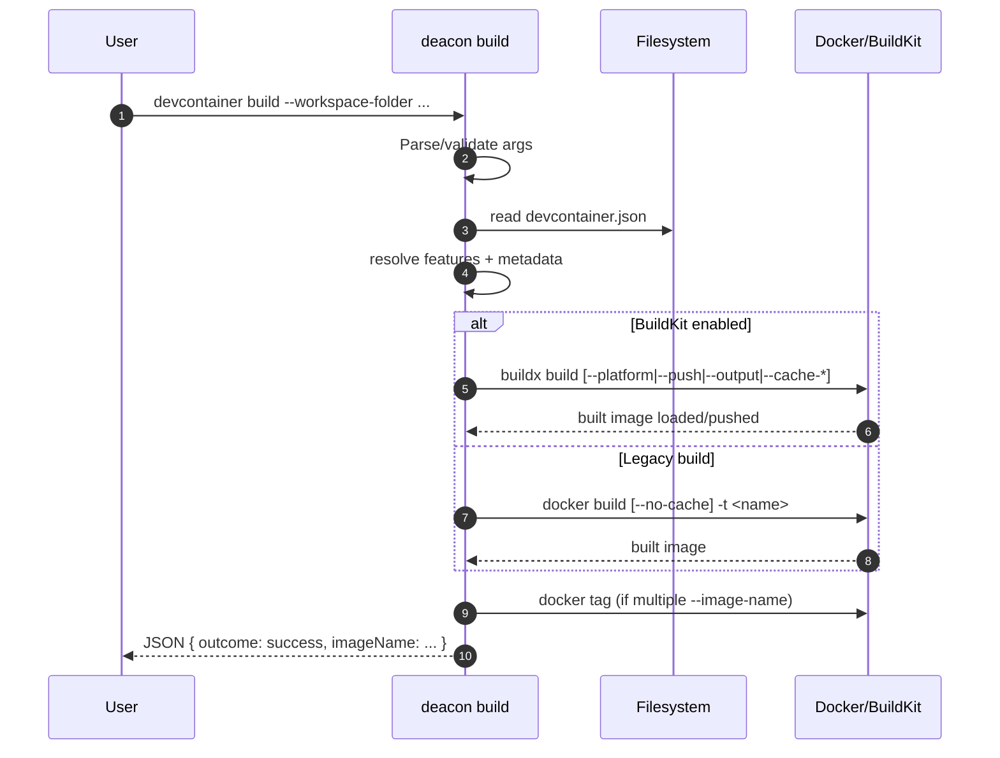
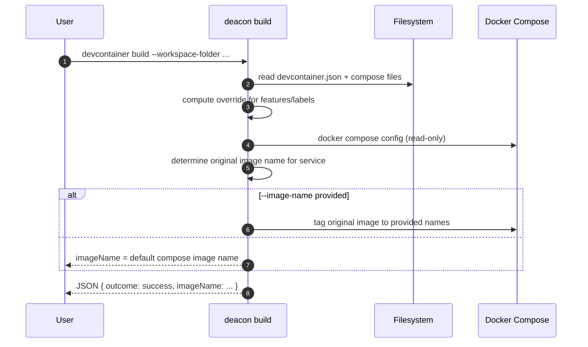
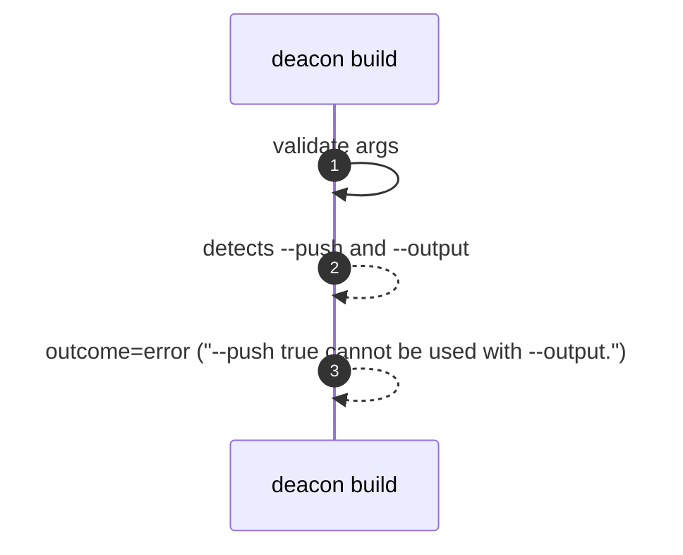
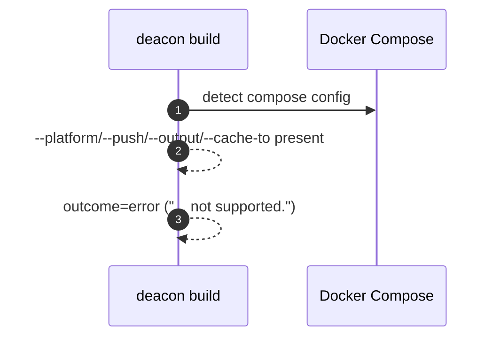
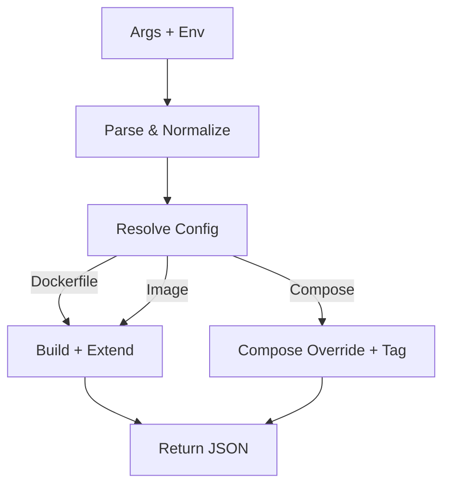

# Build Subcommand Diagrams

## Sequence – Dockerfile/Image Flow

## Sequence – Compose Flow

## Error Flow – Mutually Exclusive push/output

## Error Flow – Compose unsupported flags

## Data Flow Overview

