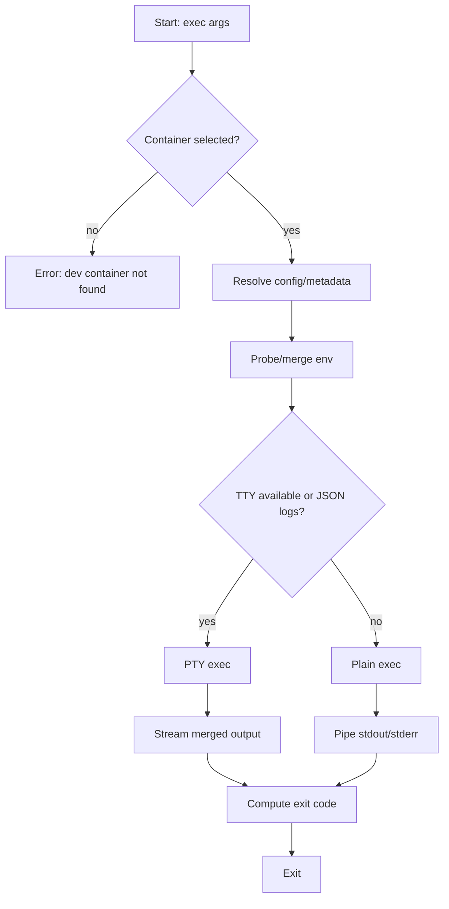

# Exec Subcommand Diagrams

```mermaid
sequenceDiagram
    autonumber
    participant U as User
    participant CLI as Devcontainer CLI
    participant D as Docker CLI
    participant C as Container

    U->>CLI: devcontainer exec [opts] <cmd> [args]
    CLI->>CLI: Parse & validate args
    CLI->>CLI: Resolve workspace/config (optional)
    CLI->>D: docker inspect / list (find container)
    D-->>CLI: Container details
    CLI->>CLI: Merge config with image metadata
    CLI->>C: Probe user environment (userEnvProbe)
    C-->>CLI: Shell env (PATH, etc.)
    CLI->>CLI: Merge env (shell → CLI --remote-env → config remoteEnv)
    CLI->>D: docker exec [-i -t] [-u user] [-e ...] [-w cwd] <id> <cmd> [args]
    D->>C: Execute process
    C-->>D: Streams (stdout/stderr) + exit status
    D-->>CLI: Streams + exit code/signal
    CLI-->>U: Stream output; exit with code or 128+signal
```



```mermaid
sequenceDiagram
    autonumber
    participant CLI as Devcontainer CLI
    participant D as Docker CLI
    participant C as Container
    Note over CLI: Error flow (invalid flags)
    CLI->>CLI: Validate flags
    CLI-->>CLI: Throw parse error
    CLI-->>CLI: Exit 1

    Note over CLI,D,C: Error flow (docker exec failure)
    CLI->>D: docker exec ...
    D-->>C: Start process
    C-->>D: Non-zero exit
    D-->>CLI: code/signal
    CLI-->>CLI: Map to exit (code or 128+signal)
    CLI-->>CLI: Exit non-zero
```

