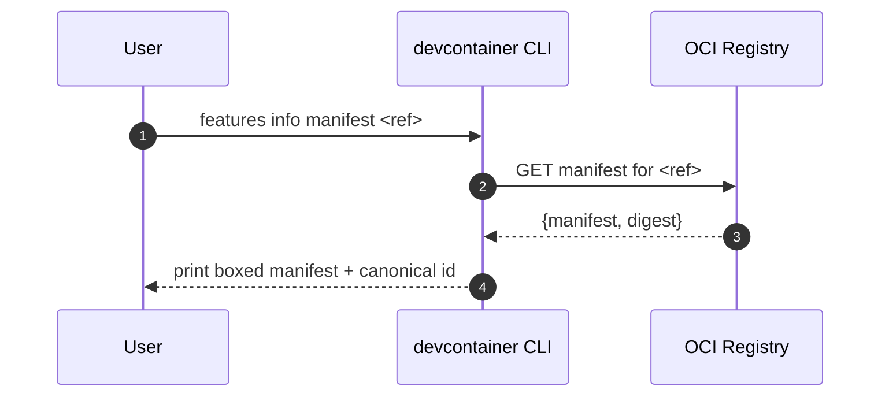
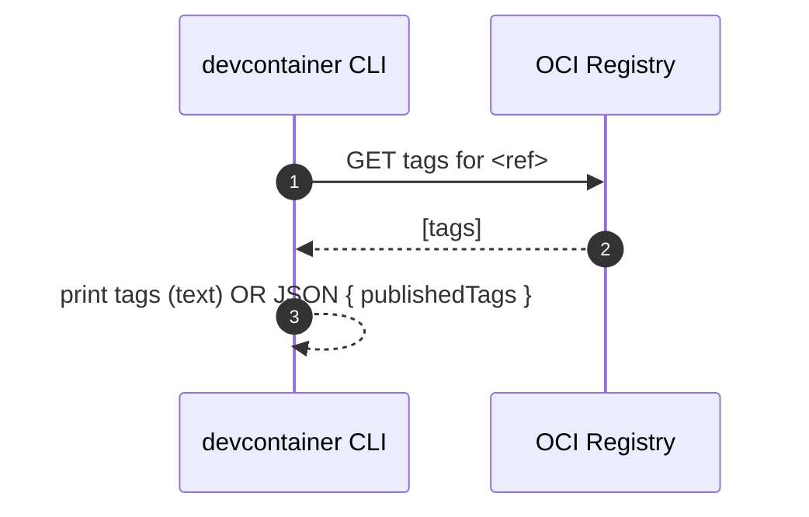
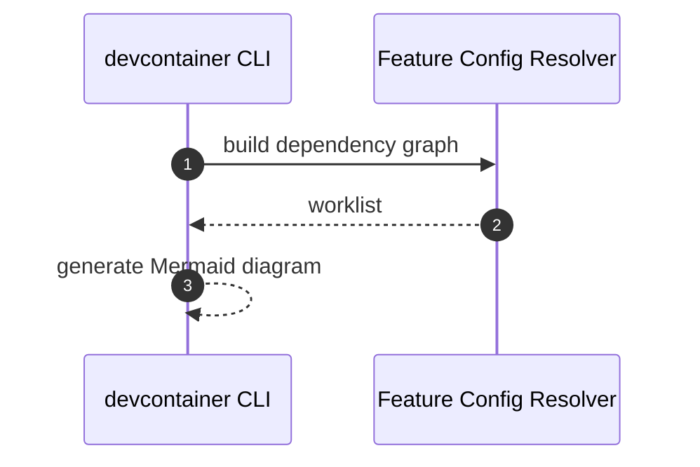

# Features Info Diagrams

## Sequence: Manifest Mode

```mermaid
sequenceDiagram
    autonumber
    participant U as User
    participant CLI as devcontainer CLI
    participant OCI as OCI Registry
    U->>CLI: features info manifest <ref>
    CLI->>OCI: GET manifest for <ref>
    OCI-->>CLI: {manifest, digest}
    CLI-->>U: print boxed manifest + canonical id
```

## Sequence: Tags Mode

```mermaid
sequenceDiagram
    autonumber
    participant CLI as devcontainer CLI
    participant OCI as OCI Registry
    CLI->>OCI: GET tags for <ref>
    OCI-->>CLI: [tags]
    CLI-->>CLI: print tags (text) OR JSON { publishedTags }
```

## Sequence: Dependencies Mode (text)

```mermaid
sequenceDiagram
    autonumber
    participant CLI as devcontainer CLI
    participant CFG as Feature Config Resolver
    CLI->>CFG: build dependency graph
    CFG-->>CLI: worklist
    CLI-->>CLI: generate Mermaid diagram
```

