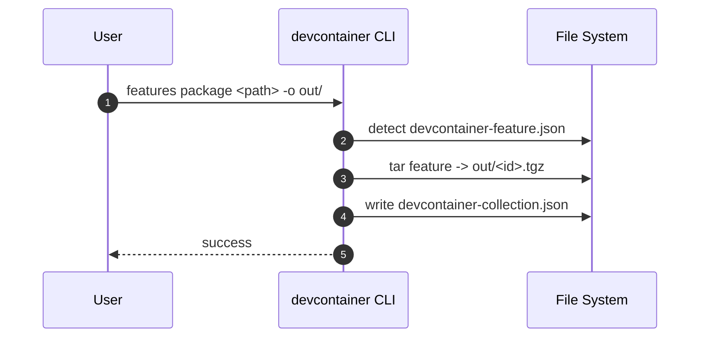
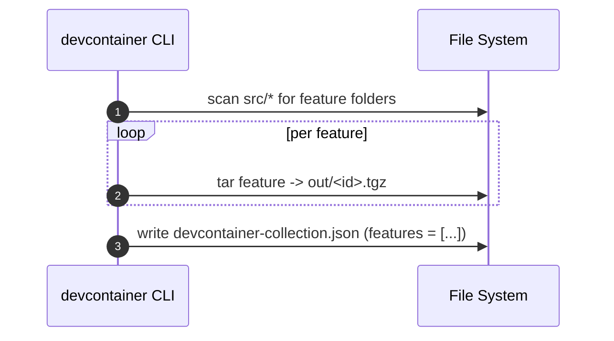

# Features Package Diagrams

## Sequence: Single Feature Packaging

```mermaid
sequenceDiagram
    autonumber
    participant U as User
    participant CLI as devcontainer CLI
    participant FS as File System
    U->>CLI: features package <path> -o out/
    CLI->>FS: detect devcontainer-feature.json
    CLI->>FS: tar feature -> out/<id>.tgz
    CLI->>FS: write devcontainer-collection.json
    CLI-->>U: success
```

## Sequence: Collection Packaging

```mermaid
sequenceDiagram
    autonumber
    participant CLI as devcontainer CLI
    participant FS as File System
    CLI->>FS: scan src/* for feature folders
    loop per feature
      CLI->>FS: tar feature -> out/<id>.tgz
    end
    CLI->>FS: write devcontainer-collection.json (features = [...])
```

