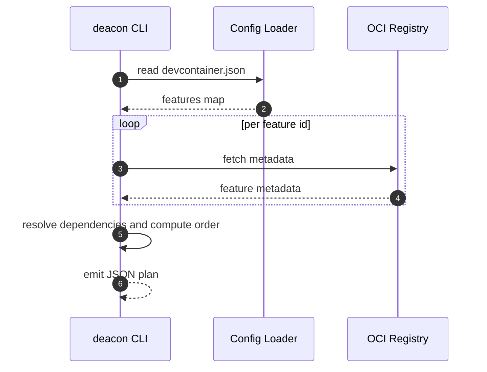

# Features Plan Diagrams

## Sequence: Plan Computation

```mermaid
sequenceDiagram
    autonumber
    participant CLI as deacon CLI
    participant CFG as Config Loader
    participant OCI as OCI Registry
    CLI->>CFG: read devcontainer.json
    CFG-->>CLI: features map
    loop per feature id
      CLI->>OCI: fetch metadata
      OCI-->>CLI: feature metadata
    end
    CLI->>CLI: resolve dependencies and compute order
    CLI-->>CLI: emit JSON plan
```

