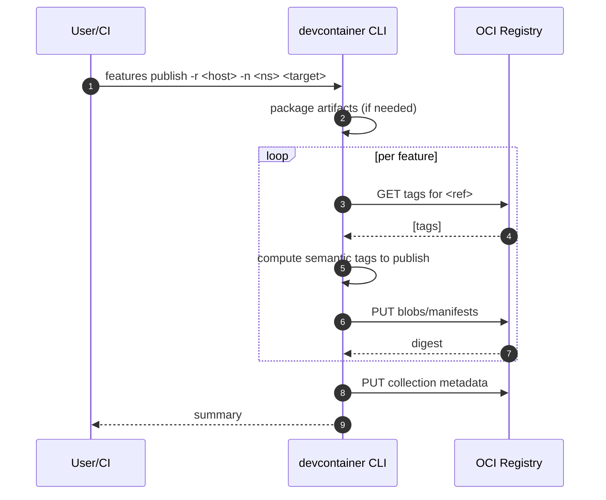

# Features Publish Diagrams

## Sequence: Publish Flow

```mermaid
sequenceDiagram
    autonumber
    participant U as User/CI
    participant CLI as devcontainer CLI
    participant OCI as OCI Registry
    U->>CLI: features publish -r <host> -n <ns> <target>
    CLI->>CLI: package artifacts (if needed)
    loop per feature
      CLI->>OCI: GET tags for <ref>
      OCI-->>CLI: [tags]
      CLI->>CLI: compute semantic tags to publish
      CLI->>OCI: PUT blobs/manifests
      OCI-->>CLI: digest
    end
    CLI->>OCI: PUT collection metadata
    CLI-->>U: summary
```

