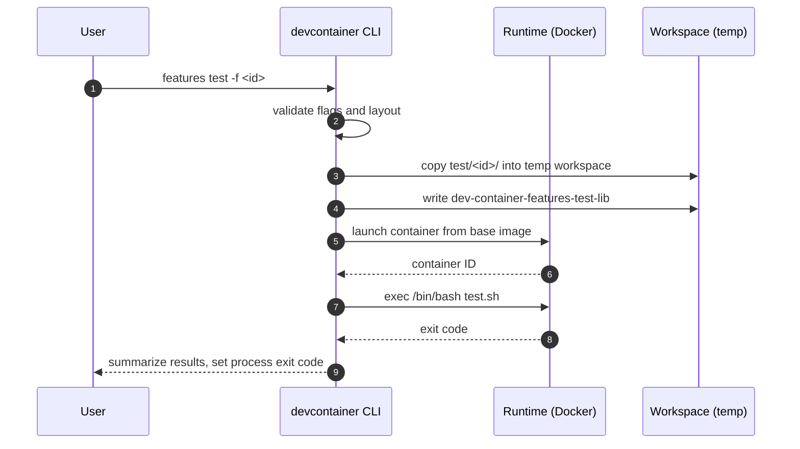
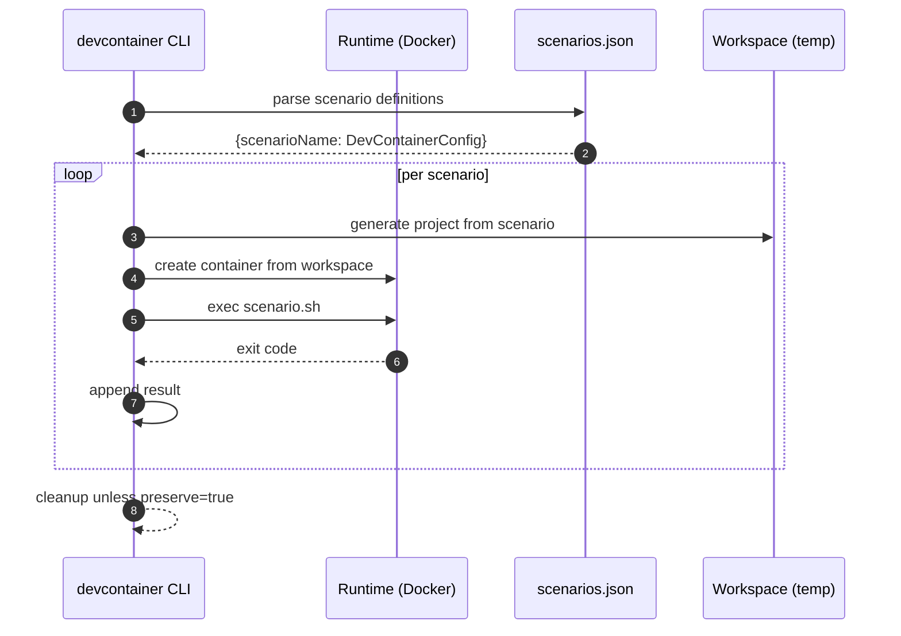

# Features Test Diagrams

## Sequence: Autogenerated Test (test.sh)


## Sequence: Scenario Test


## Data Flow: Results Aggregation
```mermaid
flowchart TD
  A[Run Tests] --> B[Collect { testName, result }]
  B --> C{All Passed?}
  C -- yes --> D[Exit 0]
  C -- no --> E[Exit 1]
```

