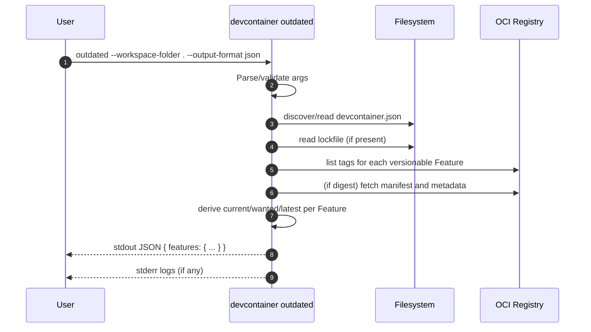
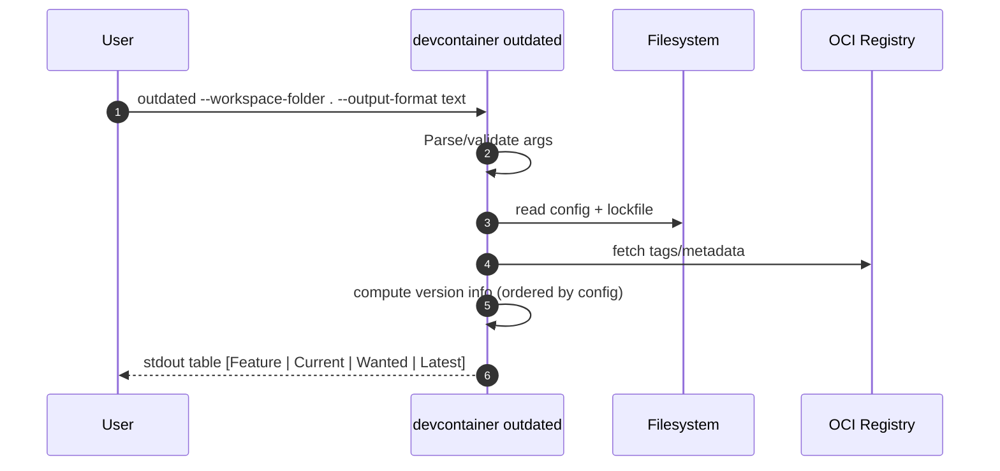
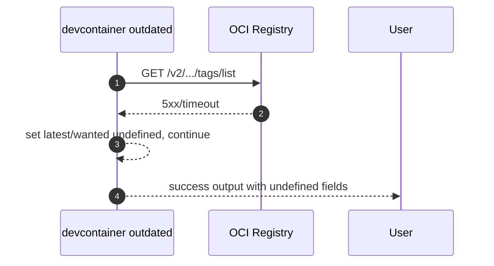
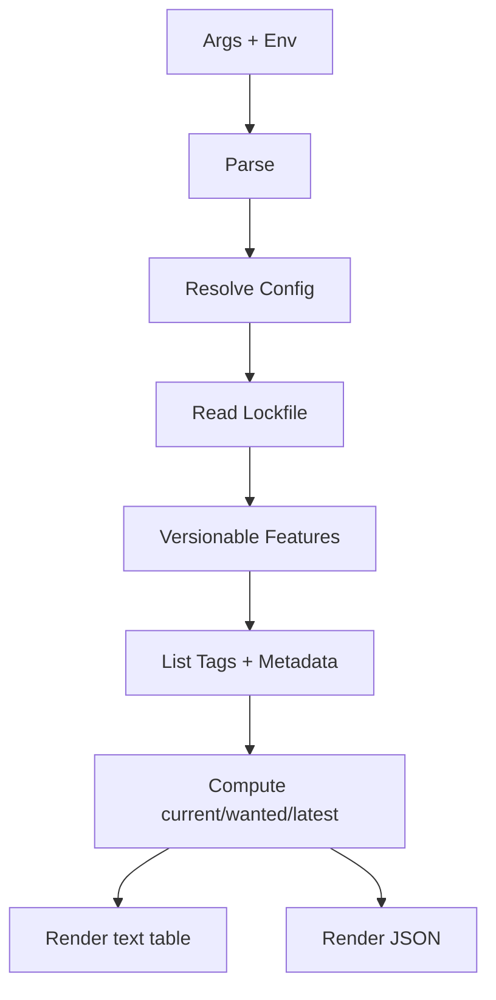

# Outdated Subcommand Diagrams

## Sequence – JSON Output

```mermaid
sequenceDiagram
    autonumber
    participant U as User
    participant CLI as devcontainer outdated
    participant FS as Filesystem
    participant OCI as OCI Registry

    U->>CLI: outdated --workspace-folder . --output-format json
    CLI->>CLI: Parse/validate args
    CLI->>FS: discover/read devcontainer.json
    CLI->>FS: read lockfile (if present)
    CLI->>OCI: list tags for each versionable Feature
    CLI->>OCI: (if digest) fetch manifest and metadata
    CLI->>CLI: derive current/wanted/latest per Feature
    CLI-->>U: stdout JSON { features: { ... } }
    CLI-->>U: stderr logs (if any)
```

## Sequence – Text Table Output

```mermaid
sequenceDiagram
    autonumber
    participant U as User
    participant CLI as devcontainer outdated
    participant FS as Filesystem
    participant OCI as OCI Registry

    U->>CLI: outdated --workspace-folder . --output-format text
    CLI->>CLI: Parse/validate args
    CLI->>FS: read config + lockfile
    CLI->>OCI: fetch tags/metadata
    CLI->>CLI: compute version info (ordered by config)
    CLI-->>U: stdout table [Feature | Current | Wanted | Latest]
```

## Error Flow – Registry Unavailable

```mermaid
sequenceDiagram
    autonumber
    participant CLI as devcontainer outdated
    participant OCI as OCI Registry

    CLI->>OCI: GET /v2/.../tags/list
    OCI-->>CLI: 5xx/timeout
    CLI-->>CLI: set latest/wanted undefined, continue
    CLI-->>User: success output with undefined fields
```

## Data Flow Overview

```mermaid
flowchart TD
    A[Args + Env] --> B[Parse]
    B --> C[Resolve Config]
    C --> D[Read Lockfile]
    D --> E[Versionable Features]
    E --> F[List Tags + Metadata]
    F --> G[Compute current/wanted/latest]
    G --> H[Render text table]
    G --> I[Render JSON]
```

