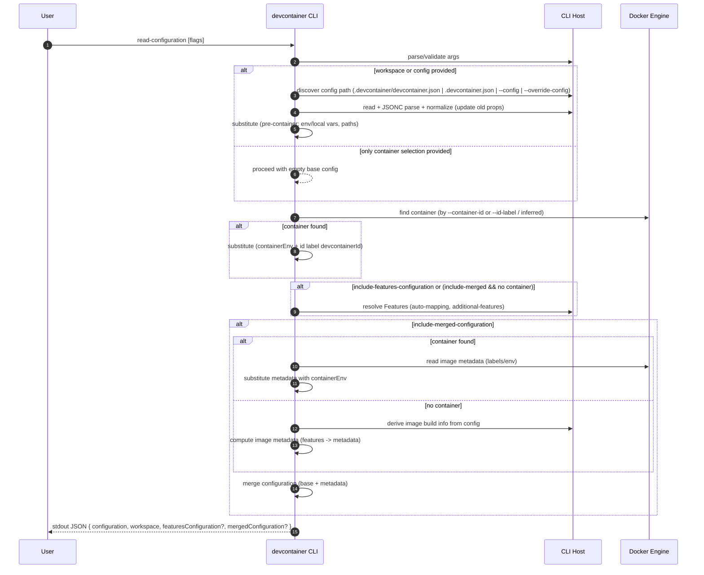
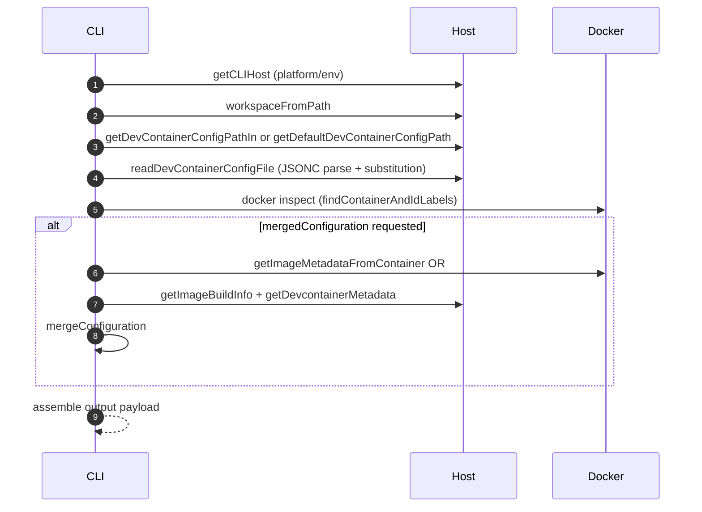
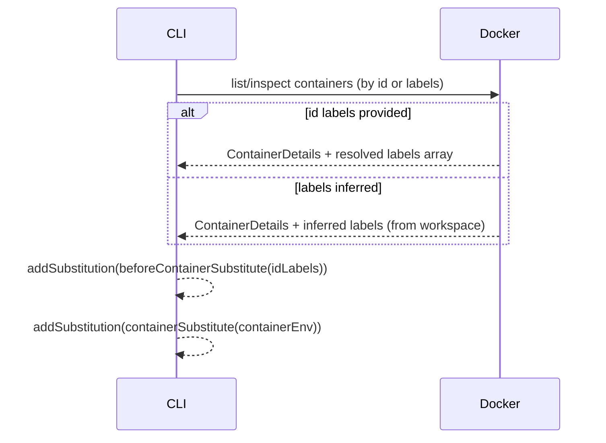

## Sequence Diagrams

```mermaid
sequenceDiagram
  autonumber
  participant U as User
  participant CLI as devcontainer CLI
  participant Host as CLI Host
  participant D as Docker Engine

  U->>CLI: read-configuration [flags]
  CLI->>Host: parse/validate args
  alt workspace or config provided
    CLI->>Host: discover config path (.devcontainer/devcontainer.json | .devcontainer.json | --config | --override-config)
    CLI->>Host: read + JSONC parse + normalize (update old props)
    CLI->>CLI: substitute (pre-container: env/local vars, paths)
  else only container selection provided
    CLI-->>CLI: proceed with empty base config
  end
  CLI->>D: find container (by --container-id or --id-label / inferred)
  alt container found
    CLI->>CLI: substitute (containerEnv + id label devcontainerId)
  end
  alt include-features-configuration or (include-merged && no container)
    CLI->>Host: resolve Features (auto-mapping, additional-features)
  end
  alt include-merged-configuration
    alt container found
      CLI->>D: read image metadata (labels/env)
      CLI->>CLI: substitute metadata with containerEnv
    else no container
      CLI->>Host: derive image build info from config
      CLI->>CLI: compute image metadata (features -> metadata)
    end
    CLI->>CLI: merge configuration (base + metadata)
  end
  CLI-->>U: stdout JSON { configuration, workspace, featuresConfiguration?, mergedConfiguration? }
```

```mermaid
sequenceDiagram
  autonumber
  participant CLI
  participant Host
  participant D as Docker

  CLI->>Host: getCLIHost (platform/env)
  CLI->>Host: workspaceFromPath
  CLI->>Host: getDevContainerConfigPathIn or getDefaultDevContainerConfigPath
  CLI->>Host: readDevContainerConfigFile (JSONC parse + substitution)
  CLI->>D: docker inspect (findContainerAndIdLabels)
  alt mergedConfiguration requested
    CLI->>D: getImageMetadataFromContainer OR
    CLI->>Host: getImageBuildInfo + getDevcontainerMetadata
    CLI->>CLI: mergeConfiguration
  end
  CLI-->>CLI: assemble output payload
```

```mermaid
sequenceDiagram
  participant CLI
  participant D as Docker

  CLI->>D: list/inspect containers (by id or labels)
  alt id labels provided
    D-->>CLI: ContainerDetails + resolved labels array
  else labels inferred
    D-->>CLI: ContainerDetails + inferred labels (from workspace)
  end
  CLI-->>CLI: addSubstitution(beforeContainerSubstitute(idLabels))
  CLI-->>CLI: addSubstitution(containerSubstitute(containerEnv))
```

