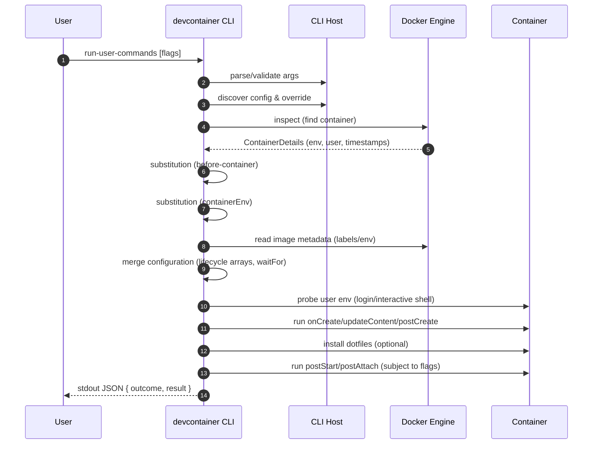
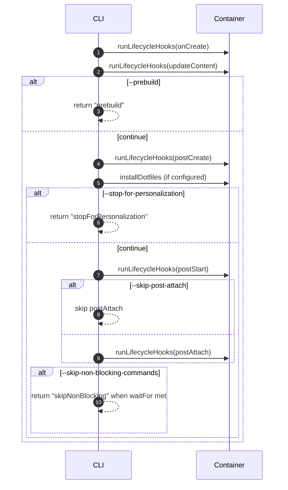
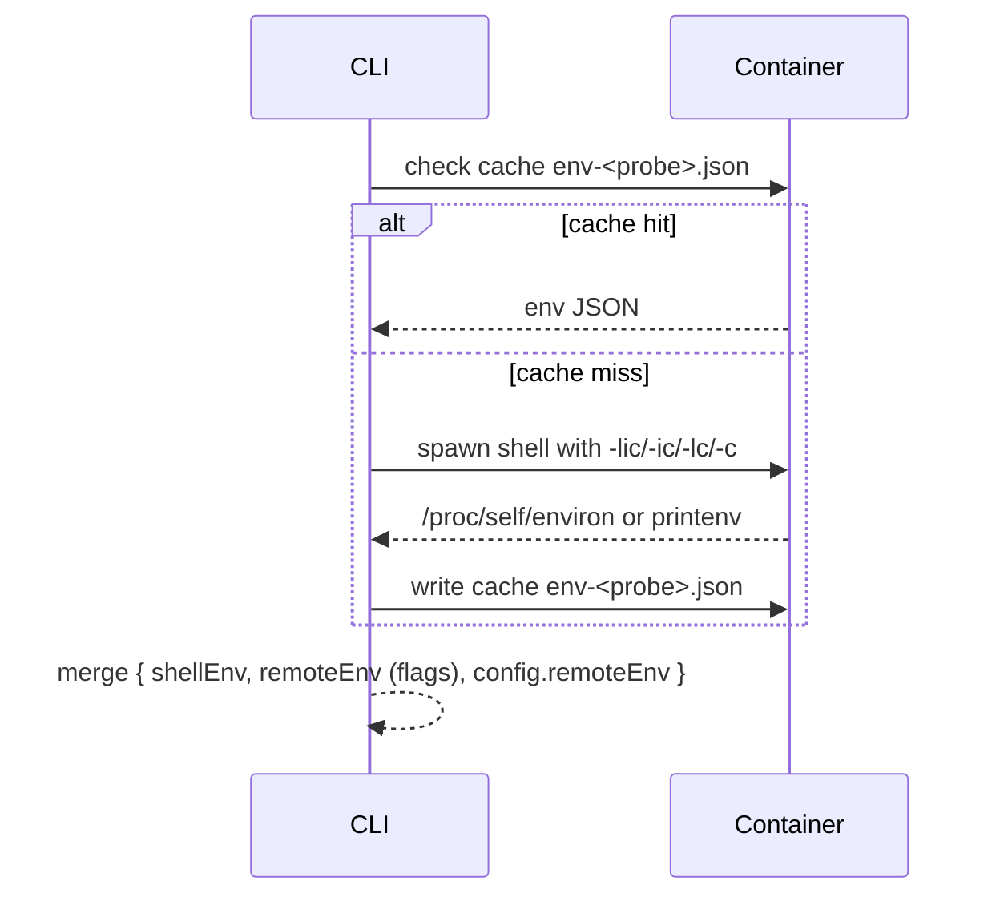
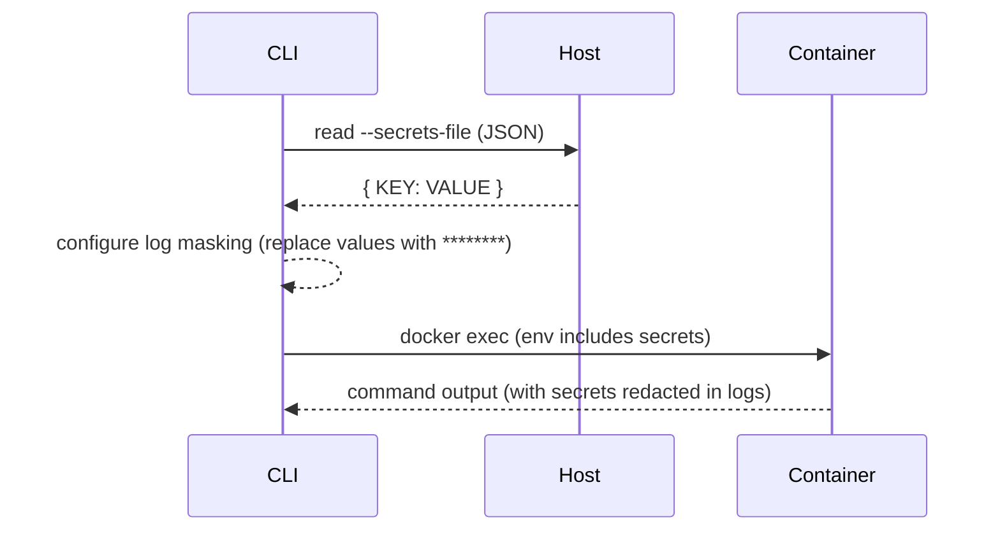

## Sequence Diagrams

```mermaid
sequenceDiagram
  autonumber
  participant U as User
  participant CLI as devcontainer CLI
  participant Host as CLI Host
  participant D as Docker Engine
  participant C as Container

  U->>CLI: run-user-commands [flags]
  CLI->>Host: parse/validate args
  CLI->>Host: discover config & override
  CLI->>D: inspect (find container)
  D-->>CLI: ContainerDetails (env, user, timestamps)
  CLI->>CLI: substitution (before-container)
  CLI->>CLI: substitution (containerEnv)
  CLI->>D: read image metadata (labels/env)
  CLI->>CLI: merge configuration (lifecycle arrays, waitFor)
  CLI->>C: probe user env (login/interactive shell)
  CLI->>C: run onCreate/updateContent/postCreate
  CLI->>C: install dotfiles (optional)
  CLI->>C: run postStart/postAttach (subject to flags)
  CLI-->>U: stdout JSON { outcome, result }
```

```mermaid
sequenceDiagram
  autonumber
  participant CLI
  participant C as Container

  CLI->>C: runLifecycleHooks(onCreate)
  CLI->>C: runLifecycleHooks(updateContent)
  alt --prebuild
    CLI-->>CLI: return "prebuild"
  else continue
    CLI->>C: runLifecycleHooks(postCreate)
    CLI->>C: installDotfiles (if configured)
    alt --stop-for-personalization
      CLI-->>CLI: return "stopForPersonalization"
    else continue
      CLI->>C: runLifecycleHooks(postStart)
      alt --skip-post-attach
        CLI-->>CLI: skip postAttach
      else
        CLI->>C: runLifecycleHooks(postAttach)
      end
      alt --skip-non-blocking-commands
        CLI-->>CLI: return "skipNonBlocking" when waitFor met
      end
    end
  end
```

```mermaid
sequenceDiagram
  participant CLI
  participant C as Container

  CLI->>C: check cache env-<probe>.json
  alt cache hit
    C-->>CLI: env JSON
  else cache miss
    CLI->>C: spawn shell with -lic/-ic/-lc/-c
    C-->>CLI: /proc/self/environ or printenv
    CLI->>C: write cache env-<probe>.json
  end
  CLI-->>CLI: merge { shellEnv, remoteEnv (flags), config.remoteEnv }
```

```mermaid
sequenceDiagram
  participant CLI
  participant Host
  participant C as Container

  CLI->>Host: read --secrets-file (JSON)
  Host-->>CLI: { KEY: VALUE }
  CLI-->>CLI: configure log masking (replace values with ********)
  CLI->>C: docker exec (env includes secrets)
  C-->>CLI: command output (with secrets redacted in logs)
```

