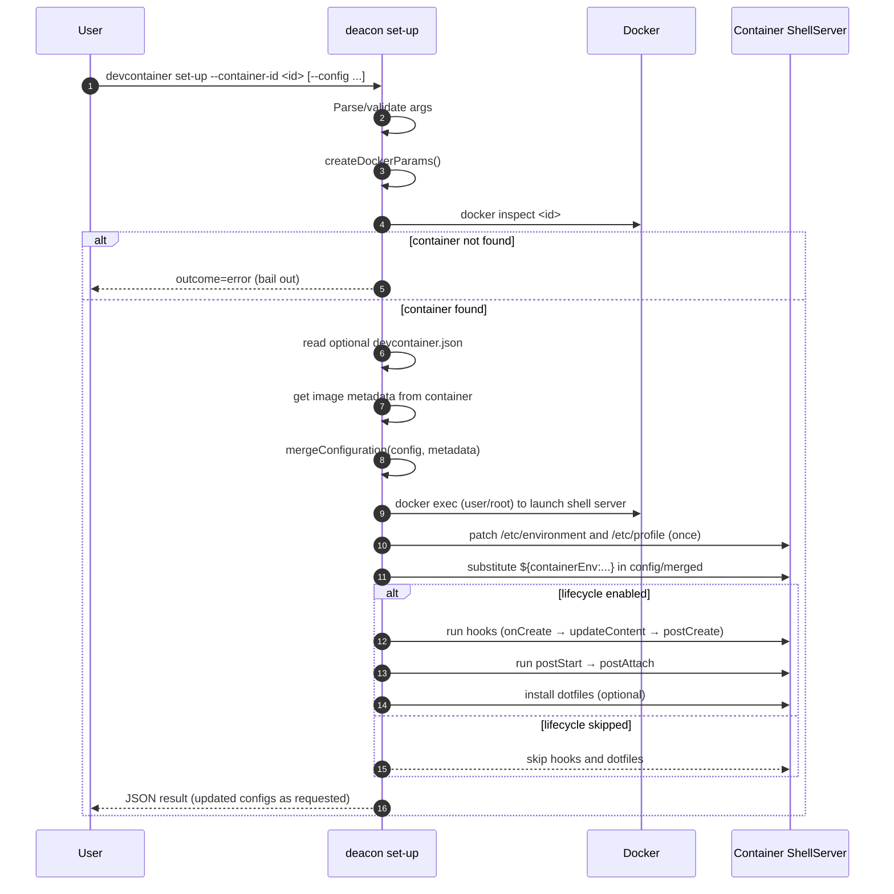
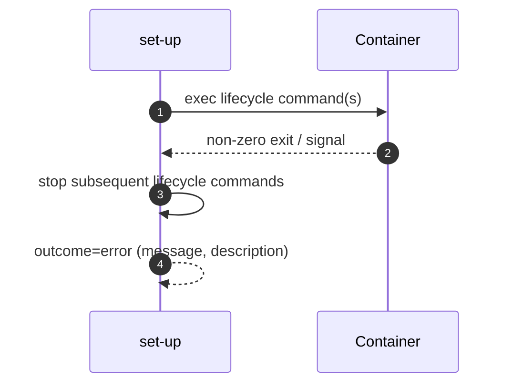
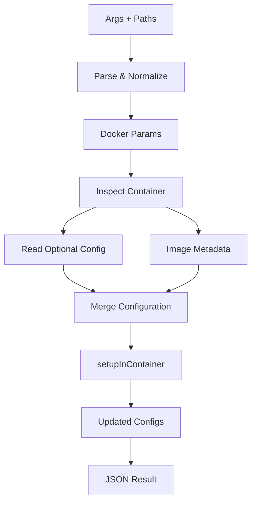

# Set-Up Subcommand Diagrams

## Sequence – Set Up Existing Container

```mermaid
sequenceDiagram
    autonumber
    participant U as User
    participant CLI as deacon set-up
    participant D as Docker
    participant C as Container ShellServer

    U->>CLI: devcontainer set-up --container-id <id> [--config ...]
    CLI->>CLI: Parse/validate args
    CLI->>CLI: createDockerParams()
    CLI->>D: docker inspect <id>
    alt container not found
        CLI-->>U: outcome=error (bail out)
    else container found
        CLI->>CLI: read optional devcontainer.json
        CLI->>CLI: get image metadata from container
        CLI->>CLI: mergeConfiguration(config, metadata)
        CLI->>D: docker exec (user/root) to launch shell server
        CLI->>C: patch /etc/environment and /etc/profile (once)
        CLI->>C: substitute ${containerEnv:...} in config/merged
        alt lifecycle enabled
            CLI->>C: run hooks (onCreate → updateContent → postCreate)
            CLI->>C: run postStart → postAttach
            CLI->>C: install dotfiles (optional)
        else lifecycle skipped
            CLI-->>C: skip hooks and dotfiles
        end
        CLI-->>U: JSON result (updated configs as requested)
    end
```

## Error Flow – Hook Failure

```mermaid
sequenceDiagram
    autonumber
    participant CLI as set-up
    participant C as Container

    CLI->>C: exec lifecycle command(s)
    C-->>CLI: non-zero exit / signal
    CLI->>CLI: stop subsequent lifecycle commands
    CLI-->>CLI: outcome=error (message, description)
```

## Data Flow Overview

```mermaid
flowchart TD
    A[Args + Paths] --> B[Parse & Normalize]
    B --> C[Docker Params]
    C --> D[Inspect Container]
    D --> E[Read Optional Config]
    D --> F[Image Metadata]
    E --> G[Merge Configuration]
    F --> G
    G --> H[setupInContainer]
    H --> I[Updated Configs]
    I --> J[JSON Result]
```

