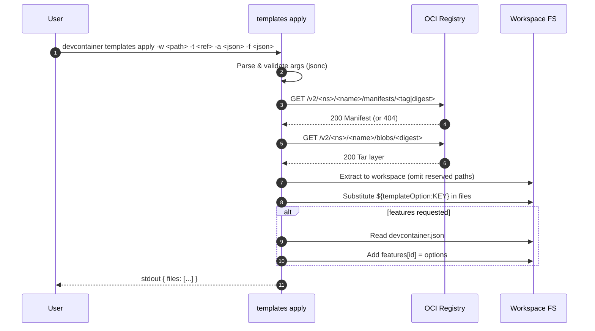
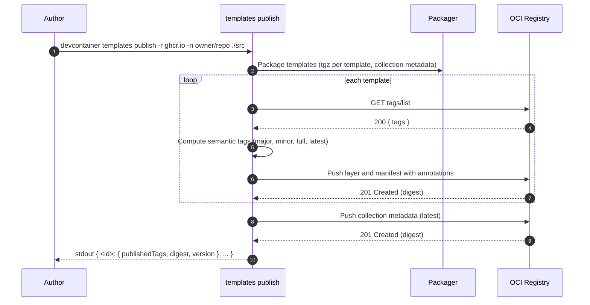
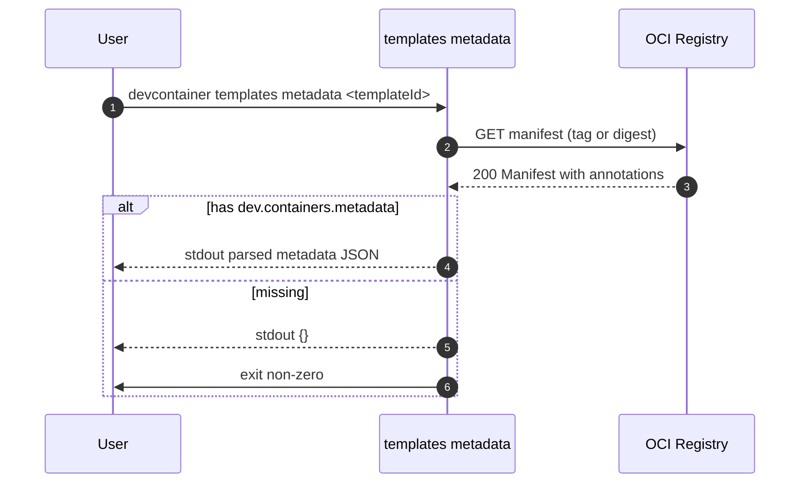

# Templates Subcommand — Diagrams

## Sequence — templates apply



## Sequence — templates publish



## Sequence — templates metadata



## ASCII — Data Flow (apply)

```
┌───────────────┐
│ User Input    │
└───────┬───────┘
        │ args
        ▼
┌─────────────────────┐
│ Parse & Validate    │
└───────┬─────────────┘
        │ oci-ref
        ▼
┌─────────────────────┐      manifest      ┌───────────────┐
│ Fetch Manifest      ├───────────────────▶│ Resolve Layer │
└───────┬─────────────┘                    └───────┬───────┘
        │ blob url                                  │ digest
        ▼                                           ▼
┌─────────────────────┐  tar  ┌────────────────────────────┐
│ Download & Extract  ├──────▶│ Write Files to Workspace   │
└───────┬─────────────┘       └───────────┬────────────────┘
        │                                   │
        ▼                                   ▼
┌─────────────────────┐            ┌────────────────────────┐
│ Option Substitution │            │ Feature Injection      │
└───────┬─────────────┘            └───────────┬────────────┘
        │                                   │
        ▼                                   ▼
               ┌───────────────────────────────────────────┐
               │ stdout { files: [...] } + logs to stderr  │
               └───────────────────────────────────────────┘
```

