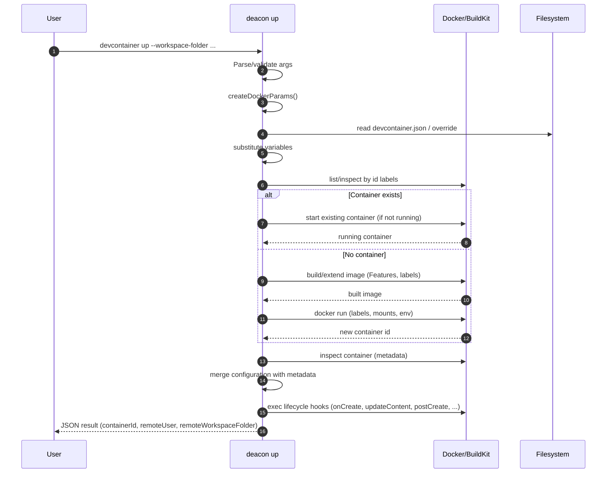
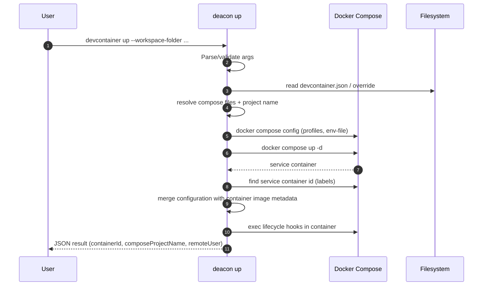
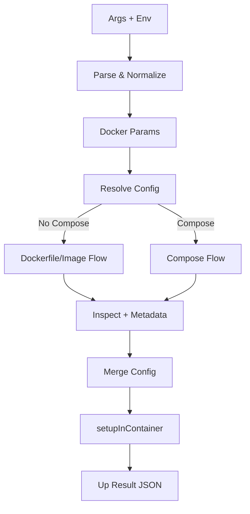

# Up Subcommand Diagrams

## Sequence – Dockerfile/Image Flow


## Sequence – Docker Compose Flow


## Error Flow – Lifecycle Command Failure
```mermaid
sequenceDiagram
    autonumber
    participant CLI as deacon up
    participant C as Container

    CLI->>C: exec lifecycle command(s)
    C-->>CLI: non-zero exit / signal
    CLI->>CLI: mark lifecycle failed; stop further user commands
    CLI-->>CLI: outcome=error (message, description)
```

## Data Flow Overview


