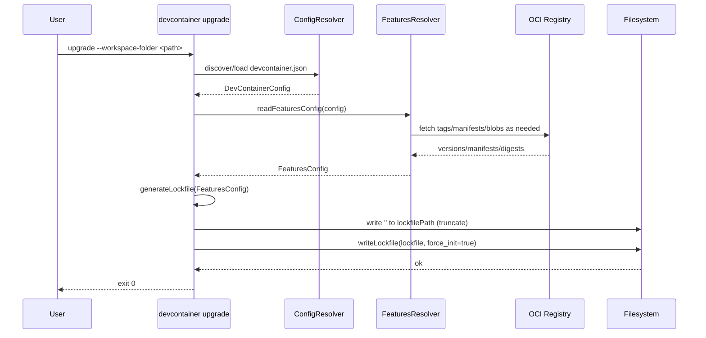
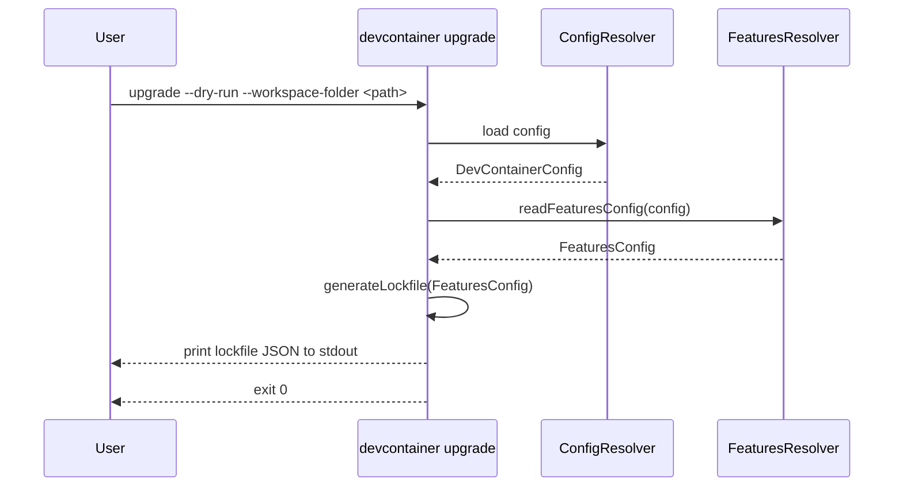
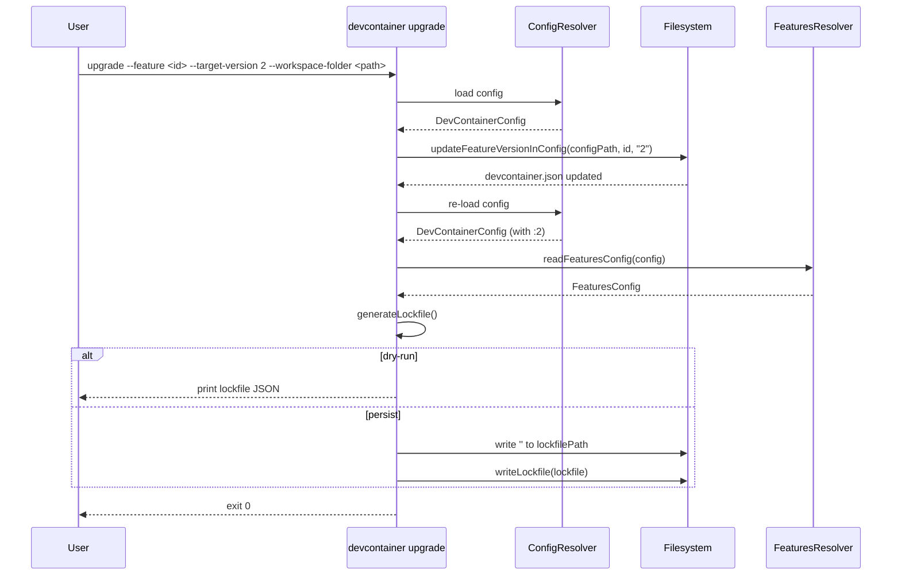
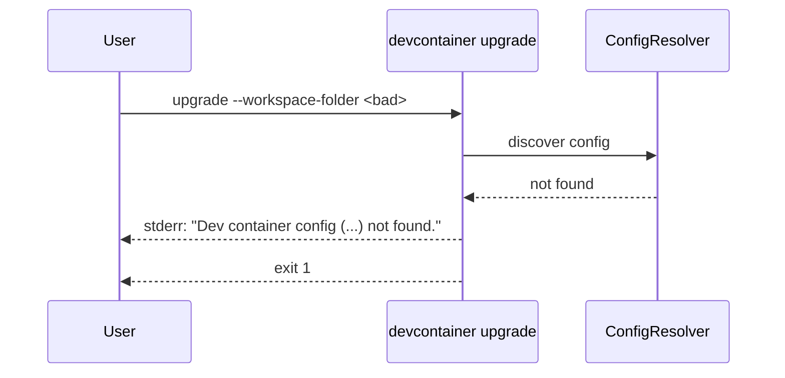

# Upgrade Subcommand — Diagrams

## Sequence — Standard Upgrade (persist lockfile)

## Sequence — Dry Run (stdout only)

## Sequence — Pin Feature Then Upgrade

## Error Flow — Config Not Found

