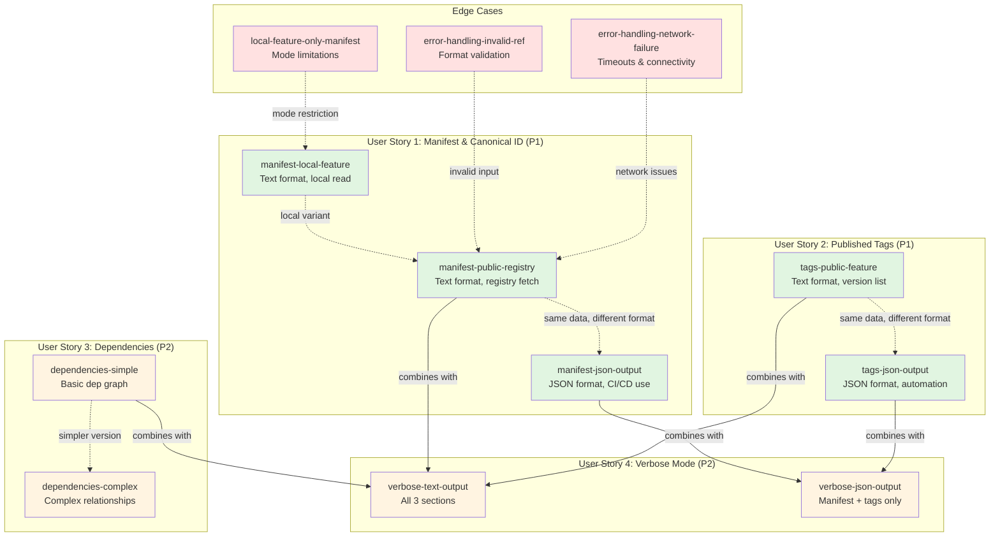

# Features Info Examples - Visual Guide

## Example Relationship Diagram



**Legend:**
- 🟢 Green: Priority 1 (P1) - Core functionality
- 🟡 Yellow: Priority 2 (P2) - Enhanced features
- 🔴 Red: Edge cases - Error handling

**Arrows:**
- Solid (`-->`) - Combines/aggregates functionality
- Dotted (`-.->`) - Variant or related example

## Learning Path

### Beginner - Start Here
1. **manifest-local-feature** - Simplest example, no network required
2. **manifest-public-registry** - Basic registry fetch
3. **tags-public-feature** - Discover available versions

### Intermediate
4. **manifest-json-output** - Automation-friendly output
5. **dependencies-simple** - Understanding relationships
6. **verbose-text-output** - Complete information view

### Advanced
7. **verbose-json-output** - Complex automation scenarios
8. **dependencies-complex** - Intricate dependency graphs
9. **error-handling-*** - Production error handling

## Feature Comparison Matrix

| Example | Network | Local | Text | JSON | Registry Auth | Dependencies |
|---------|---------|-------|------|------|---------------|--------------|
| manifest-public-registry | ✅ | ❌ | ✅ | ❌ | Optional | No |
| manifest-local-feature | ❌ | ✅ | ✅ | ❌ | N/A | No |
| manifest-json-output | ✅ | ❌ | ❌ | ✅ | Optional | No |
| tags-public-feature | ✅ | ❌ | ✅ | ❌ | Optional | No |
| tags-json-output | ✅ | ❌ | ❌ | ✅ | Optional | No |
| dependencies-simple | ❌ | ✅ | ✅ | ❌ | N/A | Yes |
| dependencies-complex | ❌ | ✅ | ✅ | ❌ | N/A | Yes |
| verbose-text-output | ✅ | ❌ | ✅ | ❌ | Optional | Yes |
| verbose-json-output | ✅ | ❌ | ❌ | ✅ | Optional | Partial |
| error-handling-invalid-ref | ❌ | ❌ | ✅ | ✅ | N/A | No |
| error-handling-network-failure | ❌ | ❌ | ✅ | ✅ | N/A | No |
| local-feature-only-manifest | ❌ | ✅ | ✅ | ✅ | N/A | No |

## Use Case Decision Tree

```
Need feature information?
│
├─ Local feature during development?
│  └─ manifest-local-feature ✅
│
├─ Verify feature digest for security?
│  └─ manifest-json-output ✅
│
├─ Discover available versions?
│  └─ tags-public-feature (text) or tags-json-output (automation) ✅
│
├─ Understand feature dependencies?
│  └─ dependencies-simple or dependencies-complex ✅
│
├─ Complete overview needed?
│  └─ verbose-text-output (humans) or verbose-json-output (machines) ✅
│
└─ Testing error handling?
   └─ error-handling-* examples ✅
```

## Example Complexity Levels

### Level 1: Basic (No prerequisites)
- manifest-local-feature
- dependencies-simple
- error-handling-invalid-ref

### Level 2: Network Required
- manifest-public-registry
- tags-public-feature
- manifest-json-output
- tags-json-output

### Level 3: Advanced Integration
- verbose-text-output
- verbose-json-output
- dependencies-complex
- error-handling-network-failure

### Level 4: Production Scenarios
- All examples combined
- Custom authentication
- Error recovery workflows
- CI/CD integration patterns

## Testing Coverage Map

Each example covers specific acceptance scenarios from the spec:

| Example | US1.AS1 | US1.AS2 | US1.AS3 | US1.AS4 | US2.AS1 | US2.AS2 | US2.AS3 | US3.AS1 | US3.AS2 | US4.AS1-4 |
|---------|---------|---------|---------|---------|---------|---------|---------|---------|---------|-----------|
| manifest-public-registry | ✅ | ❌ | ❌ | ❌ | ❌ | ❌ | ❌ | ❌ | ❌ | ❌ |
| manifest-local-feature | ❌ | ❌ | ❌ | ✅ | ❌ | ❌ | ❌ | ❌ | ❌ | ❌ |
| manifest-json-output | ❌ | ✅ | ✅ | ❌ | ❌ | ❌ | ❌ | ❌ | ❌ | ❌ |
| tags-public-feature | ❌ | ❌ | ❌ | ❌ | ✅ | ❌ | ❌ | ❌ | ❌ | ❌ |
| tags-json-output | ❌ | ❌ | ❌ | ❌ | ❌ | ✅ | ✅ | ❌ | ❌ | ❌ |
| dependencies-simple | ❌ | ❌ | ❌ | ❌ | ❌ | ❌ | ❌ | ✅ | ✅ | ❌ |
| verbose-text-output | ❌ | ❌ | ❌ | ❌ | ❌ | ❌ | ❌ | ❌ | ❌ | ✅ |
| verbose-json-output | ❌ | ❌ | ❌ | ❌ | ❌ | ❌ | ❌ | ❌ | ❌ | ✅ |

**AS = Acceptance Scenario** (from spec.md User Stories)

## Quick Command Reference

```bash
# View the structure
tree examples/features-info -L 2

# Run all tests
cd examples/features-info && bash test-all-examples.sh

# Run specific test
cd examples/features-info/manifest-local-feature
deacon features info manifest ./sample-feature

# Enable network tests
export DEACON_NETWORK_TESTS=1

# Generate documentation
for dir in examples/features-info/*/; do
  echo "## $(basename "$dir")"
  cat "$dir/README.md" | head -20
done > all-examples.md
```

## Contributing New Examples

When adding a new example:
1. Create subdirectory under `examples/features-info/`
2. Include `README.md` with sections: Description, Use Case, Prerequisites, Running, Expected Output, Success Criteria
3. Add all required files (feature metadata, scripts)
4. Update main `README.md` index
5. Add test case to `test-all-examples.sh`
6. Update this visual guide
7. Run full test suite to verify

## Related Resources

- [Main README](README.md) - Complete examples overview
- [Quick Reference](QUICK_REFERENCE.md) - Command syntax and patterns
- [Test Suite](test-all-examples.sh) - Automated validation
- [Spec](../../docs/subcommand-specs/features-info/SPEC.md) - Authoritative behavior
