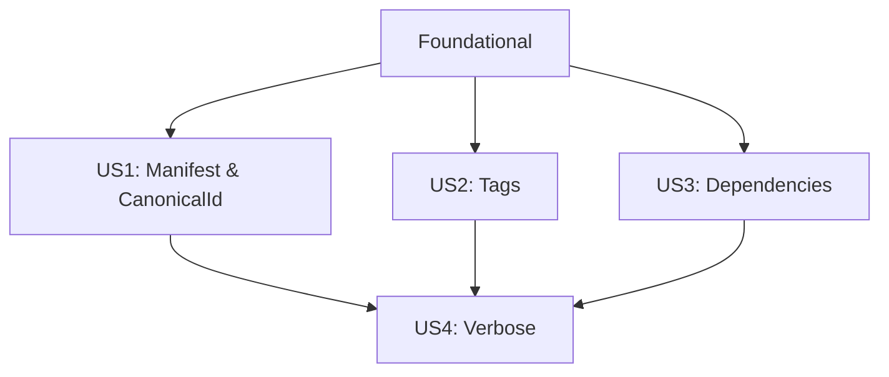

---

description: "Tasks to close behavior/output gaps in Features Info subcommand"
---

# Tasks: Features Info GAP Closure

**Input**: Design documents from `/specs/004-close-features-info-gap/`
**Prerequisites**: plan.md (required), spec.md (required), research.md, data-model.md, contracts/

**Tests**: Included per research.md (unit + CLI smoke). Tests are organized under each story.

**Organization**: Tasks are grouped by user story to enable independent implementation and testing.

## Format: `[ID] [P?] [Story] Description`

- [P]: Can run in parallel (different files, no dependencies)
- [Story]: US1, US2, US3, US4 (from spec.md)
- Each task includes an exact file path

---

## Phase 1: Setup (Shared Infrastructure)

**Purpose**: Lightweight documentation scaffolding to support acceptance tracking.

- [X] T001 [P] Create acceptance checklist doc in specs/004-close-features-info-gap/checklists/features-info.md

---

## Phase 2: Foundational (Blocking Prerequisites)

**Purpose**: Core utilities, data contracts, and CLI flag surface required by all stories.

- [X] T002 [P] Create text module stub in crates/core/src/text/mod.rs
- [X] T003 [P] Implement boxed text utility (Unicode headers) in crates/core/src/text/boxing.rs
- [X] T004 Expose text module from core lib (add `pub mod text;`) in crates/core/src/lib.rs
- [X] T005 Add `get_manifest_with_digest` (returns manifest + sha256 digest of body) in crates/core/src/oci.rs
- [X] T006 Implement tag pagination with Link headers and page/total cap (10 pages/1000 tags) in crates/core/src/oci.rs
- [X] T007 [P] Define Features Info data contracts (VerboseJson, PublishedTags, etc.) in crates/core/src/features_info.rs
- [X] T008 [P] Replace `--json` with `--output-format <text|json>` for `features info` in crates/deacon/src/cli.rs
- [X] T009 [P] Add unit tests for data contracts and helper serialization in crates/core/tests/features_info_models.rs

**Checkpoint**: Foundation ready — user story phases can now proceed independently (US1/US2 in parallel; US3 independent; US4 depends on US1–US3).

---

## Phase 3: User Story 1 — Inspect manifest and canonical ID (Priority: P1) 🎯 MVP

**Goal**: Fetch OCI manifest and compute/emit canonicalId; support local refs with `canonicalId: null`.

**Independent Test**: Run `deacon features info manifest <ref>` and validate text (boxed sections) and JSON output contract.

### Tests (write first)
- [X] T010 [P] [US1] Unit test: canonicalId computation from manifest bytes digest in crates/core/tests/canonical_id.rs
- [X] T011 [P] [US1] CLI smoke tests: text + JSON outputs and error `{}` cases in crates/deacon/tests/integration_features_info_manifest.rs

### Implementation
- [X] T012 [US1] Implement `manifest` mode using `default_fetcher_with_config(10s)` in crates/deacon/src/commands/features.rs
- [X] T013 [US1] Enforce JSON contract: stable keys; `{}` + exit 1 on errors; `canonicalId: null` for local refs in crates/deacon/src/commands/features.rs
- [X] T014 [US1] Canonical ID helper wiring to `get_manifest_with_digest` in crates/core/src/oci.rs
- [X] T015 [US1] Use core text boxing to print "Manifest" and "Canonical Identifier" sections in crates/deacon/src/commands/features.rs

**Checkpoint**: US1 independently demonstrable (text + JSON).

---

## Phase 4: User Story 2 — Discover published tags (Priority: P1)

**Goal**: List published tags with pagination, 10s timeout, and stable sorting.

**Independent Test**: Run `deacon features info tags <ref>` and validate text (boxed list) and JSON output `{ "publishedTags": [...] }`.

### Tests (write first)
- [X] T016 [P] [US2] Unit test: pagination parsing and caps (10 pages/1000 tags) in crates/core/tests/integration_oci_enhancements.rs
- [X] T017 [P] [US2] CLI smoke tests: text + JSON outputs and `{}` + exit 1 on error in crates/deacon/tests/integration_features_info_tags.rs

### Implementation
- [X] T018 [US2] Implement `tags` mode using paginated `list_tags` (sorted deterministically) in crates/deacon/src/commands/features.rs

**Checkpoint**: US2 independently demonstrable.

---

## Phase 5: User Story 3 — Visualize dependency graph (Priority: P2)

**Goal**: Render Mermaid dependency graph (text-only) from `dependsOn`/`installsAfter`.

**Independent Test**: Run `deacon features info dependencies <ref>` and validate boxed Mermaid `graph TD` output; JSON mode yields `{}` + exit 1.

### Tests (write first)
- [X] T019 [P] [US3] CLI smoke test: dependency graph (text-only) in crates/deacon/tests/integration_features_info_dependencies.rs

### Implementation
- [X] T020 [US3] Implement Mermaid graph builder and boxed section "Dependency Tree (Render with https://mermaid.live/)" in crates/deacon/src/commands/features.rs
- [X] T021 [US3] Enforce JSON mode behavior for dependencies: `{}` + exit 1 in crates/deacon/src/commands/features.rs

**Checkpoint**: US3 independently demonstrable (text-only).

---

## Phase 6: User Story 4 — Combined verbose view (Priority: P2)

**Goal**: Aggregate Manifest/Canonical ID, Published Tags, and Dependency Graph (text); in JSON emit only `{ manifest, canonicalId, publishedTags }` with partial-failure policy.

**Independent Test**: Run `deacon features info verbose <ref>`; verify text has all three boxed sections; JSON omits graph and returns `errors` map + exit 1 on any sub-mode failure.

### Tests (write first)
- [X] T022 [P] [US4] CLI smoke tests: verbose text + JSON partial-failure scenarios in crates/deacon/tests/integration_features_info_verbose.rs

### Implementation
- [X] T023 [US4] Implement verbose aggregator with partial-failure policy and exit 1 on any error in crates/deacon/src/commands/features.rs

**Checkpoint**: US4 independently demonstrable.

---

## Phase N: Polish & Cross-Cutting Concerns

- [X] T024 [P] Add tracing spans and fields: `feature.info.manifest|tags|dependencies|verbose` in crates/deacon/src/commands/features.rs
- [X] T025 [P] Update validation steps/examples in specs/004-close-features-info-gap/quickstart.md
- [X] T026 Ensure JSON output purity (stdout-only) coverage for features info in crates/deacon/tests/json_output_purity.rs

---

## Phase R: Remediation from Analysis

**Purpose**: Address analysis findings (test gating, auth coverage, local refs, CLI flags tests, docs/contracts clarifications).

- [X] T027 [P] Add network test gating helper to newly added networked CLI tests (skip unless `DEACON_NETWORK_TESTS=1`). Apply within each new test file under `crates/deacon/tests/`.
- [X] T028 Update CI to enable `DEACON_NETWORK_TESTS=1` for jobs running networked tests in `.github/workflows/ci.yml` (test/smoke jobs).
- [X] T029 Implement bearer-token auth and error mapping in `crates/core/src/oci.rs` (401/403 → typed error; redact secrets in logs).
- [X] T030 Add core auth tests with mocks in `crates/core/tests/integration_oci_auth.rs` (no network usage).
- [X] T031 Add CLI auth failure test stubs in `crates/deacon/tests/integration_features_info_auth.rs` (gated by `DEACON_NETWORK_TESTS`).
- [X] T032 Implement local ref handling to read `devcontainer-feature.json` (core helper and CLI wiring).
- [X] T033 Add CLI tests for local refs in `crates/deacon/tests/integration_features_info_local.rs` (canonicalId null).
- [X] T034 Add CLI flag tests for `features info` (`--output-format`, `--log-level`, legacy `--json` rejection) in `crates/deacon/tests/cli_flags_features_info.rs`.
- [X] T035 Normalize command naming in spec and tests to `deacon` (docs only).
- [X] T036 Fix path references in `plan.md` and `tasks.md` to use relative paths (docs only).
- [X] T037 Add JSON Schemas for outputs under `specs/004-close-features-info-gap/contracts/` (`features-info.manifest.json`, `features-info.tags.json`, `features-info.verbose.json`).
- [X] T038 Clarify sorting tie-breakers and local metadata source in `spec.md` (FR‑010; FR‑002/FR‑003).
- [X] T039 Add timeout tests with mocks in `crates/core/tests/oci_timeout.rs`.
- [X] T040 Extend JSON purity tests to include log-level variations and modes for features info (reuse `crates/deacon/tests/json_output_purity.rs` or add separate file if needed).
- [X] T041 Fix duplicate numbering in US4 acceptance scenarios in `spec.md`.

## Dependencies & Execution Order

### Phase Dependencies
- Setup (Phase 1): None
- Foundational (Phase 2): Blocks all user stories
- US1 (P1): Depends on Phase 2; independent of other stories
- US2 (P1): Depends on Phase 2; independent of other stories
- US3 (P2): Depends on Phase 2; independent of US1/US2
- US4 (P2): Depends on US1, US2, and US3 (text aggregation includes graph)
- Polish: After targeted stories are complete

### User Story Dependency Graph (Mermaid)

### Parallel Opportunities
- Within Phase 2: T002, T003, T007, T008, T009 can run in parallel; T004 follows T002/T003; T005–T006 can proceed in parallel on `oci.rs` if coordinated
- After Phase 2: US1 and US2 can proceed in parallel; US3 can also proceed in parallel; US4 waits for US1–US3
- Within each story: tests [P] can run in parallel; model/helpers [P] parallelize with CLI test scaffolding

---

## Parallel Examples

### US1
- Run together:
  - T010 [US1] crates/core/tests/canonical_id.rs
  - T011 [US1] crates/deacon/tests/integration_features_info_manifest.rs

### US2
- Run together:
  - T016 [US2] crates/core/tests/integration_oci_enhancements.rs
  - T017 [US2] crates/deacon/tests/integration_features_info_tags.rs

### US3
- Run together:
  - T019 [US3] crates/deacon/tests/integration_features_info_dependencies.rs

### US4
- Run together:
  - T022 [US4] crates/deacon/tests/integration_features_info_verbose.rs

---

## Implementation Strategy

### MVP First (User Story 1 Only)
1. Complete Phase 2 tasks T002–T006, T008
2. Implement US1 (T010–T015)
3. Validate via quickstart and smoke tests

### Incremental Delivery
1. Add US2 (T016–T018) → validate independently
2. Add US3 (T019–T021) → validate independently
3. Add US4 (T022–T023) → validate independently
4. Polish (T024–T026)

---

## Report

- Output path: specs/004-close-features-info-gap/tasks.md
- Total tasks: 26
- Task counts by user story:
  - US1: 6 (T010–T015)
  - US2: 3 (T016–T018)
  - US3: 3 (T019–T021)
  - US4: 2 (T022–T023)
  - Setup: 1 (T001)
  - Foundational: 9 (T002–T009)
  - Polish: 3 (T024–T026)
- Parallel opportunities: Highlighted in sections above (tests and independent modules)
- Independent test criteria:
  - US1: CLI produces boxed Manifest/Canonical sections (text) and `{ manifest, canonicalId }` JSON; invalid ref ⇒ `{}` + exit 1
  - US2: CLI prints boxed Published Tags (text) and `{ publishedTags: [...] }` JSON; empty/inaccessible ⇒ `{}` + exit 1
  - US3: CLI prints boxed Mermaid graph (text); JSON mode ⇒ `{}` + exit 1
  - US4: CLI prints all three boxed sections (text); JSON returns union of `{ manifest, canonicalId, publishedTags }` with `errors` on partial failure and exit 1
- Suggested MVP: User Story 1 (US1)
- Format validation: All tasks use required checklist format `- [ ] T### [P?] [US?] Description with file path`
